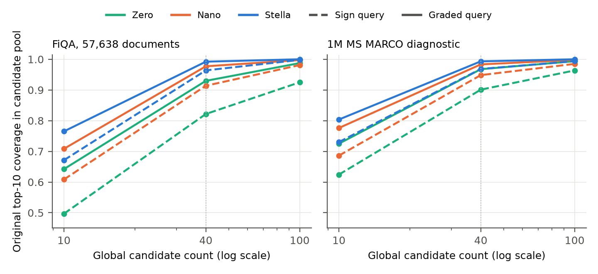

# Constella: Choosing Query Compute without Rebuilding the Index

**Draft v14, 2026-10-01. Not for circulation.** Results are labelled **registered** (method fixed before observation) or **exploratory**. `m15/EVIDENCE.md` gives human-readable numbers, sources, and limits; `m15/MEASUREMENTS.md` preserves the methods.

## Abstract

Can a search service use a cheaper query encoder without replacing its document index? We study Constella, three query encoders that search the same document vectors. The original encoder is Stella, a pretrained 400-million-parameter text embedding model. Zero replaces its query network with a token lookup table; Nano uses a 34.5-million-parameter transformer. Across 15 BEIR retrieval benchmarks, Zero and Nano retain 81.4% and 90.5% of Stella's exact-search score. Median warmed query encoding on a laptop CPU takes 44 microseconds for Zero, 2.25 ms for Nano, and 31.6 ms for Stella.

Fast encoding does not determine the cost of search. Zero needs more graph-search work on the two collections we measure. On a million-passage diagnostic, its speed advantage over Nano shrinks to 2.2-fold when retrieval is included, preserving each encoder's own exact-search score within 1%. A separate controlled experiment compresses documents to binary codes and changes only how queries are scored. Preserving query coordinate magnitudes raises Zero's coverage of its exact top ten from 82.2% to 93.0% on FiQA and from 90.1% to 96.8% on the million-passage diagnostic, at a 40-candidate budget. This measures candidate selection, not a native latency improvement. Finally, a table-fitting study across 26 teacher models shows why teacher retrieval quality alone can be a poor selection guide. The evidence supports several query budgets over one index, with measured limits on quality, search cost, and construction effort.

## 1. Introduction

In dense retrieval, a model turns documents and queries into vectors, and search ranks documents by their similarity to a query vector. Replacing that model can require encoding every document again. For a service with an existing index, the practical question is whether query computation can change while those document vectors stay in place.

Query-side distillation makes this possible. A smaller query encoder learns to approximate the vectors produced by the original model, called the **teacher**. It is trained to search the teacher's document space, so documents need not be encoded again. This differs from adopting an unrelated small embedding model: vectors with the same number of coordinates need not have the same meaning.

Our teacher is **Stella**, the pretrained `stella_en_400M_v5` text embedding model, with 400 million parameters and 1024-dimensional output [Stella]. We keep its document encoder and stored document vectors unchanged. We call the three available query paths **Constella**: the original Stella encoder, **Nano**, a 34.5M transformer trained to approximate Stella, and **Zero**, a learned table of token vectors. Zero combines the vectors of the query's tokens without running a transformer. An application can choose an available encoder for an endpoint or for an individual request, then search the same index.

The construction follows earlier work [QED, EmbedDistill, pyNIFE, LEAF]. Our question is what this choice buys in practice. There are two costs in a dense request: producing the query vector and finding documents with it. A faster encoder can lose retrieval quality. It can also produce vectors that require more work from an approximate-search index.

We examine these costs in separate steps. Exact search over 15 retrieval benchmarks measures each encoder's quality without approximation error. A laptop benchmark measures encoding time. Two populated Qdrant collections, searched through the same vector search engine, measure the additional work of approximate retrieval. A final scoring control holds compressed document codes fixed and tests how much candidate information is lost when query magnitudes are discarded. Each step answers a different question; an encoding speedup or candidate-coverage gain is not a measured serving speedup.

The main system result is that the encoding saving can shrink sharply after search. On our million-passage diagnostic, Zero loses more of its exact-search quality than Nano or Stella when the graph search explores few candidates. Giving Zero more search effort repairs much of this loss, but spends some of its encoding advantage. One shared binary index leaves a useful speed difference; one uncompressed configuration nearly consumes it. These results show why an encoder change warrants measuring search again, even when the documents and index are unchanged.

The precision control identifies another choice. Binary document codes keep only the sign of each vector coordinate. Signing the query too also removes the strength of its coordinates. Keeping those query magnitudes improves candidate coverage for all three encoders on both workloads, with larger absolute gains for Zero, which starts with more misses. This is a reason to evaluate query precision separately from encoder cost. It does not yet demonstrate a faster native search setting.

Construction raises a different decision: which teacher should a cheap query encoder imitate? Under one table-fitting recipe, the strongest registered teacher produces the weakest table. A direct test of the candidate table is much more informative than the teacher's own retrieval score. We also report the preparation and fitting costs separately: Nano's final optimization takes 57.3 hours on one A100 GPU, about $95 at the historical rental rate, excluding the rest of the project.

The paper therefore connects available query budgets to their quality, search work, and construction requirements. It also measures the room for choosing an encoder per query, while showing that the simple routing policies we tested are weak. The public models, inference quickstart, and evidence record make these results inspectable. The contribution is an applied study of this family, not a new distillation architecture.

## 2. What earlier work establishes

Query-side distillation is already a practical way to reuse document vectors. QED trains a small query encoder to match a frozen model's embeddings; EmbedDistill studies how preserving embedding geometry helps distillation [QED, EmbedDistill]. LEAF targets teacher-aligned encoders with modest data and infrastructure. NanoVDR replaces the query side of a visual-document retriever with a smaller text model [LEAF, NanoVDR]. Affordable fitting and index reuse have precedents.

A lookup table is also an established alternative to a query network. Model2Vec and static sentence embeddings combine fixed vectors for the tokens in a text [Model2Vec, StaticEmb]. Unlike a transformer, a static table does not compute each token's representation from its surrounding words. pyNIFE fits such a table to a frozen teacher, reuses the teacher's index, and proposes switching between table and contextual query encoders [pyNIFE]. LightRetriever jointly trains a lookup-table query side and a document side based on a large language model [LightRetriever]. We study this approach with an unchanged document model and measure how the resulting queries behave inside approximate search.

Teacher selection and per-query retrieval choices have related work too. Cho and Hariharan, and PROD in dense retrieval, show that a stronger teacher need not produce a stronger student [Cho and Hariharan 2019, PROD]. NanoVDR compares quality retention across datasets for one teacher; we compare teachers under one table recipe on the same datasets. Work on retrieval strategy selection and query performance prediction asks when a query needs a different retrieval path [Arabzadeh et al., QPP]. Compatible representation learning addresses reuse of an existing index when a model changes [BCT, FCT]. These precedents bound our claims about switching and teacher selection.

Queries that differ from the indexed-data distribution can make graph search harder. OOD-DiskANN and RoarGraph use query information when building an index to address that problem [OOD-DiskANN, RoarGraph]. QA-Cos improves candidate selection from binary sketches by using query-aware decoding [QA-Cos]. We do not introduce these ideas. Our experiments substitute compatible text query encoders over fixed document vectors, then separate encoding cost, graph-search work, and query-scoring precision. The teacher comparison and build accounting support the decisions involved in constructing this family.

## 3. Constella: one document index, three query tiers

### 3.1 What makes the encoders interchangeable

Stella converts each document to a normalized 1024-dimensional vector. We pin `NovaSearch/stella_en_400M_v5` to revision `ffeb2b7e`, encode in 32-bit floating point (fp32), store in 16-bit floating point (fp16), and use cosine similarity. Zero and Nano are trained against this particular space. Matching the vector width is only one requirement: the prompt, tokenizer, pooling method, normalization, and training targets affect where a query lands.

Zero's tokenizer breaks a query into tokens, including subword pieces. The encoder looks up one learned vector per token, combines them, and normalizes the result. Repeated tokens receive weights proportional to the square root of their counts, so repetition grows their influence more slowly than simple counting. Nano instead uses a small pretrained transformer, bge-small. It combines outputs from three layers, projects them into Stella's space, and averages token outputs (mean pooling). Its squared L2 training loss penalizes the squared distance from the teacher's target vector.

| Query path | Computation per query | Construction |
|---|---|---|
| Stella | the original 400M transformer with its query prompt | original query path, no student to build |
| Nano | a 34,540,672-parameter transformer | bge-small layers 12, 8, and 4; linear projection to 1024 dimensions and mean pooling; squared L2 alignment to Stella targets |
| Zero | token lookup, count-saturated pooling, normalization | 30,522 token rows trained with cosine and ranking losses, exported as int8 |

Here, **hot swapping** means choosing an available, aligned query encoder and sending its vector to the same collection. The documents do not need to be encoded again, and these three dense query paths do not need separate document indexes. This assumes the encoder is already available; it says nothing about the time to load a model.

We verified all three paths against the same populated disk-backed Qdrant collection on each of the two search workloads. The collection was not updated or rebuilt between encoder batches. Queries were encoded beforehand and then searched in batches, so this verifies compatibility rather than concurrent switching or production failover (`results/m15_e2_ann_fiqa.json`, `results/m15_e2_ann_msmarco1m.json`). The quickstart in `README.md` demonstrates Nano and Zero using one collection. Appendix E records implementation details that can silently break compatibility.

### 3.2 The available quality and encoding budgets

We measure retrieval quality on **BEIR-15**, the 15 datasets from the BEIR retrieval benchmark used in this study [BEIR]. They cover different retrieval tasks. The score is **nDCG@10**, normalized discounted cumulative gain at ten: it rewards relevant documents near the top of the first ten results. A **macro average** gives each dataset equal weight. Here we use exact search, which scores every stored document vector, so approximate-search errors do not enter the quality comparison. **Retention** divides an encoder's macro score by Stella's macro score; it is not a percentage of queries answered correctly.

**Table 1.** Exact-search quality over the same Stella document vectors. Encoding time is the median (p50) for 100 real 5-12-word queries, one query at a time, with four CPU threads on an Apple M5 Pro. The runtime is ONNX Runtime for the transformers and NumPy for Zero. Assets include model and tokenizer files. The timing method was registered; the BEIR-15 aggregates are descriptive (`results/m15_e1_latency.json`, `results/m20_beir15_run.json`).

| Query path | nDCG@10 | Retention | Encode p50 | Assets |
|---|---:|---:|---:|---:|
| Stella | 0.5614 | 1.000 | 31.6 ms | 1669.6 MiB |
| Nano | 0.5081 | 0.905 | 2.25 ms | 132.3 MiB |
| Zero | 0.4572 | 0.814 | 0.044 ms | 90.1 MiB |

Nano keeps about nine tenths of Stella's score at one fourteenth of its encoding time; Zero keeps about four fifths at one seven-hundredth. These are distinct quality choices. They are not speedups at equal retrieval quality. The ratios also depend on query length and workload; Section 4 measures encoding again for its own queries.

Zero's warmed encoding takes about 44 microseconds, with no transformer computation. Loading its assets into memory takes 0.215 s, and the first query takes 0.208 ms in this benchmark. Retrieval still has to run. Asset size also differs from peak process memory; the full timing and memory inventory is in `m15/EVIDENCE.md`. We did not measure the resident memory needed to keep all three encoders loaded together.


**Figure 1.** The three query paths over the same Stella document vectors. Each point trades retrieval-score retention against warmed encoding time. Alternative models using their own indexes are reported separately in Appendix B.

Task differences matter. Zero retains 0.667 of Stella's score on TREC-COVID, while Nano retains 0.988 on Quora. Against **BM25**, a lexical retriever based on term matches, Zero scores higher on 11 of 15 datasets descriptively; BM25's macro is 0.4006. The original registered BM25 comparison did not pass its statistical correction, and Appendix B preserves that outcome.

For a service keeping its Stella index, these are three compatible query choices. For a new index, other small encoders are alternatives. The project originally selected bge-small and LEAF as release targets; Nano scores below both on their own document indexes in this BEIR-15 comparison. Appendix B preserves those reference scores and the registered comparisons. They are selected references, not a comprehensive model frontier or controlled replacements over Stella's documents.

### 3.3 Can the service choose a tier for each query?

The more expensive encoder does not win every query. On the 12 datasets outside the held-out test, Zero scores higher than Nano on 18% of queries and Nano scores higher on 39%, averaging the shares across datasets. To measure the potential benefit of selection, we use an **oracle**: it knows the relevance labels and picks the better encoder for each query. It reaches 0.5473 macro nDCG@10, against 0.5161 from always using Nano. If it sends the queries with the largest gains to Nano first, it matches always-Nano while using Nano on only 15% of each dataset's queries (`results/m15_e5_oracle.json`, registered).

A real router cannot see those relevance labels. Our three signals available before retrieval recover little of the oracle's gain. The gap between Zero's top retrieval scores is more useful, recovering about a quarter of the gain on the six public sets, but it requires a Zero search and another search for queries sent to Nano. Appendix C gives the policies and their costs, along with a query-vector blend that failed to transfer from development to evaluation queries.

This establishes room for better selection, not a working adaptive policy. The encoders also used different training data, including Zero's exposure to the FEVER dataset family. Their disagreements cannot be attributed to architecture alone. A service can still select a default encoder for its quality and latency needs without a router.

## 4. Changing the query encoder changes the search

### 4.1 How much of the encoding saving survives retrieval?

Exact search scores every document. An approximate nearest-neighbor (ANN) index does less work, with a risk of missing useful results. Our search engine uses HNSW (Hierarchical Navigable Small World), a graph that connects nearby document vectors. The query determines which links search follows. Keeping the graph fixed therefore does not guarantee that a replacement query encoder will find its own best documents with the same effort.

We tested two collections: FiQA, with 57,638 documents, and a one-million-passage subset of MS MARCO. The subset keeps every judged relevant passage for the validation queries and fills the remaining places at random. It removes most competing passages, so its absolute scores are optimistic relative to the full corpus. It is a diagnostic, and MS MARCO is validation-only in our distillation. All three encoders search the same populated Qdrant collection for each storage configuration (v1.19.1, native macOS build).

Three controls affect search cost. HNSW's `ef` setting controls graph-search effort. **Quantization** stores lower-precision document codes for cheaper scoring. **Rescoring** ranks the selected candidates again using the original stored vectors; **oversampling** selects extra candidates before that step. We swept `ef`, uncompressed vectors, and three compressed formats: 8-bit scalar, 1-bit binary, and 4-bit TurboQuant. The compressed searches used rescoring with 1x-4x oversampling. Appendix F records the indexing setup; the full method is in `m15/MEASUREMENTS.md`.

For each encoder, we chose the fastest recorded setting that loses no more than 1%, 2%, or 5% of **that encoder's own exact nDCG@10**. For example, the 1% target allows a relative score loss of at most 0.01 times its exact score. It does not ask Zero to reach Nano's quality. This comparison asks how much approximation adds to each encoder's existing quality loss; the method was registered before the sweep.

At the same uncompressed setting on the million-passage collection (`ef` 16), approximate search loses 16.3% of Zero's exact score, 7.0% of Nano's, and 4.4% of Stella's. The returned top ten contain 82%, 91%, and 93% of each encoder's exact top-ten neighbors, respectively (`results/m15_e2_ann_msmarco1m.json`). Neighbor recovery and relevance quality are different measures: missing an exact neighbor need not mean missing a judged relevant document.

Zero's median cosine similarity to its nearest document is 0.60, compared with 0.74 for Nano and 0.78 for Stella. Its query vectors are less similar to their nearest documents on this workload. This is consistent with harder graph search, but does not establish the cause. The broader result is the observed difference in search effort on our two workloads, not a general rule that tables are harder to search.


**Figure 2.** Retrieval quality against median encoding plus search time. Each point is the fastest recorded configuration reaching that quality. Points can come from different quantization collections; all three encoders were measured on each collection. Dotted lines mark each encoder's exact score. Left: million-passage diagnostic; right: FiQA.

One binary collection gives a concrete shared-index example. To stay within 1% of their own exact scores, Zero uses `ef` 512 and 2x oversampling, Nano uses `ef` 256 and 4x, and Stella uses `ef` 128 and 1x. Their scores are 0.6116, 0.6893, and 0.7226, with median encoding plus search times of 1.11, 2.48, and 21.3 ms. The documents, graph, and compression remain unchanged; only the query vector and request settings change. This illustration is exploratory, drawn from the registered sweep.

Encoding was timed separately for this diagnostic's queries. On this sample, Nano takes approximately 62 times as long as Zero to encode; the times in Table 1 concern a different query sample and imply about 51 times. After retrieval, the diagnostic's gap is 2.2-fold. These are workload-specific speed ratios at different absolute quality levels.

Search can consume nearly all of the saving. On the uncompressed million-passage collection, the fastest settings within 1% of each encoder's exact score take 3.61 ms for Zero and 3.85 ms for Nano. Allowing each encoder a different compression configuration gives a Nano/Zero ratio of 2.2 at the 1% target and 3.1 at the 5% target. FiQA gives ratios of 3.8-4.3 across those targets (`results/m15_e2_ann_fiqa.json`). Figure 2 shows the measured choices. Encoding plus search is a sum of per-query times measured in separate phases of the same process; it excludes model loading and application dispatch.

Adding lexical retrieval spends another part of the budget. Combining Zero with BM25 raises its BEIR-15 macro from 0.4572 to 0.4933, or 87.9% of Stella's score. Nano plus BM25 reaches 0.5110, or 91.0%. On the million-passage diagnostic, combining 100 dense and 100 BM25 candidates with distribution-based score fusion (DBSF) takes 4.71 ms including Zero encoding, at nDCG@10 0.6183. That fusion normalizes the two score lists before merging them. It uses a separate uncompressed dense-plus-sparse collection; the dense-only binary example takes 1.11 ms at 0.6116. Fusion adds an index and search path, rather than just changing the dense query encoder.

The transferable lesson is to measure approximate search after replacing a query encoder. Shared-index compatibility alone does not establish that existing search settings remain adequate. Our timings quantify that consequence for Constella on these collections; they do not predict the speedup for another family or workload.

### 4.2 What is lost when the query is compressed too?

The compression configurations above used separate graph builds. We followed them with two more controlled tests. The first changes native search options on one fixed graph. The second removes the graph entirely and changes only query scoring. This separates a search-engine observation from a candidate-scoring question.

For the native test, we selected 192 queries per workload by a deterministic query-ID rule. On one binary collection, we alternated scoring with the original stored vectors and scoring with binary codes, then varied rescoring and oversampling. At the primary `ef` 64, binary scoring with rescoring and 1x oversampling loses 11.7 percentage points of exact-neighbor recovery for Zero on FiQA, 5.1 for Nano, and 2.3 for Stella. On the million-passage replication, the penalties are smaller: 3.9, 3.1, and 2.2 points. The interval for Zero's extra penalty over Nano includes zero. We retain that weaker replication, rather than replace it with a more favorable secondary setting (`results/m15_e16_quantization_pilot.json`, `results/m15_e17_quantization_replication.json`, exploratory).

These options affect more than final ordering. Qdrant merges results from index segments, and rescoring can change which candidates survive that merge. The native comparison therefore does not isolate a rerank of one identical global candidate list. Original-vector scoring uses `ignore=true` on the same binary collection; it does not use a newly built uncompressed graph.

The scoring control asks a simpler question. A one-bit document code records whether each coordinate is positive or negative. In the tested Qdrant version, the default binary query encoding keeps only those signs too [Qdrant 1.19.1]. Two query coordinates with very different strengths can then contribute equally. What candidate information returns if the query keeps its magnitudes, while the document codes stay the same?

We scored every document code in two ways: `sign(q)` dot `sign(d)`, using signs for both query and document, and normalized `q` dot the same `sign(d)`, retaining the query's original coordinate values. We call the latter **graded query scoring**. For each encoder, the target is its ten best documents under original-vector exact search. We measure how many of those ten enter a candidate list of 10, 40, or 100 documents. The primary budget is 40. Quantized scores can tie at the boundary, so coverage averages the inclusion expected from choosing uniformly among tied candidates. The query vectors and targets are identical across the two conditions, and no graph is involved (`results/m15_e18_query_precision.json`, exploratory).



**Figure 3.** Candidate coverage on identical binary document codes. Each encoder targets its own original-vector exact top ten. Solid lines keep query magnitudes; dashed lines keep query signs only. Values average expected inclusion at tied boundaries over 192 queries per workload. This is exhaustive scoring, without a graph or native latency measurement.

At 40 candidates, Zero's coverage rises from 0.8217 to 0.9297 on FiQA and from 0.9010 to 0.9677 on the million-passage diagnostic. Nano gains 6.33 and 3.49 percentage points; Stella gains 2.84 and 2.47. Zero's additional absolute gain over Nano is 4.46 points on FiQA (95% paired query interval 2.53-6.43) and 3.17 on the diagnostic (1.58-4.75).

All three encoders benefit, and Zero starts with more misses to repair. It does not recover a larger fraction of its sign-only misses than the other encoders. Mean cosine between each full query and its sign-only version is about 0.80 for every tier. Zero does not show a larger mean angular distortion, and the source of the coverage difference remains unresolved. The full budget rows and miss fractions are in `m15/EVIDENCE.md`.

This result repeats across two workloads for the same Stella-aligned family. It shows that encoder computation and query-scoring precision are separate choices: useful magnitude information remains even in Zero's cheap query vectors. It does not establish a universal property of lookup tables. Graded scoring here uses the original query values, not native 8-bit query encoding; candidate count is global, not Qdrant's per-segment oversampling. Candidate coverage also measures a different outcome from judged relevance or request latency. The next deployment test is whether supported native query precision improves the quality/cost tradeoff after its scoring cost is included.

## 5. Building compatible query encoders

### 5.1 What does the build cost include?

A teacher-aligned encoder learns from text paired with the teacher's vectors. Those vectors must be produced before fitting; ranking losses may also need document vectors or query-document pairs. We separate data preparation, teacher encoding, and fitting. Reusing a serving index avoids re-encoding its documents for deployment, but does not remove the cost of preparing training targets.

**Table 2.** Component build costs. Nano's optimization time is measured and priced at the recorded historical rental rate. Zero's figures are historical estimates. Training-example presentations count examples shown during optimization, not distinct texts. Sources: `results/m15_e15_decision_audit.json`, `results/m13_build_record.json`, `results/m13_build_allocation.json`, `m7/LEDGER.md`.

| Artifact | Fitting or optimization | Preparation and accounting boundary |
|---|---|---|
| Closed-form probe | 4-7 minutes per registered configuration on an A100 for fitting and development scoring, including fit-query encoding except for cached Stella targets | coarse intervals between output files; downloads, data assembly, and index construction excluded |
| Zero | approximately 20 minutes of retraining on an RTX 3080, historical estimate | changing teachers was estimated to require 8-12 hours of target re-encoding; not a measured complete rebuild |
| Nano | 57.3 A100 hours for 199,999,721 example presentations; about $95 at the recorded $1.664/hour rental rate | teacher targets already prepared; excludes data generation, preparation, recipe search, failed runs, evaluation, export, and engineering time |

The final Nano optimization ran on one GPU. Its roughly $95 component price makes the scale of fitting concrete, but is not a from-scratch reproduction budget or evidence that this training amount is optimal. Zero's short fitting estimate also assumes prepared targets. The estimated 8-12 hours to encode targets under another teacher is a separate cost.

The two students use different data. Nano's batches mix 75% query examples and 25% document examples; its pretrained bge-small base also has prior MS MARCO exposure. Zero's pool includes FEVER training data, which Nano's pool excludes. Our distillation uses MS MARCO only for validation. Appendix F lists the recorded sources and build configuration; these permissions and differences remain part of interpreting the results.

### 5.2 Does the strongest teacher make the strongest table?

An existing index fixes the teacher's document space. In that situation, the question is whether a proposed cheap query encoder works well in that space. Before building an index, however, a team can choose the teacher too. We study that second decision with a simpler table-fitting recipe, distinct from the trained Zero and Nano models.

The **closed-form table probe** fits token vectors by solving a regularized linear regression problem. It learns to reconstruct teacher query vectors from token counts, with a penalty for moving too far from teacher-derived starting rows. This is ridge regression. The resulting table can encode a query itself, so we evaluate its retrieval directly. Its success would not certify a table or transformer trained by a different recipe.

We first fitted this recipe to 10 checkpoints from six model families. All use the same BERT WordPiece token vocabulary, which keeps the table's inputs comparable. The fit uses 337,981 queries screened against the held-out data. The regularization strength, which controls that penalty, was chosen separately for each teacher on two development datasets: CQADupStack physics and programmers. Choices were then fixed before evaluating six public BEIR datasets (`results/m15_e8_frozen_lambdas.json`, `results/m15_e8_towers.json`, registered).

After that result, we added 17 checkpoints with the same recipe and selection order. One arctic checkpoint failed the solver's convergence requirement, leaving 26 measured teachers: ten registered and 16 exploratory (`results/m15_e8x_towers.json`). Each teacher and its table search that teacher's own document vectors. This compares possible index designs; it does not swap unrelated teachers into the Stella index. Appendix F lists the additional model families.


**Figure 4.** A teacher's own retrieval score weakly ranks its table's score under this recipe. Evaluating the table on development queries ranks its public score much better. Filled points are the registered ten; hollow points are the exploratory 16. Intervals use 10,000 bootstrap resamples of checkpoints.

Spearman correlation compares rankings: a value near +1 means two rankings agree closely, while a value near zero means little overall rank association. Across these 26 checkpoints, teacher quality and table quality correlate at +0.09, with a 95% interval of -0.39 to +0.52. That wide interval allows moderate associations, so it does not establish independence.

The specific reversal is more concrete. The best registered teacher, gte-large-en-v1.5, produces the weakest registered table. Stella produces the best six-set table score across all 26. The two models share a backbone, tokenizer, and 1024-dimensional architecture but differ in training and in how hidden states become the output vector. This is a consequential counterexample to choosing a teacher solely by its own retrieval score under this recipe.

**Table 3.** The teacher-choice consequence, measured by six-set macro nDCG@10. Each teacher and table use the same six datasets and that teacher's document index. The rows are registered; the selection difference is an exploratory derivation (`results/m15_e15_decision_audit.json`).

| Teacher | Teacher score | Table score | Table / teacher |
|---|---:|---:|---:|
| gte-large-en-v1.5 | 0.5970 | 0.2455 | 0.411 |
| Stella | 0.5745 | 0.3974 | 0.692 |

The development test chooses Stella. Choosing the strongest teacher by its public score would choose gte-large; the selected Stella table scores 0.1519 higher. The teacher selection by public score is a hindsight comparison, not a prospectively tested policy based on model cards.

Directly testing the table is much more informative. Its development score correlates with its public score at 0.88 across the 26 checkpoints (95% interval 0.70-0.95), and at 0.90 across the registered ten. A sensitivity check that resamples model families is recorded in `results/m15_e14_screen_checks.json` (exploratory). The result supports evaluating the intended cheap representation, rather than inferring its quality from its teacher.

The test's workload still matters. Stella wins the six-set table average. On the four sets without disclosed Stella training overlap, development/public ranking agreement is lower, at 0.68. There the selected table trails the best registered candidate by 0.0048, and the best of all 26 by 0.0278. It ranks fifth on SciFact and eleventh on TREC-COVID (`results/m15_e15_decision_audit.json`, exploratory). These development forums therefore do not select the best teacher for every domain.

This is broader than a comparison of one favorable pair, but it still tests one table recipe, one vocabulary, and six public datasets. The checkpoints include related model families and training sources. Exposure for the registered ten is disclosed in `m15/e8_exposure.json`; the exploratory 16 were not individually audited. The comparison uses a cleaned fit-query list after an earlier list had 1.31% held-out-query overlap. Three vector-error diagnostics do not reliably explain the teacher ranking; Appendix D.3 records them. None of these results validates the probe as a selector for trained Zero or Nano.

### 5.3 Using these models or building another family

The existing models require no student training to use. The inference quickstart selects Nano or Zero over one collection, with artifact identities and output checks in the release records. The repository also records how the students were built, although it does not provide a standalone training tool for an arbitrary teacher.

For a fixed index, evaluate the intended cheap encoder against the actual stored document vectors. When choosing a teacher before indexing, test candidate cheap encoders directly. Select settings on representative development queries, then evaluate on other queries. Keep the original query encoder as a reference, record target preparation separately from fitting, and measure approximate search for each available path. The probe driver (`m15src/e8_towers.py`), Zero recipe (`m7/RECIPE.md`), and Nano configuration (`m13/build_config.json`) are concrete starting points, with the accounting boundaries above.

## 6. How far do these findings reach?

The evidence has different strengths. Interchangeable query encoders are a capability under the alignment contract in Section 3, demonstrated on populated collections. The quality comparison spans 15 datasets, but uses these particular trained models. The search-effort pattern and query-precision gain repeat across two workloads for the same Stella-aligned family. That is replication across workloads, not across independently trained model families. The teacher study spans 26 checkpoints but tests one table recipe. Routing, blending, and shuffle examples are supporting diagnostics, not general policies or causal explanations.

The exact quality results include four datasets held out for one registered test: FEVER, DBpedia-entity, and CQADupStack android and english. Their published aggregates enter BEIR-15, but those datasets play no fitting or diagnostic role here. Table regularization, router thresholds, and blend weights use the physics and programmers forums. The served models were built earlier using the project's development suite. Appendix B preserves the registered comparisons, including negative and unresolved outcomes.

These are not experiments that isolate architecture while holding training data constant. Zero trained on FEVER-train and HotpotQA; Nano's pool excluded FEVER. Zero's higher FEVER-family scores mix data and architecture. Stella also uses one fixed query prompt in our serving path: its BEIR-15 score is 0.5614, while its model card reports 58.97 on a percentage scale with task-specific instructions, a 400-token limit, and bfloat16 computation. The card and our test are different configurations.

Intervals that resample queries describe variation across those queries with the trained models fixed. They do not cover training-seed variation or independent teacher families. The teacher correlations and checkpoint intervals likewise do not establish a general law of distillation; 16 of the 26 checkpoints were added after the original observation. BEIR-15 aggregates and the cost/selection audit are descriptive.

Latency measurements cover one laptop CPU, one runtime, and two collections, not server throughput or GPU serving. The positive-preserving MS MARCO subset removes most competing passages; its absolute quality and search penalties may differ on the full corpus. Speed ratios preserve each encoder's own quality target, not equal absolute quality. We have not priced index migration, measured concurrent encoder switching, or measured all-tier resident memory. The build accounting omits the full research and engineering effort.

The precision controls use 192 queries per workload. The native binary penalty varies by workload; its primary million-passage interaction is weaker than FiQA's. The graph-free control isolates query scoring on identical document codes, but does not measure native scalar8 query performance, graph traversal, relevance gain, or latency. Zero's larger absolute candidate gain partly reflects more initial misses. It does not establish that table encoders are intrinsically more sensitive to quantization.

These limits leave useful conclusions. Compatibility alone cannot certify a search setting, and a teacher's score cannot certify a table produced by the tested recipe. Those counterexamples are sufficient reasons to test the relevant choices directly. They do not tell us how often either problem occurs across all models. A native query-precision test would strengthen the practical finding; another teacher space would test its reach beyond Stella.

## 7. Conclusion

Constella gives a service three query budgets over the same Stella document vectors: a lookup table, a small transformer, and the original encoder. Each offers a different quality and encoding cost without requiring another document index.

On our workloads, Zero needs more approximate-search effort, reducing its encoding advantage over Nano. Shared vectors do not guarantee adequate shared search settings. With identical binary document codes, retaining query magnitudes improves candidate coverage for all three encoders. This motivates testing query precision; its native cost remains unmeasured.

Under one table recipe, teacher quality poorly guides table quality. Direct development testing works better, but winners vary by domain. Final Nano fitting ran on one GPU; preparation and research are separate costs. An existing index can support several query budgets, provided the quality and search cost are measured for each.

## Appendix A. What a mean-pooled table absorbs

Some corrections applied after pooling can instead be precomputed into the token rows. The query then keeps the same lookup-and-pool computation. This appendix states that algebraic equivalence; it does not claim that the corrections improve retrieval.

The full proof is in `m15/PROOF_ABSORB.md`. Let a table with rows $w_t$ pool a query with weights $\alpha_t(q) \ge 0$ that sum to one (mean pooling, and Zero's count-saturated pooling), then normalize. (1) Applying $x \mapsto Ax + b$ after pooling equals pooling the table $w'_t = A w_t + b$, because $\sum_t \alpha_t (A w_t + b) = A \sum_t \alpha_t w_t + b$; under sum pooling the offset would scale with query length instead. (2) Reweighting tokens by fixed $g_t > 0$ and renormalizing equals the table $g_t w_t$ up to a positive scalar that the final normalization removes. Centering, whitening, principal-component removal, IDF or SIF weighting and their compositions are therefore tables of the same shape. The lemmas do not cover nonlinear maps, pooling weights that depend on count patterns, or word order.

## Appendix B. Selected references and registered evaluations

The main comparison keeps Stella's document vectors fixed. The external references below answer a separate question: what quality did selected alternatives achieve with their own document representations? bge-small and LEAF were chosen as the project's release targets, and BM25 supplies a lexical reference. This selection is not a survey of all small retrievers or a state-of-the-art ranking. The dense encoding times use the same laptop protocol as Table 1.

| Reference | Document representation | BEIR-15 macro nDCG@10 | Encode p50 |
|---|---|---:|---:|
| bge-small-en-v1.5 | its own dense vectors | 0.5171 | 2.57 ms |
| LEAF | arctic-embed-m dense vectors | 0.5402 | 1.39 ms |
| BM25 | lexical terms | 0.4006 | not reported here |

Nano's 0.5081 is lower than both selected dense references. The shared-index capability matters when keeping Stella's documents is a requirement; it does not establish that Nano is the best option for a new index. Sources: `results/m20_beir15_run.json`, `results/m15_e1_latency.json`. The complete eight-system per-dataset rows, including lexical fusion, remain in `m15/EVIDENCE.md`.

The registered tests used specified dataset partitions and decision rules. Their outcomes are preserved below, rather than inferred from the later BEIR-15 averages.

| Contrast | Partition | Difference in nDCG@10 | Registered outcome |
|---|---|---:|---|
| Nano - bge-small | clean-4 | +0.017648 (one-sided lower bound +0.003674) | established |
| Nano - bge-small | all six | +0.027449 | established |
| Nano - LEAF | all six | +0.016181 | established |
| Nano - LEAF | clean-4 | -0.001063 | unresolved |
| Nano - bge-small | held-out NDO-3, dataset-weighted | +0.0032 [-0.0069, +0.0134] | registered descriptive |
| Nano - bge-small | held-out NDO-3, query-pooled | -0.0121 [-0.0219, -0.0024] | registered descriptive |
| Nano - LEAF | held-out NDO-3 | -0.0389 [-0.0488, -0.0290] | registered descriptive |

Clean-4 is NFCorpus, SCIDOCS, SciFact and TREC-COVID, the six-set members Stella's recorded training data does not name. NDO-3 weights DBpedia-entity 0.5 and the two held-out CQADupStack forums 0.25 each; FEVER's row is in `m15/EVIDENCE.md`. "Unresolved" means the registered rule did not establish a difference; no equivalence interval was computed. Sources: `m21/BENCHMARKS.md`, `results/m13_reserved_run.json`.

The originally held-out four, copied only from the published aggregate receipt `results/m13_reserved_run.json`:

| System | FEVER | DBpedia | CQADup android | CQADup english |
|---|---:|---:|---:|---:|
| nano-dense | 0.6231 | 0.4190 | 0.4774 | 0.4298 |
| zero-dense | 0.6978 | 0.3900 | 0.4431 | 0.3690 |
| stella-query | 0.8207 | 0.4603 | 0.5275 | 0.5183 |
| bge-small-en-v1.5 | 0.8662 | 0.4003 | 0.4761 | 0.4558 |
| leaf-ir-asym | 0.8671 | 0.4520 | 0.5260 | 0.4707 |
| bm25 | 0.5036 | 0.3045 | 0.3952 | 0.3481 |
| zero+bm25 dbsf@100 | 0.7559 | 0.4030 | 0.4629 | 0.4016 |
| nano+bm25 dbsf@100 | 0.6879 | 0.4296 | 0.4750 | 0.4323 |

Zero's original registered dense test missed the LightRetriever-derived bar. Its comparison with BM25 failed the Holm threshold despite a positive unadjusted interval; its fused comparison with the OpenSearch reference was unresolved (`m21/BENCHMARKS.md`). These outcomes remain part of the research record and establish neither superiority nor equivalence. Full six-set and BEIR-15 rows for every system are in `m15/EVIDENCE.md`.

## Appendix C. Routing and vector blending

### C.1 Routing headroom

On the 12 BEIR-15 datasets outside the held-out test, averaging per-dataset shares, Zero and Nano both score 0 on 17% of queries, tie above 0 on 26%, and Zero is higher on 18% and Nano on 39% (pooling all queries gives 56% ties, because Quora is large and tied on 72% of its queries). A per-query oracle with relevance labels picks the better tier and reaches 0.5473 macro nDCG@10, against 0.5161 for always-Nano and 0.5580 for Stella. Sending only 15% of each dataset's queries to Nano, largest gains first, already matches always-Nano; at 25% it reaches 0.5334 (`results/m15_e5_oracle.json`, registered). Without Climate-FEVER, the one FEVER-family set among the 12, always-Nano scores 0.5406 and the oracle needs 20% of queries to match it (0.5453). This label-aware oracle bounds what routing can gain.

### C.2 Frozen routers

A router must decide which queries justify running Nano. We test subwords per word (tokenization fertility), the length of the pooled vector before normalization, word count, the gap between Zero's first and tenth document scores, and the number of documents shared by Zero and BM25 in their top ten. For each signal, we fitted its direction and threshold on the two development forums at Nano budgets of 10%, 25%, and 50%, then froze them. We compared each router with random routing at its realized Nano share and with the oracle at that share (`results/m15_e6_router.json`, `results/m15_e10_router.json`, registered).

The gain over random is the increase in nDCG@10 compared with selecting the same share of queries at random. The oracle gain share divides that gain by the improvement available from label-aware selection. Each row averages over the listed number of datasets.

| Signal | Available after | Gain over random, 25% budget | Oracle gain share | Sets |
|---|---|---:|---:|---|
| Fertility | encoding | +0.0049 | 0.10 | 12 |
| Pooled vector norm | encoding | +0.0016 | 0.03 | 12 |
| Word count | encoding | +0.0018 | 0.04 | 12 |
| Zero score margin | Zero search | +0.0175 | 0.25 | 6 |
| Zero/BM25 overlap | both searches | +0.0154 | 0.31 | 6 |


**Figure 5.** Left: the upper bound from label-aware routing on the 12 evaluation sets, against random routing. Right: the share of the oracle's gain over random routing each frozen router recovers, per Nano budget; orange signals are known before the search, green ones after Zero's own search.

The three query-only signals carry little. Zero's retrieval margin carries more: sending queries with the narrowest margin to Nano (28% of each dataset's queries on average, 24% pooled) scores 0.4865 on the six sets, against 0.4690 for random routing at that share and 0.5317 for always-Nano. Gains are largest where Zero is weakest: +0.043 on SciFact and +0.032 on TREC-COVID. Sending routed queries to the Appendix C.3 blend instead of Nano scores 0.4834, 0.0031 lower. The agreement signal counts shared documents; at the 10% budget its frozen threshold routes no queries.

### C.3 Cost and vector blending

A margin router first searches with Zero, then encodes and searches again for escalated queries. Its cost therefore includes two searches on those queries. Section 4's modest end-to-end gap limits the latency it can save on this workload; the oracle is a relevance upper bound, not a deployable speedup.

Zero and Nano write into one space, so a system can search once with normalize((1 - a) Nano + a Zero), adding 0.044 ms to Nano. The development forums chose a = 0.3, raising Nano there from 0.4247 to 0.4295. On the six public sets, the frozen blend lowered it by 0.0051 (95% interval -0.0092 to -0.0011), gaining only on ArguAna (+0.005) and losing most on TREC-COVID (-0.016). For Stella, the forums chose no blend (`results/m15_e9_blend.json`, registered descriptive; a pre-freeze code check printed SciFact's curve, recorded in `m15/MEASUREMENTS.md`). The forums that ranked teachers in Section 5.2 did not select a useful blend weight.

## Appendix D. Query and teacher diagnostics

### D.1 Shuffle sensitivity

Zero uses a unigram table: one row per token, with no representation of token order. Its output is unchanged if the same token counts arrive in a different order. On 3,727 queries of six public sets, the Stella-minus-Zero gap correlates with Stella's own nDCG@10 drop under five word shuffles (Spearman 0.52). The 40% of queries on which shuffling hurts Stella carry about 90% of the observed net gap (`results/m15_e12_failure_modes.json`, exploratory). This localizes a failure pattern but does not identify its cause: both differences share Stella's full-query score, shuffling changes more than word order, and positive and negative query gaps cancel in the net total.

Stratifying by broad bins of Stella's score leaves the association at 0.53. A separate control perturbs Stella's query vector once in an isotropic random direction at the same cosine distance as one shuffle. Among 3,069 queries with positive Stella scores, that perturbation costs 0.009 nDCG@10 on average, against 0.047 for shuffling (`results/m15_e12b_fragility.json`, exploratory). Broad score bins do not remove all shared-score coupling, and equal-distance isotropic noise does not match a language perturbation's direction relative to ranking boundaries. These controls establish a bounded diagnostic, not that word order explains a particular fraction of the loss or that general fragility has been excluded.

Subwords per word correlate with the gap at 0.10. That feature measures fragmentation, not token rarity or training support. Two selected FiQA failures illustrate the diagnostic (`results/m15_e13_robustness.json`, exploratory). For "What credit card information are offline US merchants allowed to collect for purposes other than the transaction?", the first relevant answer ranks first with Stella, 59th after shuffling, 11th with Nano, and outside Zero's top 100. For "What can I do with a physical stock certificate for a now-mutual company?", the corresponding ranks are 1, 8, 13, and 29. These queries were selected for large shuffle sensitivity and large Stella-minus-Zero gaps, so they do not represent the typical query.

### D.2 Short and unfinished queries

We cut each SciFact, NFCorpus, and FiQA test query and measured the share of its own full-query nDCG@10 each tier keeps (macro over the three sets, registered, `results/m15_e4_prefix.json`):

| Cut | Stella query | Nano | Zero | BM25 |
|---|---:|---:|---:|---:|
| First word | 0.293 | 0.288 | 0.297 | 0.362 |
| First two words | 0.389 | 0.381 | 0.387 | 0.448 |
| First three words | 0.479 | 0.468 | 0.461 | 0.528 |
| First half of the words | 0.610 | 0.597 | 0.604 | 0.656 |
| First half of the characters | 0.549 | 0.533 | 0.547 | 0.488 |

The dense tiers' shares differ by at most 0.02 at every cut shown and by 0.034 at 75% of the words (0.846, 0.829 and 0.812 for Stella, Nano and Zero). This is a descriptive similarity on cut test queries, not an equivalence test or real typing. BM25 keeps a larger share on word prefixes and a smaller one when a cut lands inside a word.

### D.3 Teacher diagnostics

Vector dimension is the number of coordinates, not the number of model parameters. Higher-dimensional checkpoints tend to produce weaker tables under this recipe. The association with absolute table quality is -0.44, while dimension correlates with teacher quality at +0.61. Its stronger association with retention, -0.76, partly reflects the teacher score in the denominator. Dimension is not parameter count and is confounded with training and readout; this is not a causal result about model size. The within-family observations and both absolute and relative correlations are recorded in the evidence file.

Vector fidelity is also an unreliable substitute for retrieval evaluation in these experiments. Tables fitted to the two e5 checkpoints match their teacher query vectors more closely than Stella's table does (mean cosine 0.90 and 0.89, against 0.78), yet retrieve worse. Three exploratory scalar diagnostics, including error relative to ranking margins, do not explain the teacher ranking reliably at n = 10 (`results/m15_e11_mechanism.json`, `results/m15_e11b_margin.json`). We have established a practical reversal and a useful direct screen, not its underlying cause.

## Appendix E. Quality spread and serving compatibility

Per-dataset BEIR-15 rows for all eight systems, E8's per-dataset tables and the full E1 latency inventory are in `m15/EVIDENCE.md`.

An encoder is compatible when its vectors are aligned with the index's document space, with the same width, normalization and similarity; our served paths match their references to 4.5e-08 (Zero), 1.2e-07 (Nano) and a minimum cosine of 1.00000000 (Stella through the published ONNX document-encoder computation graph). Three things fail silently: Stella without its prompt scores at cosine 0.80 against the correct vector; Stella's tokenizer pads to 512 by default, which drops cosine to 0.35; and FastEmbed's mean pooling returns float64 for mean-pooled models, Nano among them, which doubles memory and changes the raw bytes (qdrant/fastembed issue #752, recorded in the project audit; our measurements pool in float32 with ONNX Runtime directly).

## Appendix F. Reproducibility

The inference quickstart in `README.md` builds one collection and queries it with Nano and Zero. Artifact identities are `Qdrant/stella-en-400M-v5-doc-onnx`, `Qdrant/constella-zero`, and `Qdrant/constella-nano`; pinned model hashes and implementation parity are recorded in the release milestones and E1.

The search sweep used HNSW for every segment before timing. Its `indexing_threshold` was 1 KB rather than the 10,000 KB default, so small segments were indexed rather than served by a plain scan. This benchmark setting is not a deployment recommendation.

Zero's recorded training sources include ESCI, FEVER-train, HotpotQA-train, Mr. TyDi English, and SQuAD-train, plus NQ-open and TriviaQA query text (`m7/RECIPE.md`). Nano uses a different pool and a 75% query / 25% document batch mix (`m13/build_config.json`). The exploratory teacher expansion includes MiniLM, bge, e5, thenlper gte, arctic, Contriever, and TAS-B. These names identify the measured candidates; their exact checkpoints and settings are in the receipts.

The native option tests are E16/E17 in `m15/MEASUREMENTS.md`; the graph-free query-precision control is E18. They reuse 192 deterministically selected queries per workload. The source and result records preserve the query-vector hashes, model identities, and each encoder's own exact target. Their methods were committed before execution; all three are exploratory.

Every figure regenerates from committed JSON (`python m15/figures/make_figures.py`) and every number in `m15/EVIDENCE.md` from `python m15/make_evidence.py`. M15 result files (`results/m15_*.json`), except E8's frozen-lambda file (written on the pod and bound by hash into E8's result), carry the script hash, git commit, seed and machine; model and dataset revisions are recorded in the result, in the scripts it names, or in the result it was derived from (E8's frozen lambdas are bound by hash into E8's result; E12 and E12b take their pins from the committed M20 rows). Earlier results carry the provenance records of the milestone that produced them. Methods and reviews: `m15/MEASUREMENTS.md`, `m15/REVIEWS/`.

E15 derives teacher-choice consequences and component build costs from five published JSON receipts and the Zero ledger, without new training or raw evaluation access. To check E15 without overwriting its committed receipt, write a new result to an unused scratch path:

```sh
.venv/bin/python m15src/e15_decision_audit.py \
  --output work/m15/e15-check/result.json
```

The script records input and code hashes; the paper distinguishes measured training time, priced component cost, and historical estimates.

## References

Primary-source checks and links to the detailed audits are recorded in `m15/RELATED_WORK.md`.

- [QED] Yuxuan Wang and Hong Lyu. Query Encoder Distillation via Embedding Alignment is a Strong Baseline Method to Boost Dense Retriever Online Efficiency. SustaiNLP Workshop at ACL, 2023. [arXiv:2306.11550](https://arxiv.org/abs/2306.11550).
- [EmbedDistill] Seungyeon Kim, Ankit Singh Rawat, Manzil Zaheer, et al. EmbedDistill: A Geometric Knowledge Distillation for Information Retrieval. 2023. [arXiv:2301.12005](https://arxiv.org/abs/2301.12005).
- [LEAF] Robin Vujanic and Thomas Rueckstiess. LEAF: Knowledge Distillation of Text Embedding Models with Teacher-Aligned Representations. 2025, revised 2026. [arXiv:2509.12539](https://arxiv.org/abs/2509.12539).
- [NanoVDR] Zhuchenyang Liu, Yao Zhang, and Yu Xiao. NanoVDR: Distilling a 2B Vision-Language Retriever into a 70M Text-Only Encoder for Visual Document Retrieval. 2026. [arXiv:2603.12824](https://arxiv.org/abs/2603.12824).
- [LightRetriever] Guangyuan Ma, Yongliang Ma, Xuanrui Gou, Zhenpeng Su, Ming Zhou, and Songlin Hu. LightRetriever: A LLM-based Text Retrieval Architecture with Extremely Faster Query Inference. ICLR, 2026. [arXiv:2505.12260](https://arxiv.org/abs/2505.12260).
- [pyNIFE] Stephan Tulkens. pyNIFE: Nearly Inference Free Embeddings in Python. Software, 2025. [Repository](https://github.com/stephantul/pynife).
- [Model2Vec] MinishLab. Model2Vec: Fast State-of-the-Art Static Embeddings. Software. [Repository](https://github.com/MinishLab/model2vec).
- [StaticEmb] Tom Aarsen. Train 400x faster Static Embedding Models with Sentence Transformers. Hugging Face, 15 January 2025. [Blog post](https://huggingface.co/blog/static-embeddings).
- [Cho and Hariharan 2019] Jang Hyun Cho and Bharath Hariharan. On the Efficacy of Knowledge Distillation. ICCV, 2019. [Proceedings](https://openaccess.thecvf.com/content_ICCV_2019/html/Cho_On_the_Efficacy_of_Knowledge_Distillation_ICCV_2019_paper.html).
- [PROD] Zhenghao Lin, Yeyun Gong, Xiao Liu, et al. PROD: Progressive Distillation for Dense Retrieval. WWW, 2023. [arXiv:2209.13335](https://arxiv.org/abs/2209.13335).
- [Arabzadeh et al.] Negar Arabzadeh, Xinyi Yan, and Charles L. A. Clarke. Predicting Efficiency/Effectiveness Trade-offs for Dense vs. Sparse Retrieval Strategy Selection. CIKM, 2021. [arXiv:2109.10739](https://arxiv.org/abs/2109.10739).
- [QPP] Guglielmo Faggioli, Thibault Formal, Stefano Marchesin, Stéphane Clinchant, Nicola Ferro, and Benjamin Piwowarski. Query Performance Prediction for Neural IR: Are We There Yet? 2023. [arXiv:2302.09947](https://arxiv.org/abs/2302.09947).
- [BCT] Yantao Shen, Yuanjun Xiong, Wei Xia, and Stefano Soatto. Towards Backward-Compatible Representation Learning. CVPR, 2020. [Proceedings](https://openaccess.thecvf.com/content_CVPR_2020/html/Shen_Towards_Backward-Compatible_Representation_Learning_CVPR_2020_paper.html).
- [FCT] Vivek Ramanujan, Pavan Kumar Anasosalu Vasu, Ali Farhadi, Oncel Tuzel, and Hadi Pouransari. Forward Compatible Training for Large-Scale Embedding Retrieval Systems. CVPR, 2022. [arXiv:2112.02805](https://arxiv.org/abs/2112.02805).

- [OOD-DiskANN] Shikhar Jaiswal, Ravishankar Krishnaswamy, Ankit Garg, Harsha Vardhan Simhadri, and Sheshansh Agrawal. OOD-DiskANN: Efficient and Scalable Graph ANNS for Out-of-Distribution Queries. 2022. [arXiv:2211.12850](https://arxiv.org/abs/2211.12850).
- [RoarGraph] Meng Chen, Kai Zhang, Zhenying He, Yinan Jing, and X. Sean Wang. RoarGraph: A Projected Bipartite Graph for Efficient Cross-Modal Approximate Nearest Neighbor Search. PVLDB 17(11): 2735-2749, 2024. [Paper](https://www.vldb.org/pvldb/vol17/p2735-chen.pdf).
- [QA-Cos] Daehun Nyang. Beyond Hamming: Query-Aware Decoding of Binary Cosine Sketches. ICML 2026, PMLR 306: 94126-94143. [Proceedings](https://proceedings.mlr.press/v306/nyang26a.html).
- [Qdrant 1.19.1] Qdrant contributors. Binary query encoding and vector-index search implementation, v1.19.1. [Tagged source](https://github.com/qdrant/qdrant/tree/v1.19.1).

- [Stella] Stella-en-400M-v5. Model card for `NovaSearch/stella_en_400M_v5`. [Model page](https://huggingface.co/NovaSearch/stella_en_400M_v5).
- [BEIR] BEIR contributors. BEIR retrieval benchmark, datasets, and evaluation software. [Repository](https://github.com/beir-cellar/beir).
