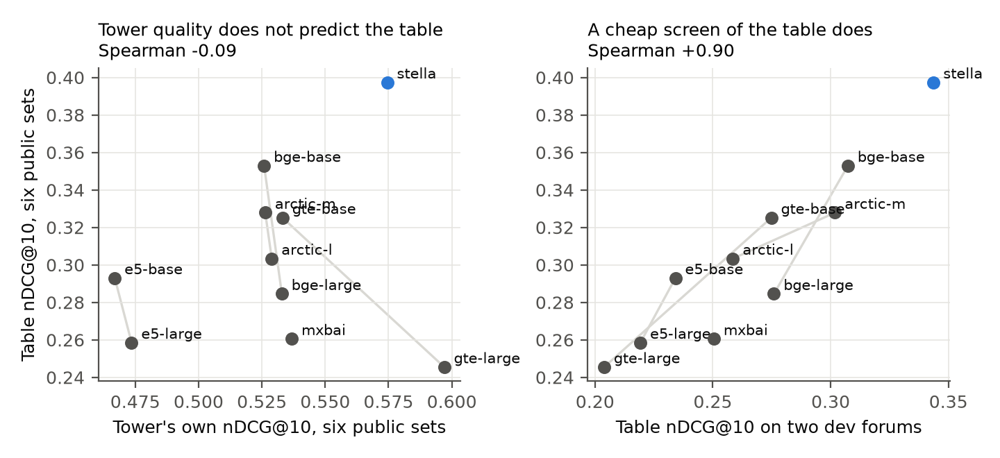
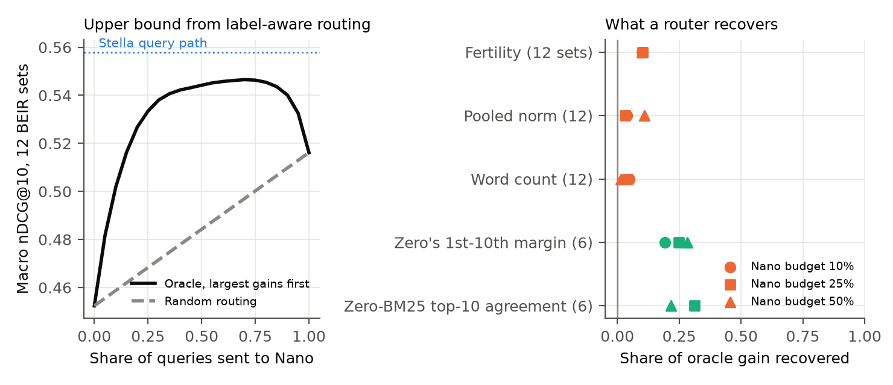
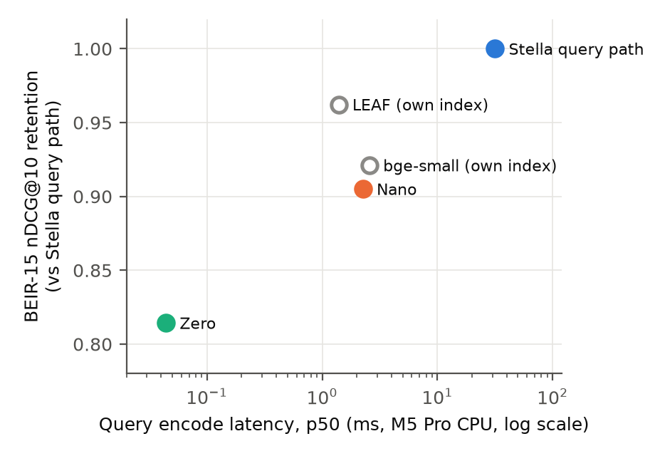

# Screen the Student: Cheap Query Encoders for a Frozen Document Index

**Draft v10, 2026-10-01. Not for circulation.** Each claim names the committed file behind its numbers. `m15/EVIDENCE.md` restates every number with its source and caveats. Results are labelled **registered** (method frozen before observation, `m15/MEASUREMENTS.md`) or **exploratory**.

## Abstract

A cheap query encoder can write into an existing document index's vector space, leaving the expensive document side fixed. We fit one closed-form lookup-table query encoder, a token table fitted by ridge regression with no neural network at query time, to 26 embedding towers. The towers' own retrieval quality did not rank the tables they produced (Spearman +0.09 on six public BEIR sets, 95% interval -0.39 to +0.52), and bigger towers tended to distill worse (-0.76 between embedding dimension and retention). The strongest tower in our registered set, gte-large-en-v1.5, made its weakest table, while Stella, trained from the same backbone, made the best. A few-minute screen of each table on development forums did rank them (0.88, interval 0.70 to 0.95; 0.74 to 0.95 when whole model families are resampled). Over one frozen `stella_en_400M_v5` index, the separately trained Zero table keeps 81.4% of the tower's nDCG@10 on 15 BEIR datasets at 0.044 ms per query on a laptop CPU. A 34.5M-parameter distilled transformer keeps 90.5% at 2.25 ms, against 31.6 ms for the tower. About 90% of the table's loss sits on the 40% of queries whose Stella nDCG@10 drops when their words are shuffled; merely fragile queries and queries full of rare subwords carry far less of it. Routing on the table's own retrieval margin recovers a quarter of the headroom an oracle router would. Inside a vector search engine, the table needs a wider graph search, shrinking its encode-time saving over the transformer from about 60-fold to 2- to 3-fold end to end on a one-million-passage collection.

## 1. Introduction

Suppose your document vectors come from a strong, slow embedding model. Re-embedding the corpus is expensive and risky. Query encoding costs less per request, but runs on every device and at every keystroke in search-as-you-type. If a cheaper query encoder can use the existing index, two decisions follow:

1. **If you may want cheap queries later, which embedding model should the index be built on?** The natural guess is the best one on the leaderboard, since the cheap encoder is distilled from it.
2. **Which queries actually need the expensive encoder?** A system could serve the cheap tier by default and escalate selected queries, all against one index.

We test both decisions. Under one closed-form lookup-table recipe fitted to 26 towers, tower retrieval quality did not rank the resulting tables, and neither did three scalar proxies for ease of distillation tested on the registered ten. Bigger towers tended to yield worse tables; scoring each table on a small development set ranked them well. We call this *screen the student*. A per-query oracle shows that the table's losses are large but concentrated. They are largest on queries whose Stella score drops when their words are shuffled, and the table's own retrieval margin is the cheapest signal we found for selecting queries to escalate.

**Contributions.**

- A comparison of 26 towers under one lookup-table recipe (ten registered, 16 added exploratorily). Ridge weights were frozen on development data before six public sets were scored. Tower quality did not rank table quality, bigger towers tended to distill worse, and a direct development screen ranked them (Section 4).
- A per-query localization of the table's loss on order-dependent queries, controlled for the tower's own score and query fragility, with worked examples (Section 5).
- An oracle upper bound and five frozen routers built on signals the table already has, plus a test of blending two tiers' query vectors in one search (Section 6).
- The deployment cost in a vector search engine, where approximate search and quantization cost the table more than the transformer (Section 7).
- A registered head-to-head test of the transformer tier reported in full (Appendix B), and a public harness that regenerates every number from committed files.

## 2. Prior Work and What Is New Here

**Cheap query encoders over a frozen document side.** Query-encoder distillation onto a frozen document encoder keeps 92.5% of the teacher on BEIR, averaged per dataset [QED]. EmbedDistill aligns student and frozen teacher embeddings and reports 95-97% on MS MARCO and NQ [EmbedDistill]. LEAF releases 23M-parameter query models that pair with a larger document model and keep 97.7% [LEAF]. NanoVDR distills a visual-document retriever's query side and keeps 95.1% [NanoVDR].

**Lookup-table query encoders.** Static embeddings average token vectors to compute a query [Model2Vec, StaticEmb]. pyNIFE fits a per-token table against a frozen off-the-shelf tower, reuses its index, and proposes a fast static path with a slow contextual fallback [pyNIFE]. LightRetriever serves queries by embedding lookup and keeps about 95% on BEIR, but trains its document LLM jointly with the query table [LightRetriever].

**Teachers, routing, and compatibility.** A stronger teacher does not always make a better student [Cho and Hariharan 2019], including in dense retrieval distillation [PROD]. Choosing between sparse and dense retrieval per query [Arabzadeh et al.] and predicting retrieval quality [QPP] are established. Backward- and forward-compatible training upgrade an embedding model without re-encoding a gallery [BCT, FCT].

**What is new here.** We hold one recipe fixed across many frozen towers and test what predicts the student, with development choices frozen before public evaluation. We analyze per-query loss with controls for obvious confounds, test routers against an oracle at matched traffic, measure the static tier's larger approximate-search penalty, and test blending two query encoders' vectors over one index, which did not help. The architecture comes from prior work [pyNIFE, LightRetriever].

## 3. Setup

**The frozen index.** `NovaSearch/stella_en_400M_v5` at revision `ffeb2b7e`: 1024-dimensional document vectors, fp32 compute, normalized, stored fp16, cosine similarity. Sections 5 to 7 search these vectors. Section 4 fits tables to other towers over each tower's own document vectors.

**Three query tiers over that index.**

| Tier | What runs at query time | How it was built | Build cost |
|---|---|---|---|
| Stella query path | the tower itself, with its `s2p_query` prompt | nothing to build | none |
| Nano | a 34,540,672-parameter transformer: bge-small layers 12, 8 and 4 concatenated, a linear head to 1024, mean pooling | squared L2 to Stella's vectors over 199,999,721 examples (75% query, 25% document batches) | 57.3 A100 hours, about $95 |
| Zero | a 30,522 x 1024 int8 table; the query vector is the normalized, count-saturated mean of its tokens' rows | cosine and ranking losses against Stella, then int8 | about 20 minutes of training after 8-12 hours of encoding on one RTX 3080 |

Sources: `results/m13_build_record.json`, `m7/RECIPE.md`. BM25 (bm25s, Lucene, k1 = 1.2, b = 0.75) is a reference and the lexical half of fused systems (DBSF over two top-100 prefetches, as in Qdrant's Query API).

**Evaluation.** We measure nDCG@10 under exact search on 15 BEIR datasets (`results/m20_beir15_run.json`, per-query rows in `results/m20_beir15_scores/`); Section 7 alone uses approximate search. Four datasets (FEVER, DBpedia-entity, and two CQADupStack forums) were held out for a registered one-shot test. Their frozen results enter the BEIR-15 aggregates but play no fitting or diagnostic role here. We fitted every choice made for this paper (ridge weights, router thresholds, blend weights) on two other CQADupStack forums, physics and programmers, and evaluated it elsewhere. The tiers themselves were built earlier on the project's development suite. They saw different training data: Zero's included FEVER-train and HotpotQA, while Nano's pool excluded FEVER, so Zero-versus-Nano comparisons on claim-style sets (FEVER, Climate-FEVER) mix architecture with data. Our single-prompt Stella path scores 0.5614 on BEIR-15 (the model card reports 58.97 with task-specific instructions, a 400-token limit, and bf16). Our bge-small (0.5171), LEAF (0.5402), and BM25 (0.4006) match their public numbers within half a point (sources and protocols in `m15/REVIEWS/2026-09-30-sonnet-literature.md`).

## 4. A Strong Tower Need Not Yield a Strong Table

For any tower sharing its tokenizer, we fit a lookup table in closed form: ridge regression maps query token counts to the tower's query vector, anchored at each token's own tower embedding (`m8src/teacher_screen.py`). We first fitted 10 checkpoints from six model families, all sharing one BERT WordPiece vocabulary, on 337,981 training queries screened against every held-out set. We chose each ridge weight on the two development forums and froze it in `results/m15_e8_frozen_lambdas.json` before scoring public sets (`results/m15_e8_towers.json`, registered). After seeing that result, we added 17 checkpoints under the same recipe, freeze order, and convergence gate (exploratory, `results/m15_e8x_towers.json`): MiniLM, bge, e5, thenlper gte, and arctic models from 384 to 1024 dimensions, Contriever, and TAS-B. One (arctic-embed-m v1) failed the convergence gate at its extended ridge weight and is excluded, leaving 26.

**Figure 1.** Each point is one checkpoint's closed-form table; filled points are the registered ten, hollow points the exploratory 16, and Stella is blue. Left: the tower's own nDCG@10 against its table's, on six public BEIR sets. Middle: the table's score on the two development forums against its public score. Right: the table's retention of its tower against the tower's embedding dimension. Intervals are 10,000-draw bootstraps over checkpoints.

**The tower's score did not rank the tables.** Across 26 checkpoints, the Spearman correlation between tower and table six-set scores is +0.09 (95% interval -0.39 to +0.52); across the registered ten it was -0.09. The strongest registered tower, gte-large-en-v1.5 (0.5970), made its weakest table (0.2455, keeping 41% of its tower). Stella gives the sharpest contrast. It was trained from gte-large-en-v1.5 and shares its 24-layer, 1024-dimensional architecture and tokenizer, but differs in training and read-out (mean pooling and a dense head against gte-large's CLS token). It made the best table of all 26 (0.3974, keeping 69%). Reading arctic-embed-l with mean pooling instead of CLS made its table worse (0.2764 against 0.3034), so read-out alone does not explain Stella.

**Bigger towers made worse tables.** Across the 26, embedding dimension, our proxy for tower size, correlates with tower quality at +0.61 and table retention at -0.76. Within families (six-set table nDCG@10; retention of the tower in parentheses):

| Family | Small | Base | Large |
|---|---:|---:|---:|
| bge v1.5 | 0.358 (0.71) | 0.353 (0.67) | 0.285 (0.53) |
| e5 v2 | 0.320 (0.70) | 0.293 (0.63) | 0.259 (0.55) |
| gte (thenlper) | 0.290 (0.60) | 0.276 (0.55) | 0.248 (0.48) |
| gte v1.5 | | 0.325 (0.61) | 0.246 (0.41) |

The pattern holds in every family but arctic, where xs and s are close (0.344 and 0.352), and the six-layer MiniLM beats the twelve-layer one. Size is confounded with training data and dimension. This is an observation about these 26 checkpoints; Stella is its clearest exception.

**Scoring the table itself did rank them.** Development-forum table scores rank public table scores with Spearman 0.88 across the 26 (95% interval 0.70 to 0.95). Across the registered ten it was 0.90 (0.68 on clean-4), and it ranged from 0.87 to 0.98 when any one family was left out (`results/m15_e13_robustness.json`). Either forum alone ranks the registered ten nearly as well (0.87 for physics, 0.92 for programmers), and resampling whole model families rather than checkpoints gives an interval of 0.74 to 0.95, against -0.36 to +0.53 for tower quality (`results/m15_e14_screen_checks.json`). For the registered ten, the screen took 4 to 7 minutes per tower on one A100, measured between successive output files. For every tower but Stella, whose training-query vectors were cached, that time includes encoding the 337,981 training queries and both forums.

**Three proxies did not rank them either.** We measured each proxy on the real test queries (exploratory; `results/m15_e11_mechanism.json`, `results/m15_e11b_margin.json`):

| Candidate explanation | Measurement | Spearman with table quality |
|---|---|---:|
| The tower is "almost a bag of words" | mean cosine between the table's and the tower's query vector | -0.07 |
| The tower reads word order, which a table cannot | mean cosine between a query's vector and its shuffled version's | -0.27 |
| The table's error is small relative to the tower's ranking margins | RMS vector error over the median gap between the tower's 1st and 10th score, averaged over six sets | -0.42 |

The first two point the wrong way; the third points the right way but weakly (and at -0.13 against retention). The e5 tables reproduce their towers' query vectors best (cosine 0.90 and 0.89, against 0.78 for Stella), yet rank documents worse. One possible explanation, a hypothesis at n = 10, is that e5's own score margins are narrowest (a median 1st-to-10th gap of 0.026 averaged over the sets, against 0.084 for Stella), so small vector errors reorder results. But gte-base has the widest margins (0.109) and still makes a middling table. Across these towers, vector fidelity did not track ranking quality; a direct ranking screen did.

**Scope.** This is one recipe on 26 checkpoints (ten registered) and six public sets. Intervals are bootstraps over checkpoints, not significance tests. For the registered ten, no checkpoint's authors disclose training on these six test sets and most trained on their source families, partly per community metadata (`m15/e8_exposure.json`); the 16 exploratory checkpoints were not audited for exposure. An earlier project screen used a training list with 1.31% overlap with held-out queries and found a correlation of 0.000 over eight configurations; this refit uses the cleaned list.

## 5. What the Table Cannot Represent

### 5.1 What Post-Processing It Absorbs

A mean-pooled table absorbs any affine map after pooling and any fixed per-token weighting such as IDF or SIF: the result is another table of the same shape (Appendix A proves this; a numerical check agrees to 9.31e-14, `results/m7_absorb_check.json`). Such post-processing adds no representational capacity, though it may help initialization. Adding rows did not help either: earlier closed-form rows for word pairs and finer segmentations did not improve development scores (best -0.0028, `m8/FINDINGS.md`). The unigram tables used here are blind to token order by construction.

### 5.2 The Loss Sits on Shuffle-Sensitive Queries

A table gives "A treats B" and "B treats A" the same representation. Rare words split into many subwords are another possible source of loss. We measured both on the 3,727 test queries of the six public sets (exploratory; `results/m15_e12_failure_modes.json`, `results/m15_e12b_fragility.json`). A query's *order dependence* is the drop in Stella's own nDCG@10 when its words are shuffled; *fertility* is subwords per word.

| Per-query association with the Stella-minus-Zero gap | Spearman |
|---|---:|
| Order dependence (five shuffles averaged), all 3,727 queries | 0.52 |
| Order dependence, within bins of the Stella path's own score | 0.53 |
| Order dependence (one shuffle), controlling for fragility, 3,069 queries Stella scores above 0 | 0.42 |
| Fertility, all queries | 0.10 |

On the 40% of queries where shuffling hurts Stella, it beats Zero by 0.210 nDCG@10; on the rest, by 0.015. Those queries carry about 90% of the table's total loss. Shuffling costs Stella 0.035 per query on average, 37% of its mean gap to Zero (0.094). The shuffle-induced drop equals 37% of the gap, and the gap also concentrates on shuffle-sensitive queries; both are associations. The gap rises from 0.071 in the lowest fertility tercile to 0.133 in the highest, against -0.055 to 0.235 across order-dependence terciles.

Two confounds matter. Both order dependence and the Stella-minus-Zero gap can be large only where Stella scores well, so we repeated the correlation within bins of Stella's score; it does not move. Some queries may also suffer under any perturbation. We therefore moved each Stella query vector by exactly the distance shuffling moved it, but in a random direction. Among the 3,069 queries Stella scores above zero, that move costs 0.009 nDCG@10 on average against 0.047 for one shuffle, and its damage correlates with Zero's gap at only 0.07. The table's loss follows shuffle sensitivity, and general fragility barely predicts it. This remains an association: shuffling changes a query in more ways than word order alone. Nano's advantage over Zero also concentrates on order-dependent queries, less strongly (0.26), consistent with a transformer that reads part of the order Stella reads (shuffling costs Nano 4.4% of its score, and Stella 6.9%, on SciFact, NFCorpus, and FiQA; `results/m15_e4_prefix.json`).

Two FiQA questions illustrate the result (`results/m15_e13_robustness.json`; rank of the first relevant answer):

| Query | Stella | Stella, words shuffled | Nano | Zero |
|---|---:|---:|---:|---:|
| What credit card information are offline US merchants allowed to collect for purposes other than the transaction? | 1 | 59 | 11 | not in top 100 |
| What can I do with a physical stock certificate for a now-mutual company? | 1 | 8 | 13 | 29 |

Both ask about relations between parts ("allowed to collect ... for purposes other than", "do with ... for a now-mutual company"). Stella's ranking falls when the words are shuffled; a bag of tokens represents both orders identically. Fragmentation matters in rarer, sharper cases (`results/m15_examples.json`): on SciFact, "Ivermectin is used to treat lymphatic filariasis" splits into `iv ##er ##me ##ct ##in` and `fi ##lar ##ias ##is`, and Zero misses the relevant document entirely while Nano ranks it second. Yet "ADAR1 binds to Dicer to cleave pre-miRNA" splits almost as badly (2.29 subwords per word) and Zero ranks the answer first.

## 6. Which Queries Need Context, and Can a System Find Them?

### 6.1 An Upper Bound

On the 12 BEIR-15 datasets outside the held-out test, averaging per-dataset shares, Zero and Nano both score 0 on 17% of queries, tie above 0 on 26%, and Zero is higher on 18% and Nano on 39% (pooling all queries gives 56% ties, because Quora is large and tied on 72% of its queries). A per-query oracle with relevance labels picks the better tier and reaches 0.5473 macro nDCG@10, against 0.5161 for always-Nano and 0.5580 for Stella. Sending only 15% of each dataset's queries to Nano, largest gains first, already matches always-Nano; at 25% it reaches 0.5334 (`results/m15_e5_oracle.json`, registered). Without Climate-FEVER, the one FEVER-family set among the 12, always-Nano scores 0.5406 and the oracle needs 20% of queries to match it (0.5453). This label-aware oracle bounds what routing can gain.

### 6.2 Routers Built on What the Table Already Knows

A router must decide before running Nano. For each signal, we fitted its direction and threshold on the two development forums at Nano budgets of 10%, 25%, and 50%, then froze them. We compared each router with random routing at its realized Nano share and with the oracle at that share (`results/m15_e6_router.json`, `results/m15_e10_router.json`, registered).

| Signal the table computes anyway | Known | Router minus random, 25% budget | Share of oracle gain recovered | Sets |
|---|---|---:|---:|---|
| Subwords per word (fertility) | before search | +0.0049 | 0.10 | 12 |
| Norm of the pooled vector before normalization | before search | +0.0016 | 0.03 | 12 |
| Word count | before search | +0.0018 | 0.04 | 12 |
| Gap between Zero's 1st and 10th document score | after Zero's search | +0.0175 | 0.25 | 6 |
| Documents Zero's and BM25's top 10 share | after both searches | +0.0154 | 0.31 | 6 |

**Figure 2.** Left: the upper bound from label-aware routing on the 12 evaluation sets, against random routing. Right: the share of the oracle's gain over random routing each frozen router recovers, per Nano budget; orange signals are known before the search, green ones after Zero's own search.

The three query-only signals carry little. Zero's retrieval margin carries more: sending queries with the narrowest margin to Nano (28% of each dataset's queries on average, 24% pooled) scores 0.4865 on the six sets, against 0.4690 for random routing at that share and 0.5317 for always-Nano. Gains are largest where Zero is weakest: +0.043 on SciFact and +0.032 on TREC-COVID. Sending routed queries to the Section 6.3 blend instead of Nano scores 0.4834, 0.0031 lower. The agreement signal counts shared documents; at the 10% budget its frozen threshold routes no queries.

Combining E1's encode medians with Section 7's MS MARCO search medians at unquantized `ef` 128, the margin router costs about 2.7 ms per query against 3.8 ms for always-Nano. It saves about 1.1 ms and gives up 0.045 nDCG@10 on these sets. Section 7 finds Nano only 2 to 4 times as expensive as Zero end to end. Even an ideal router between these tiers cannot save more than Nano's cost minus Zero's, between a half and three quarters of Nano's end-to-end cost. A real router saves less because it also runs Zero's search on every escalated query. Routing has more value where the transformer is expensive relative to search, as on a device; the oracle measures the remaining headroom for a better signal.

### 6.3 Blending Two Query Vectors in One Search

Zero and Nano write into one space, so a system can search once with normalize((1 - a) Nano + a Zero), adding 0.044 ms to Nano. The development forums chose a = 0.3, raising Nano there from 0.4247 to 0.4295. On the six public sets, the frozen blend lowered it by 0.0051 (95% interval -0.0092 to -0.0011), gaining only on ArguAna (+0.005) and losing most on TREC-COVID (-0.016). For Stella, the forums chose no blend (`results/m15_e9_blend.json`, registered descriptive; a pre-freeze code check printed SciFact's curve, recorded in `m15/MEASUREMENTS.md`). The forums that ranked towers in Section 4 did not select a useful blend weight.

## 7. Does Cheap Encoding Survive Retrieval?

**Table 1.** BEIR-15 macro nDCG@10 under exact search over the Stella index, and query-encode latency (median over 100 real test queries of 5-12 words, batch one, four CPU threads, ONNX Runtime, Zero on NumPy, Apple M5 Pro; `results/m15_e1_latency.json`). Retention is a ratio of macros. Registered.

| Query side | nDCG@10 | Retention | Encode p50 |
|---|---:|---:|---:|
| Stella query path | 0.5614 | 1.000 | 31.6 ms |
| Nano | 0.5081 | 0.905 | 2.25 ms |
| Nano + BM25 (DBSF@100) | 0.5110 | 0.910 | 2.25 ms + BM25 |
| Zero | 0.4572 | 0.814 | 0.044 ms |
| Zero + BM25 (DBSF@100) | 0.4933 | 0.879 | 0.044 ms + BM25 |
| BM25 alone | 0.4006 | 0.713 | |

Nano keeps nine tenths of Stella's quality at one fourteenth of its encode latency; Zero keeps four fifths at one seven-hundredth and beats BM25 on 11 of 15 datasets. Nano is a mid-strength small query encoder: on BEIR-15, it scores below bge-small on bge-small's own index (0.5171) and LEAF on its arctic-embed-m index (0.5402, at 1.39 ms). Its 90.5% retention is below the 92.5% to 97.7% reported for other distilled query encoders against their own teachers. Nano shares the Stella index with Zero and Stella, enabling Section 6's routing and blending; its 34.5M student against a 400M teacher is also a wider size gap than LEAF's 23M against 109M. Retention varies more across datasets than tiers, from 0.667 (Zero on TREC-COVID) to 0.988 (Nano on Quora). Figures 4 and 5 in Appendix D show the frontier and per-dataset spread.

**A table's query needs a wider graph search.** We served each tier from Qdrant (v1.19.1, native macOS build) over a one-million-passage MS MARCO subset that keeps every judged positive and fills the rest at random (a diagnostic, not full MS MARCO; MS MARCO is used for validation only), and over FiQA (57,638 documents). For each tier, we swept HNSW `ef` and three quantizations (int8 scalar, 1-bit binary, and 4-bit TurboQuant, each with rescoring and 1x-4x oversampling). We selected the cheapest end-to-end setting within 1%, 2%, and 5% of that tier's own exact nDCG@10 (registered method). Every segment was HNSW-indexed before timing (`indexing_threshold` set to 1 KB instead of the 10,000 KB default, so no vector was served by a plain scan); this is a benchmark setting, not a recommendation. At the same unquantized setting on the 1M collection (`ef` 16), approximate search costs Zero 16.3% of its exact score, Nano 7.0%, and Stella 4.4%. Their top-10 lists agree with exact search on 82%, 91%, and 93% of neighbors (`results/m15_e2_ann_msmarco1m.json`). Median cosine to the nearest document is 0.60 for Zero, 0.74 for Nano, and 0.78 for Stella. The table's averaged query vector sits farther from documents used to build the graph, consistent with, though not a test of, a harder graph search.

**Figure 3.** nDCG@10 under approximate search against end-to-end p50 (encode plus search); each point is the fastest setting reaching that quality, and dotted lines mark each tier's exact score. Left: 1M MS MARCO subset; right: FiQA.

**The saving survives, and shrinks.** Within 1% of exact score on the 1M collection, Zero needs `ef` 512 with binary quantization and 2x oversampling (search p50 1.09 ms), Nano `ef` 256 with 4x oversampling (0.87 ms), and Stella `ef` 64 with TurboQuant (0.66 ms). Including encoding, that is 1.11 ms for Zero, 2.48 ms for Nano, and 21.3 ms for Stella. Nano costs 2.2 times Zero at the 1% target and 3.1 times at 5%, down from 62 times for encoding alone on these short queries. FiQA shows the same ordering (at `ef` 16: 6.8%, 3.2%, and 1.5% lost); Nano costs 3.8 to 4.3 times Zero end to end (`results/m15_e2_ann_fiqa.json`). Absolute laptop latencies move with background load: an earlier FiQA run with another job using the CPU measured Nano's encode at 1.75 ms against 2.83 ms in the rerun, while the ratio stayed within 3.4 to 4.3 (`results/m15_e2_ann_fiqa_run1.json`). We therefore read absolute latencies from E1 and the MS MARCO run.

**Fusion costs time in the engine too.** A fused query (Qdrant's server-side BM25 and DBSF over two prefetches of 100) takes about 4.7 ms on the 1M collection. On this subset it scores 0.6183 for Zero, against 0.6169 for Zero's exact dense search and 0.0779 below Nano's exact dense score.

## 8. Robustness and Limitations

**Short and unfinished queries.** We cut each SciFact, NFCorpus, and FiQA test query and measured the share of its own full-query nDCG@10 each tier keeps (macro over the three sets, registered, `results/m15_e4_prefix.json`):

| Cut | Stella query | Nano | Zero | BM25 |
|---|---:|---:|---:|---:|
| First word | 0.293 | 0.288 | 0.297 | 0.362 |
| First two words | 0.389 | 0.381 | 0.387 | 0.448 |
| First three words | 0.479 | 0.468 | 0.461 | 0.528 |
| First half of the words | 0.610 | 0.597 | 0.604 | 0.656 |
| First half of the characters | 0.549 | 0.533 | 0.547 | 0.488 |

The dense tiers' shares differ by at most 0.02 at every cut shown and by 0.034 at 75% of the words (0.846, 0.829 and 0.812 for Stella, Nano and Zero). This is a descriptive similarity on cut test queries, not an equivalence test or real typing. BM25 keeps a larger share on word prefixes and a smaller one when a cut lands inside a word.

**The registered test.** Before reading evaluation data, the project registered head-to-head contrasts of Nano against bge-small and LEAF. Nano beat bge-small on clean-4 (+0.0176, one-sided lower bound +0.0037) and all six, and beat LEAF on all six. Nano against LEAF on clean-4 was unresolved (-0.0011). On the one-shot held-out sets, registered as descriptive, Nano's dataset-weighted difference from bge-small was +0.0032, with a 95% interval (-0.0069 to +0.0134) spanning zero, and Nano was below LEAF (-0.0389). Appendix B gives the full table. These comparisons involve different indexes, not query encoders alone.

**Limitations.** We study one document tower and one family of students. Section 4 covers one closed-form recipe on 26 checkpoints, 16 added after the registered ten. We trained the full served-table recipe on Stella only, so whether the screen predicts trained tables for other towers is untested. BEIR-15 results are descriptive; query-resampling intervals exclude training-seed variation. Latencies come from one laptop CPU and one runtime; we did not measure server throughput or GPU serving. The MS MARCO subset removes most competing passages, making its absolute nDCG optimistic. Several BEIR sets share source families with the towers' training data, and Nano's bge-small backbone trained on MS MARCO.

## 9. Conclusion

A frozen index can serve a lookup table that gives up about a fifth of Stella's quality for a seven-hundredth of its encode cost, or a small transformer that gives up a tenth for a fourteenth. Across 26 towers, tower quality did not rank the tables they produced, bigger towers tended to distill worse, and a few-minute development screen ranked the tables. That screen uses a closed-form table, while the served Zero is trained; we trained the served recipe on Stella only. The screen chose Stella, and training improved its table further (0.434 against 0.397 on the six sets). The table's largest losses occur on queries whose Stella score drops when their words are shuffled. Its retrieval margin recovers about a quarter of the oracle's gain over matched random routing. The system saving depends on search: on our one-million-passage collection, a roughly 60-fold encode saving over Nano becomes 2.2- to 3.1-fold end to end within 1% to 5% of each tier's exact quality.

## Appendix A. What a Mean-Pooled Table Absorbs

The full proof is in `m15/PROOF_ABSORB.md`. Let a table with rows $w_t$ pool a query with weights $\alpha_t(q) \ge 0$ that sum to one (mean pooling, and Zero's count-saturated pooling), then normalize. (1) Applying $x \mapsto Ax + b$ after pooling equals pooling the table $w'_t = A w_t + b$, because $\sum_t \alpha_t (A w_t + b) = A \sum_t \alpha_t w_t + b$; under sum pooling the offset would scale with query length instead. (2) Reweighting tokens by fixed $g_t > 0$ and renormalizing equals the table $g_t w_t$ up to a positive scalar that the final normalization removes. Centering, whitening, principal-component removal, IDF or SIF weighting and their compositions are therefore tables of the same shape. The lemmas do not cover nonlinear maps, pooling weights that depend on count patterns, or word order.

## Appendix B. The Registered Test in Full

| Contrast | Partition | Difference in nDCG@10 | Registered outcome |
|---|---|---:|---|
| Nano - bge-small | clean-4 | +0.017648 (one-sided lower bound +0.003674) | established |
| Nano - bge-small | all six | +0.027449 | established |
| Nano - LEAF | all six | +0.016181 | established |
| Nano - LEAF | clean-4 | -0.001063 | unresolved |
| Nano - bge-small | held-out NDO-3, dataset-weighted | +0.0032 [-0.0069, +0.0134] | registered descriptive |
| Nano - bge-small | held-out NDO-3, query-pooled | -0.0121 [-0.0219, -0.0024] | registered descriptive |
| Nano - LEAF | held-out NDO-3 | -0.0389 [-0.0488, -0.0290] | registered descriptive |

Clean-4 is NFCorpus, SCIDOCS, SciFact and TREC-COVID, the six-set members Stella's recorded training data does not name. NDO-3 weights DBpedia-entity 0.5 and the two held-out CQADupStack forums 0.25 each; FEVER's row is in `m15/EVIDENCE.md`. "Unresolved" means the registered rule did not establish a difference; no equivalence interval was computed. Sources: `m21/BENCHMARKS.md`, `results/m13_reserved_run.json`.

## Appendix C. What Does Not Travel With a Swap

A swap is legal when the replacement emits vectors aligned with the index's document space, with the same width, normalization and similarity; our served paths match their references to 4.5e-08 (Zero), 1.2e-07 (Nano) and a minimum cosine of 1.00000000 (Stella through the published document graph). Three things fail silently: Stella without its prompt scores at cosine 0.80 against the correct vector; Stella's tokenizer pads to 512 by default, which drops cosine to 0.35; and FastEmbed's mean pooling returns float64 for mean-pooled models, Nano among them, which doubles memory and changes the raw bytes (qdrant/fastembed issue #752, open upstream; our measurements pool in float32 with ONNX Runtime directly).

## Appendix D. Frontier and Per-Dataset Figures, Full Tables

**Figure 4.** BEIR-15 retention against encode latency. Hollow markers are reference systems on their own indexes (bge-small 0.5171 at 2.57 ms, LEAF 0.5402 at 1.39 ms).

**Figure 5.** Per-dataset retention of Zero and Nano. Zero is above Nano on FEVER, HotpotQA and Climate-FEVER; Zero trained on FEVER-train while Nano's pool excluded it.

Per-dataset BEIR-15 rows for all eight systems, E8's per-dataset tables and the full E1 latency inventory are in `m15/EVIDENCE.md`.

## Appendix E. Reproducibility

Every figure regenerates from committed JSON (`python m15/figures/make_figures.py`) and every number in `m15/EVIDENCE.md` from `python m15/make_evidence.py`. M15 result files (`results/m15_*.json`), except E8's frozen-lambda file (written on the pod and bound by hash into E8's result), carry the script hash, git commit, seed and machine; model and dataset revisions are recorded in the result, in the scripts it names, or in the result it was derived from (E8's frozen lambdas are bound by hash into E8's result; E12 and E12b take their pins from the committed M20 rows). Earlier results carry the provenance records of the milestone that produced them. Methods and reviews: `m15/MEASUREMENTS.md`, `m15/REVIEWS/`.

## References

Full citations with the passages we rely on: `m15/RELATED_WORK.md`.

- [QED] Query Encoder Distillation via Embedding Alignment is a Strong Baseline Method to Boost
  Dense Retriever Online Efficiency. arXiv:2306.11550.
- [EmbedDistill] Kim, S., Rawat, A. S., Zaheer, M., et al. EmbedDistill: A Geometric Knowledge
  Distillation for Information Retrieval. arXiv:2301.12005.
- [LEAF] LEAF: Knowledge Distillation of Text Embedding Models with Teacher-Aligned
  Representations. arXiv:2509.12539.
- [NanoVDR] Liu, Z., Zhang, Y., and Xiao, Y. NanoVDR: Distilling a 2B Vision-Language Retriever
  into a 70M Text-Only Encoder for Visual Document Retrieval. arXiv:2603.12824.
- [LightRetriever] arXiv:2505.12260.
- [pyNIFE] Tulkens, S. pyNIFE. https://github.com/stephantul/pynife
- [Model2Vec] MinishLab. https://github.com/MinishLab/model2vec
- [StaticEmb] Aarsen, T. Train 400x faster Static Embedding Models with Sentence Transformers.
  Hugging Face blog, 2025.
- [Cho and Hariharan 2019] On the Efficacy of Knowledge Distillation. ICCV 2019. arXiv:1910.01348.
- [PROD] Lin, Z., et al. PROD: Progressive Distillation for Dense Retrieval. WWW 2023.
  arXiv:2209.13335.
- [Arabzadeh et al.] Arabzadeh, N., Yan, X., and Clarke, C. L. A. Predicting Efficiency/Effectiveness
  Trade-offs for Dense vs. Sparse Retrieval Strategy Selection. CIKM 2021. arXiv:2109.10739.
- [QPP] See `m15/RELATED_WORK.md`, item 8.
- [BCT] Shen et al. Towards Backward-Compatible Representation Learning. CVPR 2020.
- [FCT] Ramanujan et al. Forward Compatible Training for Large-Scale Embedding Retrieval Systems.
  arXiv:2112.02805.
