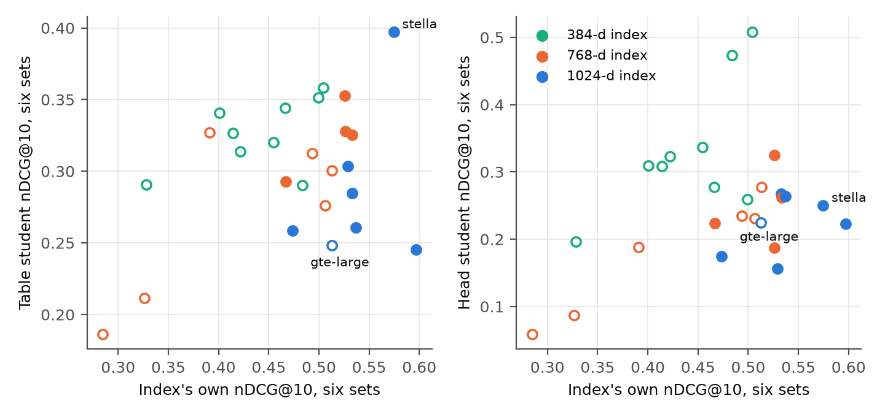
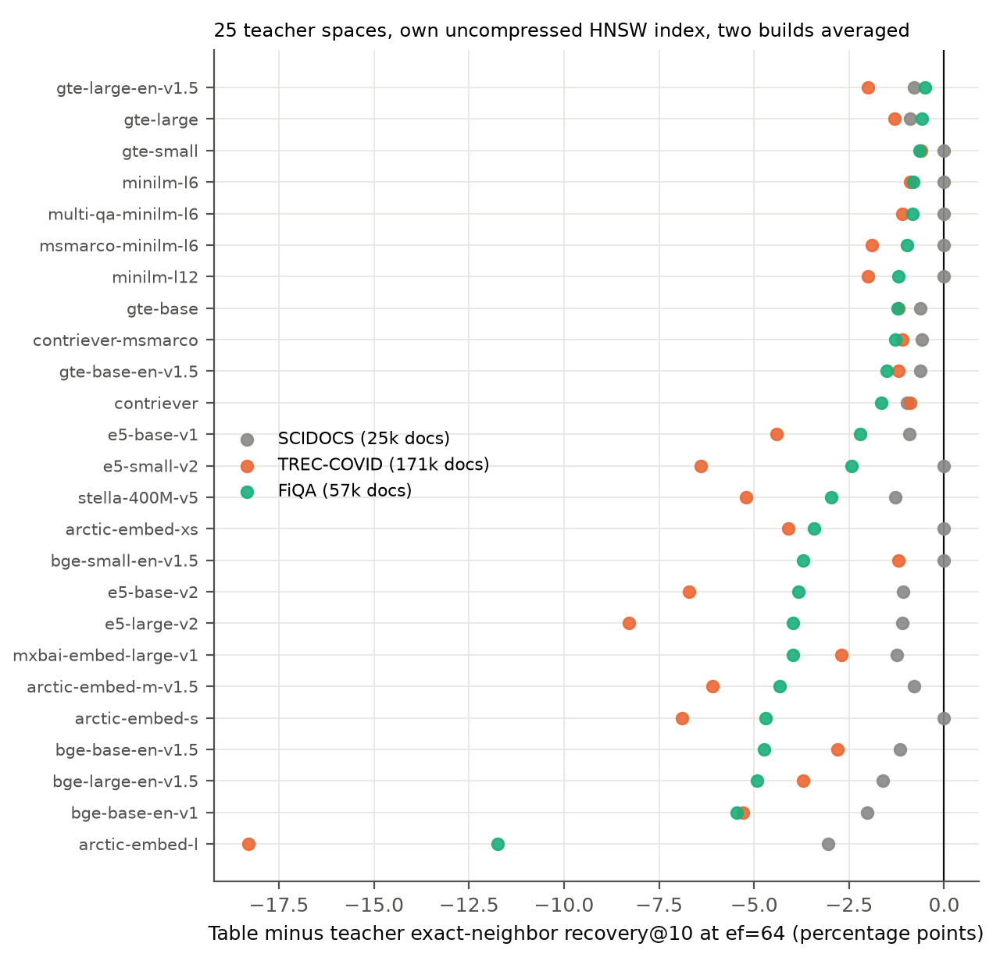
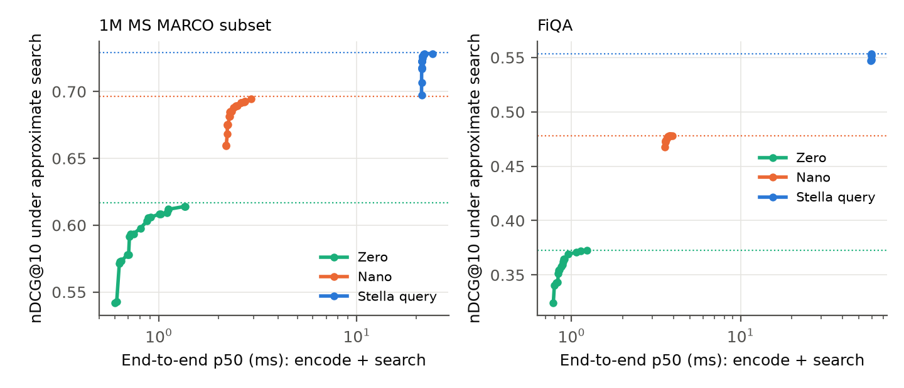
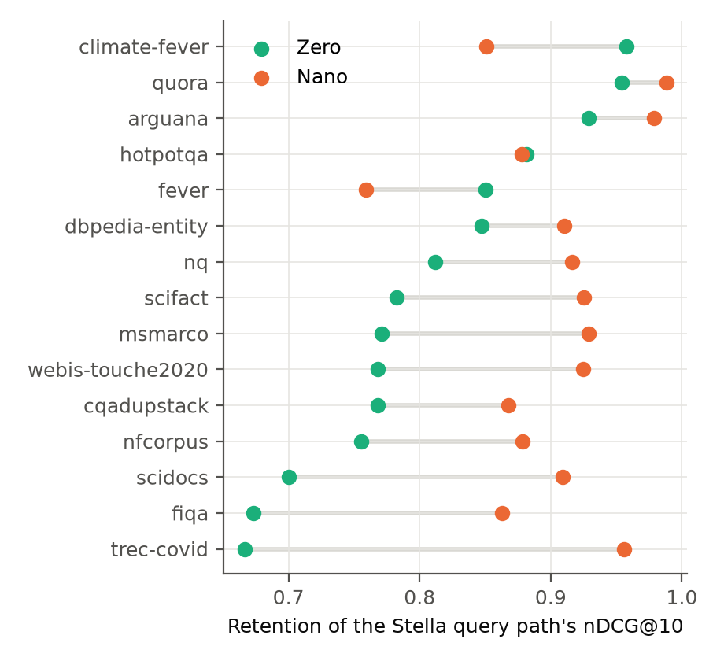

# Your Index Is Fine, Your Query Encoder Is Not: Query Distillation over Frozen Indexes

**Draft v20, 2026-10-02. Not for circulation.**

## Abstract

Document embeddings are reused across searches, allowing the cost of a large document encoder to be amortized, while every uncached query incurs an encoding cost. This asymmetry motivates replacing the query encoder with a smaller model that searches the existing document embeddings. Such a replacement can reduce query compute while avoiding the re-embedding and index migration required by a change of document encoder. We examine how the existing index shapes the retrieval quality and search cost of this replacement.

We fit two query-student representations by linear regression across 26 embedding models: a learned token-vector table and a frozen transformer with a learned projection. Their absolute retrieval quality is associated with both the original query path's quality and the document embedding dimensionality. At a given dimensionality, stronger original models tend to yield stronger students; after accounting for original-model quality, higher dimensionality predicts weaker students. Together, these properties predict student quality on held-out models better than original-model quality alone.

The encoding savings also depend on how the student's queries interact with approximate search. Token-table students require more graph-search effort to recover their exact nearest neighbors, with a corpus-dependent effect on retrieval relevance. Constella illustrates the combined trade-off: its compact transformer and token-table query encoders search the unchanged document index of the Stella embedding model, retaining 90.5% and 81.4% of Stella's exact-search nDCG@10 on BEIR-15. Separate timing measurements show that additional search work reduces their encoding savings. The existing index therefore shapes both the quality a smaller query encoder can achieve and how much of its encoding advantage translates into cheaper retrieval.

## 1. Introduction

The query and document encoders in dense retrieval serve different computational roles. Document embeddings are stored and reused across searches; query embeddings are computed as requests arrive. A smaller query encoder could exploit this asymmetry while searching the same document vectors. Its usefulness depends on both the retrieval quality it preserves and the search effort its embeddings require.

An existing document index constrains this choice: a replacement query encoder must produce vectors compatible with the stored document embeddings. Changing the document representation instead requires corpus re-embedding and index rebuilding; keeping retrieval available during the transition can require parallel indexes and ingestion pipelines, additional infrastructure load, relevance validation, and a rollback path [Index migration]. Query-only replacement preserves the stored vectors, making it possible to study how independently the query encoder can be chosen and what properties of the index govern the resulting trade-off.

**Query-side distillation** trains a student encoder to reproduce the frozen encoder's query vectors and search the frozen document vectors directly [QED, EmbedDistill, LEAF]. Static variants fit a token table, so a query costs a table lookup and a sum [pyNIFE, LightRetriever]. We study the retrieval quality and search effort of these replacements, and whether properties of the existing embedding space predict their performance.

We compare two student representations across 26 public encoder spaces, using inexpensive linear fits to keep construction consistent. The study separates the effect of replacing the query representation from the additional loss introduced by approximate search: first we evaluate the fitted queries by exact retrieval, then search them over unchanged graphs. Two questions organize the paper.

- **RQ1, student quality.** What exact-search retrieval quality can a linearly fitted query student achieve, and do embedding dimensionality (the number of vector components) and the original query path's measured quality predict it?
- **RQ2, search effort.** How much graph-search effort does the student need relative to the original query path, and can query placement predict its exact-neighbor recovery deficit at fixed effort?

Student quality follows two opposing associations: stronger original query paths favor the student, while higher dimensionality predicts weaker students. Combining them improves held-out prediction; a prospective test supports the head student's ranking, while the table result remains uncertain (Section 4). At fixed graph-search effort, token-table students recover fewer exact neighbors in every measured space on two of three corpora. The original queries' distance from documents predicts this recovery gap. LightRetriever's jointly trained lookup path also exhibits the deficit (Section 5).

**Constella** supplies the practical illustration: Stella's frozen document index [Stella] can be searched by its own query encoder, a separately trained 34.5-million-parameter transformer (Nano), or a token table (Zero). Section 6 measures their quality and how encoding savings change after search.

Throughout, "registered" marks the project's pre-registered evaluations, whose decision rules were fixed before any result was observed, and "exploratory" marks analyses added afterwards. The two index-wide screens that answer RQ1 and RQ2 are exploratory; their analyses were written down before scoring, and the prospective test of RQ1 commits its predictions before any student is fitted.

## 2. Related work

Query-side distillation against a frozen document encoder is established: QED retains 92.5% of a dense retriever's BEIR score with a two-layer student [QED], EmbedDistill distills an asymmetric student against the teacher's frozen document encoder [EmbedDistill], and LEAF reports 97.7% retention at 4.7-fold compression [LEAF]. pyNIFE fits a static token table to a frozen teacher [pyNIFE], while LightRetriever trains a lookup query side jointly with a document tower [LightRetriever]. Static sentence embeddings, Model2Vec, and NanoVDR explore related compact representations [StaticEmb, Model2Vec, NanoVDR]. RQ1 extends this work with a common-recipe comparison across encoder spaces; RQ2 tests LightRetriever's released lookup path over its own index alongside the fitted students.

Stronger teachers can produce weaker students in distillation generally [Cho and Hariharan 2019] and in dense retrieval [PROD]; those works discuss capacity gaps between teacher and student. Here, embedding dimensionality is a predictive property tested across encoder spaces, with held-out and prospective predictions.

Graph-based approximate search over HNSW is sensitive to where queries sit relative to the indexed vectors [HNSW]. Out-of-distribution queries can need more effort, and graph constructions use query samples to mitigate it [OOD-DiskANN, RoarGraph]. RQ2 examines query substitution over an unchanged graph. Query-aware decoding of binary sketches is the precedent for the precision control in Appendix C [QA-Cos].

## 3. Experimental setup

### 3.1 Encoder spaces

The roster is 26 public English embedding encoders that share the 30,522-entry BERT WordPiece vocabulary, a requirement of the table student. Ten were registered before any result; 16 were added as an exploratory expansion under the same recipe and selection order. Each encoder defines one frozen space: its document vectors are frozen and its own query encoder is the reference path. Appendix B gives the full roster and score ranges by dimensionality.

The roster spans nine related model families and three embedding sizes (384, 768, and 1024); several checkpoints are revisions of one another. We report checkpoint-resampling intervals alongside family-level sensitivity analyses. The arctic-embed-l mean-pooling control is excluded from roster statistics; its published CLS pooling is used for the roster entry.

### 3.2 Closed-form query students

The cross-model comparison uses two student representations fitted by ridge regression to the original encoder's query vectors. This gives each space the same inexpensive fitting procedure while comparing a static token representation with contextual transformer features. The original encoders and document vectors stay frozen throughout.

**Table student.** A 30,522-row table assigns one learned vector to each WordPiece token. A query is represented by the mean of its token vectors, including repeated tokens, followed by L2 normalization. Ridge regression fits the rows jointly, with a penalty toward vectors obtained by running individual tokens through the original encoder. Only the table is fitted; query encoding then consists of tokenization, lookups, and pooling.

**Head student.** The pretrained bge-small transformer [BGE] provides contextual features. We mean-pool the token states from layers 12, 8, and 4 using the attention mask and concatenate them into a 1,152-dimensional vector. A learned linear projection with bias maps this vector to the document embedding dimensionality, then L2 normalization produces the query vector. The backbone stays frozen, so fitting learns only the projection. This makes construction inexpensive; query inference still runs the bge-small backbone. Appendix B specifies both regression objectives and their solvers.

These fitted students support the comparison across encoder spaces. The released Zero and Nano models use additional optimization and different training data, described below; their measured performance is reported in Section 6.

### 3.3 Fit data, selection, and scoring

Both students are fitted on the same 337,981 screened fit queries, encoded by each index's own query path with its published prompt. The ridge penalty is chosen per index on two development forums (CQADupStack physics and programmers) and frozen before any public dataset is scored. Retrieval is scored by exact search, nDCG@10 with the registered self-hit drop, on six public BEIR datasets [BEIR]: NFCorpus, SCIDOCS, SciFact, TREC-COVID, FiQA, and ArguAna. The primary outcome is the unweighted mean nDCG@10 across these six datasets (the six-set macro); the four sets without disclosed exposure for the Stella instance (the first four) are a sensitivity outcome. Each index is scored once per set.

### 3.4 Approximate-search protocol

RQ2 uses Qdrant 1.19.1 [Qdrant 1.19.1] with uncompressed vectors, cosine distance, and hierarchical navigable small-world (HNSW) graphs (m=16, ef_construct=100). We build two graphs per space and workload using different seeded insertion orders. The workloads are FiQA (57,638 documents), SCIDOCS (25,657), and TREC-COVID (171,332). Each graph is searched with the original encoder's queries and both students' queries, sweeping `ef`, which controls the breadth of graph search, from 16 to 512.

We measure two effects of approximate search. **Relevance loss** is the fractional reduction in a path's nDCG@10 from its own exact-search score. **Exact-neighbor recovery** is the fraction of that path's exact top-10 documents recovered by graph search, with ties handled as specified in Appendix C. Each query path has its own exact-search reference.

The primary measure is the **relative-nDCG-loss multiplier**: the smallest student `ef` that matches or improves on the original path's relative loss at `ef=64`, divided by 64 and averaged over builds. For example, a multiplier of two means the student needs `ef=128` to meet that reference. If it cannot do so by `ef=512` in a build, that result is censored and its multiplier is at least eight. We also report the analogous multiplier for exact-neighbor recovery and the student-minus-original recovery gap at `ef=64`. These distinguish preserving relevance from recovering the exact neighbors. Appendix C gives the parity checks, tie rule, and tas-b exclusion.

### 3.5 Constella: separately trained query encoders for one index

Constella supplies two query encoders for Stella's 1024-dimensional document space (`stella_en_400M_v5`) [Stella]. Stella supplies fixed training targets and encodes the documents used for retrieval. Zero and Nano learn different query representations compatible with that space.

**Zero: a trained token table.** Zero learns one vector and one scalar weight per WordPiece token. Its first training phase combines agreement with Stella's query vectors and matching Stella's score distribution over candidate documents. A second, contrastive phase trains the query vectors to rank relevant documents above negatives, using frozen Stella document vectors. At export, scalar weights are folded into the table rows and the rows are quantized to int8. The served encoder pools token vectors with square-root count weights: a token occurring $c$ times contributes $\sqrt{c}$ times its stored vector. The pooled vector is L2-normalized. This representation gives each token the same vector in every query, trading contextual computation for lookup and pooling.

**Nano: a jointly optimized transformer and projection.** Nano starts from the 12-layer bge-small transformer and concatenates the 384-dimensional token states from layers 12, 8, and 4. A linear projection with bias maps the resulting 1,152 features to Stella's 1,024 dimensions; attention-masked mean pooling and L2 normalization produce the query vector. The projection is initialized by ridge regression, then the backbone and projection are trained together to minimize squared L2 error against normalized Stella embeddings. Training alternates three query batches with one document batch. Queries use Stella's query targets and documents use its document targets; retrieval uses Stella's stored document vectors. The resulting model has 34.5 million parameters.

Both models were selected through development evaluations before their benchmark results were scored. Their training sources, objectives, optimization settings, and selection procedures are specified in Appendix B. Zero's learned weights, contrastive training, and served pooling differ from the fitted table; Nano updates the backbone that the fitted head keeps frozen. These differences define the scope of the cross-model findings and the separate Constella evaluation.

## 4. RQ1: what the space predicts about student quality

### 4.1 Hypothesis and the pooled result

**H1.** The stronger the index's own retrieval, the stronger the closed-form student fitted to it; in particular, the strongest index yields the strongest student.

H1 was the project's initial selection rule. The strongest registered space, gte-large-en-v1.5, yields the weakest registered table student and a below-median head student. Stella has the second-highest original-encoder score in the same dimensionality band and yields the strongest table student. Across all 26 spaces, the rank correlation between the original encoder's score and its student's score is +0.09 for the table (95% checkpoint interval −0.39 to +0.52) and +0.09 for the head (−0.36 to +0.51). These wide intervals allow a moderate positive association. Section 4.4 evaluates the selection rule by the quality of the student it picks.

**Figure 1.** Student quality against the space's own quality for the table (left) and head (right) students, colored by dimensionality. Filled points are registered spaces; triangles are the prospective spaces of E24 (eight for the head, seven for the table).

### 4.2 Dimensionality as the competing explanation

**H1'.** At a given dimensionality, stronger spaces yield stronger students; after accounting for space quality, higher-dimensional embeddings predict weaker students. Support requires a dimensionality coefficient whose interval excludes zero and better held-out-family prediction than space quality alone.

Table B models the student's absolute six-set score using the space's own score and log2 embedding dimensionality. Standardized coefficients express the change in student quality, in standard deviations, per standard deviation of a predictor. Intervals use 10,000 checkpoint resamples. Leave-one-family-out prediction fits on eight model families and predicts the ninth.

**Table B.** Predicting student six-set nDCG@10 over 26 indexes (exploratory, analysis pre-specified). Each pair of rows compares a model using original-encoder quality alone with one that also uses dimensionality. $\beta$ denotes a standardized coefficient, with a 95% interval in brackets. R² measures in-sample fit; held-out $\rho$ is Spearman correlation across leave-one-family-out predictions.

| Student | Predictors | Quality $\beta$ | Dimensions $\beta$ | R² | Held-out $\rho$ |
|---------|-------------|-------------------------|-------------------------|------:|------------:|
| Head | quality | +0.34 [−0.16, +0.65] | | 0.12 | −0.17 |
| Head | quality + dimensions | +0.69 [+0.40, +0.97] | −0.83 [−1.14, −0.60] | 0.70 | +0.69 |
| Table | quality | +0.37 [−0.30, +0.72] | | 0.14 | −0.15 |
| Table | quality + dimensions | +0.63 [+0.06, +0.89] | −0.64 [−0.95, −0.32] | 0.48 | +0.40 |

Space quality and dimensionality correlate at +0.61 across the roster. Their opposing associations with student quality help explain the near-zero pooled rank correlation. Given dimensionality, the partial rank correlation between student and index quality is +0.58 for the head and +0.45 for the table. Table B shows a larger standardized coefficient for dimensionality under the head representation and coefficients of similar magnitude under the table representation. On the four datasets without disclosed Stella exposure, the dimensionality association persists, while the table student's original-quality coefficient interval slightly crosses zero. Appendix B gives this sensitivity and the family-adjusted fits.

### 4.3 Held-out and prospective prediction

We test whether the quality-and-dimensionality model ranks further encoders better than their own retrieval scores do. Fitted on the ten registered spaces, the model ranks the 16 later spaces at Spearman 0.85 [0.53, 0.99] for the head and 0.70 [0.20, 0.96] for the table; the original scores alone rank them at 0.37 and 0.16. Because the hypothesis was formed after all 26 spaces had been seen, this split provides retrospective validation. The following test evaluates predictions committed before the students were fitted.

For the prospective test, we chose eight previously unscored BERT-vocabulary encoders spanning the three embedding sizes, fitted the model on the 26, and committed its predictions by hash before fitting any student (Appendix B). One table fit stopped at the convergence gate, leaving seven table students and eight head students. The committed predictions rank them at Spearman +0.86 [+0.33, +1.00] for the head and +0.71 [−0.12, +1.00] for the table, against +0.26 and +0.39 for the original scores alone. Mean absolute error of the predicted six-set score is 0.039 (head) and 0.032 (table). The head's checkpoint interval supports a positive association; the table's wider interval leaves its prospective result uncertain.

### 4.4 Choosing a document encoder for a future index

When the document encoder can still be chosen, the objective is to select a space in which the fitted query student retrieves well. We compare three selection rules:

- **Original-encoder quality:** choose the space with the highest six-set score under its own query encoder (H1).
- **Quality and dimensionality:** choose the space with the highest predicted student score from the two-variable model in Section 4.2.
- **Student development score:** fit each candidate's student and choose the one that retrieves best on the two development forums from Section 3.3.

Table C reports the **score gap** between the best student available in each candidate pool and the student selected by a rule. This is an absolute difference in six-set nDCG@10, often called selection regret. Lower is better; zero means the rule selected the best available student. Each student representation is evaluated separately.

**Table C.** Student score lost through document-encoder selection. Panel (a) uses all 26 spaces; panel (b) uses only the prospective candidates. Model predictions in (a) leave each candidate out of fitting; predictions in (b) were fitted on the original 26 and committed before fitting the new students. Chosen encoder names are in Appendix B.

**(a) Original 26 candidate spaces**

| Selection rule | Head score gap | Table score gap |
|---|---:|---:|
| Original-encoder quality | 0.285 | 0.152 |
| Quality and dimensionality | 0.249 | 0.107 |
| Student development score | 0.035 | 0.000 |

**(b) Prospective candidates: eight head students, seven table students**

| Selection rule | Head score gap | Table score gap |
|---|---:|---:|
| Original-encoder quality | 0.086 | 0.107 |
| Quality and dimensionality | 0.000 | 0.043 |
| Student development score | 0.000 | 0.043 |

Across the original 26 spaces, evaluating the student's development retrieval makes a substantially better choice than either rule based on space properties. For example, selecting by original-encoder quality loses 0.285 nDCG@10 for the head student, compared with 0.035 when selecting by the student's development score. The quality-and-dimensionality model improves ranking across spaces (Sections 4.2 and 4.3), but its top choice still has a large score gap. Predicting the overall ranking and selecting its best member are different tests.

On the prospective candidates, the committed model and development screen choose the same spaces: the best head student and a table student 0.043 below the best. Selecting by original-encoder quality has the largest gap in both candidate pools. These results concern the two closed-form student recipes.

## 5. RQ2: what the index decides about search effort

### 5.1 Hypothesis

**H2.** Over an unchanged HNSW graph, the student's query path needs more effort than the original query path to recover the same fraction of its own exact neighbors.

Section 4 measures exact retrieval quality. Here, we search the same fitted queries over each space's graph to measure the additional approximation loss. Query placement relative to documents motivates the hypothesis; Section 5.3 tests whether placement features predict the recovery deficit at fixed `ef=64`.

### 5.2 Effort across 25 indexes

H2 predicts a multiplier above one in most spaces on every workload. Table D tests it.

**Table D.** Table-student search effort across 25 indexes, averaged over two builds (exploratory, analysis pre-specified). Multipliers compare the student with the original path at `ef=64`; values above one mean greater effort. Censoring means at least one build failed to reach the reference by `ef=512`. Gaps are in percentage points (pp).

**(a) Relevance-loss effort**

| Workload | Documents | Indexes $>1$ / $\leq1$ | Censored | Median, reached |
|---|---:|---:|---:|---:|
| FiQA | 57,638 | 25 / 0 | 4 | 4.0 |
| SCIDOCS | 25,657 | 17 / 8 | 8 | 1.25 |
| TREC-COVID | 171,332 | 12 / 13 | 8 | 0.25 |

**(b) Exact-neighbor recovery**

| Workload | Mean gap at ef=64 (pp) | Indexes with deficit | Median effort multiplier |
|---|---:|---:|---:|
| FiQA | −2.9 | 25 of 25 | 4.0 |
| SCIDOCS | −0.8 | 17 of 25 | 2.0 |
| TREC-COVID | −3.9 | 25 of 25 | 4.0 |

**Figure 2.** Student-minus-original exact-neighbor recovery at `ef=64`, by index and workload, averaged over two builds. Negative values mean the table student recovers fewer of its own exact neighbors.

The relevance-loss multiplier exceeds one on FiQA (25 of 25, median four over the 21 reached, four censored in at least one build) and on SCIDOCS (17 of 25). It is mixed on TREC-COVID (12 of 25): over 50 queries, the index's own path loses only 0.2% of nDCG at `ef=64`, so the relative-loss threshold there is sensitive to differences smaller than its noise. Exact-neighbor recovery gives a more consistent result: its median effort multiplier exceeds one on all three workloads (Table D). At `ef=64`, the table student recovers fewer exact neighbors in every space on FiQA and TREC-COVID, and in 17 of 25 on SCIDOCS. The head student also has a recovery deficit in 24 of 25 spaces on FiQA and 23 of 25 on TREC-COVID.

We test whether corpus size contributes to the smaller deficit on SCIDOCS by subsampling FiQA to SCIDOCS's 25,657 documents. With the same queries and two rebuilt graphs per space (exploratory, pre-specified; Appendix C), the gap at `ef=64` moves from −2.9 points to −1.2, a paired change of +1.8 points (95% interval over spaces +1.3 to +2.3). It remains 0.4 points larger than SCIDOCS's (−0.9 to −0.1). The subsample reproduces much of SCIDOCS's attenuation, with a remaining difference between the corpora.

### 5.3 Can query placement predict the recovery gap?

We next test whether measurements of query placement, computed before graph construction, predict the recovery gap across spaces. We declared nine features and two covariates before computing them (exploratory, pre-specified; Appendix C). Table F focuses on the query-to-document distance ratio: the distance from queries to their nearest documents, relative to the typical distance between neighboring documents. Correlations use 75 space-by-workload points, with intervals resampling each space together with its three workload rows. Held-out prediction fits a ridge model on all families except one and predicts that family.

**Table F.** Predictors of the recovery gap over 75 points (25 spaces by three workloads). $\rho$ denotes Spearman correlation. In the association column, negative correlation means a larger feature value accompanies a more negative recovery gap. In the held-out column, positive correlation means predicted and observed gaps rank spaces similarly. MAE is mean absolute error in percentage points (pp).

| Predictor | Association $\rho$ | 95% interval | Held-out $\rho$ | MAE (pp) |
|------------------------|------------:|------------------|------------:|----------:|
| Distance ratio, original queries | −0.64 | [−0.75, −0.48] | +0.64 | 1.26 |
| Distance ratio, student queries | −0.63 | [−0.74, −0.46] | +0.56 | 1.79 |
| All features and covariates | | | +0.73 | 1.40 |
| Training-fold mean | | | | 2.22 |

Spaces with queries farther from documents tend to pay a larger recovery penalty. The ratio computed from the original encoder's queries predicts held-out families with lower absolute error than the all-feature model (Table F), so the existing query path already supplies a useful predictor. The change in distance ratio from original to student queries predicts poorly on held-out families (Appendix C). The original-query ratio therefore marks susceptibility of a space and workload to the deficit; the regression leaves its cause unresolved. The association is clearest on FiQA and TREC-COVID; on SCIDOCS its interval includes zero.

Prediction across workloads is less precise. A model fitted on two workloads ranks the third at +0.50, but its mean error is 2.55 points against 2.33 for the training-fold mean. The ratio therefore supports relative ranking, with the magnitude of the penalty requiring calibration on the target workload.

### 5.4 The penalty in a jointly trained model

**H2d.** The lookup recovery deficit should recur when the lookup side is trained jointly with the document tower. This tests recurrence beyond the frozen-teacher fits. We tested the released LightRetriever model (Qwen2.5-1.5B with its published adapter) over its own FiQA and SCIDOCS document vectors, comparing its lookup query path with the same model's full query encoding under the Section 3.4 protocol, with the model's web-search instruction as the primary prompt and the task prompt as secondary. Predictions and quantities were fixed before encoding (exploratory, pre-specified).

**Table E.** LightRetriever lookup versus full query encoding over its own index, two builds averaged. Exact scores are nDCG@10; effort columns are `ef` multipliers; gaps are lookup-minus-full recovery at `ef=64`, with query-resampling intervals.

| Workload | Prompt | Exact score, lookup / full | Loss effort (builds) | Recovery effort | Gap (pp), 95% interval |
|---|---|---:|---|---:|---|
| FiQA | web search | 0.4065 / 0.4752 | 3.0 (2, 4) | 4.0 | −3.6 pp [−4.3, −2.9] |
| FiQA | task | 0.4124 / 0.4766 | 2.0 (2, 2) | 4.0 | −2.3 pp [−2.9, −1.8] |
| SCIDOCS | web search | 0.1655 / 0.1925 | 2.25 (0.5, 4) | 4.0 | −1.7 pp [−2.1, −1.4] |
| SCIDOCS | task | 0.1818 / 0.2017 | censored (1, censored) | 2.0 | −0.7 pp [−1.0, −0.5] |

The lookup path recovers fewer of its own exact neighbors at `ef=64` on both corpora under both prompts, with query intervals clear of zero. Matching the full path's recovery takes four times the `ef` in every FiQA build and under the primary SCIDOCS prompt. The relevance-loss multiplier agrees on FiQA (two to four); on SCIDOCS, both paths lose under 0.1% of nDCG at `ef=64`, making that reference sensitive to very small differences. GPU encoding took 0.10 ms for the lookup path and 0.90 ms for the full path. These encoding timings and graph-effort multipliers measure separate components; Section 6 combines encoding and search timing for Constella.

The `ef` multipliers measure graph-search effort. Relevance loss and exact-neighbor recovery give complementary views of the substitution, with different conclusions on TREC-COVID and on LightRetriever's SCIDOCS index.

## 6. The Constella instance

The cross-space fits make a broad comparison possible at low construction cost. Constella illustrates compatible query paths optimized further for one space: its separately trained Zero and Nano models combine cheaper encoding with different quality and search requirements. Their distinct recipes make this an operating-cost illustration; transfer of the RQ1 predictor to fully trained students remains open. Table 1 reports exact retrieval over BEIR-15.

**Table 1.** Three query paths over one frozen Stella index. Quality is the unweighted mean exact-search nDCG@10 across BEIR-15; share of Stella is the ratio to Stella's score. Encoding medians: 100 real 5-to-12-word queries, batch one, four CPU threads, Apple M5 Pro, registered protocol.

| Query encoder | nDCG@10 | Retention | Encode p50 | Size |
|---|---:|---:|---:|---:|
| Stella query encoder | 0.5614 | reference | 31.6 ms | 1669.6 MiB |
| Nano (34.5M transformer) | 0.5081 | 90.5% | 2.25 ms | 132.3 MiB |
| Zero (token table) | 0.4572 | 81.4% | 0.044 ms | 90.1 MiB |

All three query paths were verified against the same populated collections, allowing each request to choose a compatible encoder. Appendix A gives the per-dataset results and selected-reference comparisons.

**Construction cost.** The cross-space table screening fit took four to seven A100 minutes per encoder, including query encoding except for Stella's cached targets. Released Zero uses the additional training phases in Section 3.5. Nano's final optimization took 57.3 A100 hours, about $95 at the recorded rental rate, excluding data preparation, recipe search, failed runs, and evaluation. Appendix B gives the component costs.

Table 2 combines separate timing measurements on the same laptop: encoding the 100 medium-length queries from Table 1, and searching a one-million-passage MS MARCO diagnostic with 6,980 development queries. The diagnostic retains every judged-positive passage and samples the remaining documents; its reduced competition makes relevance optimistic relative to the full corpus (Appendix C). Search uses uncompressed vectors at settings within 1% of each path's own exact score. Summing the medians and scaling to one million queries gives the component costs below.

**Table 2.** Encoding-plus-search hours per million queries on the measurement laptop, extrapolated from Table 1 and Appendix C medians. Search settings keep each path within 1% of its own exact score.

| Query encoder | Encoding | Search | Total | Share of Stella |
|---|---:|---:|---:|---:|
| Stella query encoder | 8.78 h | 0.43 h (`ef=128`) | 9.2 h | reference |
| Nano | 0.63 h | 0.61 h (`ef=256`) | 1.2 h | 13% |
| Zero | 0.01 h | 0.99 h (`ef=512`) | 1.0 h | 11% |

Search time at a fixed `ef` differs by less than 5% across paths. The extra work comes from the larger `ef` needed to reach each path's relative-quality target: 128 for Stella, 256 for Nano, and 512 for Zero. Zero's extra search largely consumes its encoding advantage over Nano, bringing their extrapolated encoding-plus-search times close together (Table 2). Their exact BEIR-15 quality is reported separately in Table 1. On one binary-quantized collection, the 63-fold encoding gap between Zero and Nano becomes 2.2-fold after search, at different quality levels (Figure 3). Appendices C and D report query-precision controls, lexical fusion, and per-query routing over the same index.

**Figure 3.** Approximate-search quality against encoding plus search time on FiQA and the positive-preserving MS MARCO diagnostic, registered sweep. Dotted lines are each path's exact score.

## 7. Discussion

Document-encoder quality and student quality can favor different choices. The strongest original encoder produced the weakest registered table student. Accounting for dimensionality exposes the positive quality association hidden in the pooled comparison, yet directly evaluating a fitted student's retrieval gives the better selection on the original roster. The space properties provide a forecast; the student evaluation tests the actual choice.

Replacing only the query encoder also changes the work needed to recover its exact neighbors. The recovery deficit recurs across spaces and in a jointly trained lookup model. Its relevance consequences depend on the workload. Constella makes the cost consequence concrete: Zero's much faster encoding brings only a small advantage over Nano after uncompressed search, alongside lower exact relevance. Compatible query encoders make different compute budgets possible over the same document vectors. Their value is determined jointly by relevance, encoding, and the search settings needed to recover their results.

## 8. Limitations

RQ1 covers two closed-form recipes over 26 related spaces at three embedding sizes. Dimensionality covaries with family and quality, making its association predictive rather than causal. Checkpoint-resampling intervals describe variation within this roster; family-level prediction tests transfer across its families. Transfer to fully trained students such as Zero and Nano remains an open question.

RQ2 covers one engine, one graph configuration, and three workloads with different sizes and domains, including 50 queries on TREC-COVID. Its predictors estimate recovery gaps at fixed effort; cross-space timing ran on a shared machine, so latency conclusions rely on the separate Constella sweep. The LightRetriever replication covers one released 1.5-billion-parameter model, our reproduction of its dense path, and two corpora.

Constella's students use different training pools, including different FEVER exposure, and Stella discloses exposure on ArguAna, FiQA, and FEVER. Query intervals condition on the trained models.

## Artifact availability

The companion repository holds inference examples, build configurations, methods with their dated amendments, immutable result receipts, per-dataset tables, and the full research history including negative results. The released artifacts are Constella Zero, Constella Nano, and the Stella document encoder on the Hugging Face Hub. Two inputs are identified by hash but not yet archived in the repository: the cleaned 337,981-query fit list and the sampled one-million-passage identifier list. Prepared Zero and Nano training corpora are described by source and file manifests rather than bundled as raw text.

## Appendix A. Registered evaluations of the instance

**Serving configuration.** Stella is pinned to revision `ffeb2b7e`, with its `s2p_query` prompt, fp32 encoding, normalized output, fp16 stored document vectors, and cosine similarity; maximum sequence length 512. Zero's training pool includes FEVER-train and HotpotQA; Nano excludes FEVER. MS MARCO is licensed for non-commercial use, so it was validation-only in our distillation: it supplied no training targets, negatives, or generation seeds, although Nano's pretrained base has prior exposure to it.

**Figure A1.** Retention per dataset. Datasets with disclosed Stella training exposure are ArguAna, FiQA, and FEVER; the four originally held-out sets are FEVER, DBpedia-entity, and the CQADupStack android and english forums.

**Variation across datasets.** Zero's sum of token vectors is insensitive to word order and context. Its retention is 0.67 on TREC-COVID and FiQA, against 0.95 on Quora. Nano's retention ranges from 0.85 to 0.99 except FEVER, which was in Zero's training pool and excluded from Nano's. These dataset differences describe the released models and their distinct training pools.

**Partitions.** The six-set suite is NFCorpus, SCIDOCS, SciFact, TREC-COVID, FiQA, and ArguAna. "Clean-four" means the first four, which have no disclosed Stella overlap; it is not a causal contamination estimate. Four datasets were held out and evaluated once: FEVER, DBpedia-entity, and the CQADupStack android and english forums. Two other forums, physics and programmers, select table penalties and routing settings and were reused during model construction.

**Reference systems.** bge-small-en-v1.5 and LEAF were selected for the project's original evaluations. Each uses its own document representation. On BEIR-15 they score 0.5171 and 0.5402 against Nano's 0.5081, at 2.57 and 1.39 ms median encoding; BM25 scores 0.4006. Nano's broad-average score is below both dense references; the registered partition-specific contrasts follow.

**Nano's registered contrasts** report nDCG@10 differences and used a fixed sequence with one-sided 2.5% lower bounds. "Established" means the bound cleared zero; "unresolved" means it did not; "descriptive" rows were registered as reports, not tests. Intervals resample queries with the models fixed.

| Contrast | Partition | Score difference | Outcome |
|---|---|---:|---|
| Nano − bge-small | clean-four | +0.0176; lower bound +0.0037 | established |
| Nano − bge-small | all six | +0.0274; lower bound +0.0173 | established |
| Nano − LEAF | all six | +0.0162; lower bound +0.0065 | established |
| Nano − LEAF | clean-four | −0.0011; lower bound −0.0145 | unresolved |
| Nano − bge-small | held-out NDO-3, dataset weighted | +0.0032 [−0.0069, +0.0134] | descriptive |
| Nano − bge-small | held-out NDO-3, query pooled | −0.0121 [−0.0219, −0.0024] | descriptive |
| Nano − LEAF | held-out NDO-3 | −0.0389 [−0.0488, −0.0290] | descriptive |

NDO-3 is the registered held-out aggregate: DBpedia-entity weighted one half, the android and english forums one quarter each, FEVER excluded as the double-exposure sensitivity row.

**Zero's registered contrasts** report nDCG@10 differences and used a Holm correction across the family. Zero missed its dense bar and did not confirmatorily beat BM25.

| Contrast, all six | Score difference | Raw 95% interval | Outcome |
|---|---:|---|---|
| Zero − LightRetriever dense | −0.0243 | [−0.0405, −0.0086] | below the 0.4583 bar |
| Zero − BM25 | +0.0165 | [+0.0017, +0.0311] | unresolved; p=.0149 fails Holm .0083 |
| Zero + BM25 (convex) − OpenSearch | +0.0043 | [−0.0063, +0.0151] | unresolved |

The registered clean-four sensitivity is descriptive: −0.0443 [−0.0675, −0.0212], −0.0311 [−0.0517, −0.0109], and −0.0107 [−0.0262, +0.0043]. Unresolved superiority does not establish equivalence. The confirmatory fusion operator was convex score fusion with development-fitted weight 0.8 at depth 1000; the later DBSF-at-100 recommendation is a deployability choice, not a new confirmation. On the development components DBSF minus convex is +0.0035 at 10 candidates, −0.0020 at 50, −0.0063 at 100, and −0.0146 at 1000.

**The held-out four**, copied from their one-shot published aggregate:

| System | FEVER | DBpedia | Android | English |
|---|---:|---:|---:|---:|
| Nano | 0.6231 | 0.4190 | 0.4774 | 0.4298 |
| Zero | 0.6978 | 0.3900 | 0.4431 | 0.3690 |
| Stella | 0.8207 | 0.4603 | 0.5275 | 0.5183 |
| bge-small | 0.8662 | 0.4003 | 0.4761 | 0.4558 |
| LEAF | 0.8671 | 0.4520 | 0.5260 | 0.4707 |
| BM25 | 0.5036 | 0.3045 | 0.3952 | 0.3481 |
| Zero + BM25 | 0.7559 | 0.4030 | 0.4629 | 0.4016 |
| Nano + BM25 | 0.6879 | 0.4296 | 0.4750 | 0.4323 |

**Precision.** All released paths run in fp32 through the published loader.

## Appendix B. Construction details

**Fitted table: objective and preprocessing.** Let $X$ contain each query's token counts divided by its token count, $Y$ the original encoder's query vectors, and $W_0$ its normalized outputs for individual tokens encoded between the tokenizer's special tokens. We fit the table $W$ by

$$
\min_W \|XW-Y\|_F^2 + \lambda\|W-W_0\|_F^2.
$$

The initialization and regularization anchor therefore use the encoder's complete pooling and output projection. Tokenization includes special tokens, uses no student query prefix, and truncates at 512 tokens. The student mean-pools table rows and L2-normalizes the result. Block conjugate gradient solves the normal equations; every output column must pass the relative-residual tolerance (1e-6 in fp32, 1e-8 in fp64). The penalty grid is 1e-4 to 1e-1, extended by one decade once when the best development value is at an edge. The chosen value maximizes exact-search nDCG@10 on the two development forums and is frozen before six-set scoring. The fit list was cleaned after an earlier version had 1.31% held-out-query overlap. One expanded-roster checkpoint failed the convergence gate and is excluded. Registered checkpoint exposure is documented; the exploratory expansion was not individually audited.

**Fitted head: objective and features.** Frozen bge-small at revision `5c38ec7c` supplies attention-masked mean states from layers 12, 8, and 4. Concatenating them with a constant bias feature gives the design matrix $F$ with 1,153 columns. A dense solve fits $A$ to the same targets $Y$:

$$
\min_A \|FA-Y\|_F^2 + \lambda\frac{\operatorname{tr}(F^\top F)}{1153}\|A\|_F^2.
$$

The bias is regularized along with the other coefficients, and the prediction $FA$ is L2-normalized for retrieval. The penalty grid, development criterion, and selection order match the table's. The backbone stays fixed throughout. bge-small-en-v1.5 is also an index in the roster and shares the backbone, and gte-small is nearly its linear image (retention 1.008 and 0.978); correlations without the backbone are +0.09 against the index and +0.46 against the table.

**Released Zero: data and initialization.** Zero's training uses 338,076 usable query-document pairs plus 220,632 query-only rows from Amazon ESCI, FEVER-train, HotpotQA-train, SQuAD-train, Mr. TyDi English, NQ Open, and TriviaQA. These are distinct from the cleaned 337,981-query list used for the fitted students. The distillation phase also uses 924,704 short spans drawn from the document pool as pseudo-queries. Each of the 30,522 table rows starts from Stella's normalized output for that token in a short context; a learned scalar token weight starts from inverse document frequency. Stella's weights, query targets, and document vectors stay frozen, while table rows and token weights are optimized.

**Zero's two training phases.** The first phase runs for 16,000 steps with batches of 512 and ordinary count pooling. Half of each batch is drawn from the combined query-only and pseudo-query pool and receives cosine alignment loss. The paired-query half combines cosine alignment with KL divergence from Stella's softmax score distribution over a positive document and 31 distractors sampled from a document-vector bank. The extra-text cosine mean is added separately to the paired-query loss. The cosine and KL weights are 1 and the score temperature is 0.02. Adam uses learning rates 3e-3 for rows and 1e-2 for token weights. A row penalty of 1e-3 pulls toward initialization, divided by one plus that row's update count.

The second phase starts from that checkpoint and runs 2,500 contrastive steps on the paired queries. InfoNCE scores the positive against 32,768 sampled bank negatives plus dataset-provided negatives, at temperature 0.02. Known positives are masked from the negatives; Stella also masks a candidate whose score exceeds the positive's score minus 0.02. Adam uses peak learning rates 1e-3 for rows and 1e-2 for weights, with 200 warmup steps followed by linear decay to a tenth of those rates. The row penalty is anchored to the starting checkpoint and both phases use seed 0. The bank contains 2,000,000 frozen document vectors.

**Zero's selection and served representation.** Development retrieval selected the final two-phase recipe and, after training with mean pooling, selected square-root count pooling for the unchanged table. Export folds the learned scalar weights into the rows and applies per-row absolute-maximum int8 quantization with fp32 scales. At inference, a token occurring $c$ times contributes $\sqrt{c}$ times its dequantized row before L2 normalization. Rows never updated in either phase remain at their initialization. The development suite comprises NQ, HotpotQA, two CQADupStack forums, and two held-out training-source slices; it was reused during recipe selection. Its training-adjacent components and adaptive reuse motivate reporting the benchmark evaluations separately (Appendix A).

**Released Nano: data and objective.** Nano's deduplicated pool contains 3,486,034 query texts: 403,443 real queries from ESCI, HotpotQA, Mr. TyDi, NQ Open, SQuAD, and TriviaQA; 999,744 PAQ questions; 1,248,385 harvested texts; and 834,462 generated queries. Harvested claims, titles, and keywords are drawn from Wikipedia, arXiv metadata, and the licensed document pool. Queries are sampled with replacement to give equal presentation shares to 12 forms: factoid, how-to, claim, argument, finance, title, keyword, health, product, comparison, yes/no, and conversational. The 6,070,049 eligible training documents are replayed in reshuffled epochs. FEVER is excluded from both pools. Queries have no student prefix and document examples receive `passage: `; targets use Stella's corresponding query or document encoding. The training objective is mean squared L2 distance between normalized student and target vectors, with three query batches followed by one document batch. The document examples train Nano, while Stella remains the document encoder used at retrieval.

**Nano's generated queries and filtering.** The generation recipe uses Qwen3-8B-AWQ at revision `4da05a8e`, with thinking disabled, temperature 0.8, top-p 0.95, and request seeds derived from passage identifiers. The seven generated forms are how-to, argument, finance, health, comparison, yes/no, and conversational. Finance and health queries use Wikipedia body passages; the other five forms use passages from the HotpotQA corpus. Form-specific prompts request five queries per passage; the reply must parse as a JSON list, with one retry on failure. Token budgets are 60 per requested query, or 400 for argument and conversational forms. Assembly applies form-length checks, exact deduplication, document-based hold-out exclusions, query and document overlap screens, and rejection of copied spans of five words. Forms with a near-duplicate rate above 25% retain only representative queries; a form with fewer than 50,000 survivors is dropped. A seeded uniform sample caps each generated form at 143,000 queries before corpus-wide deduplication. The companion repository provides the prompts, source revisions, filtering rules, and manifests identifying the resulting texts.

**Nano's initialization, optimization, and selection.** The bge-small backbone is pinned to revision `5c38ec7c`. Its layers 12, 8, and 4 supply 1,152 features per token to a biased linear projection into 1,024 dimensions, followed by masked mean pooling and normalization. A ridge warm start fits the projection on 60,000 training queries (seed 21), using a 50,000/10,000 split to select the penalty by normalized squared L2 error from 1e-6 to 1; the selected penalty is 0.001 and the projection is refitted on all 60,000 queries. A linear projection commutes with mean pooling, so this pooled-feature initialization gives the same query computation as applying the projection before pooling in the served model.

The backbone and projection then train jointly with AdamW: batch 32, seed 0, betas (0.9, 0.999), epsilon 1e-8, weight decay 0.01 on matrices and zero on one-dimensional parameters, and gradient clipping at norm 1. CUDA forward passes use bf16 and the loss uses fp32. Three cycles decay linearly from 1e-4 to 1e-5, with a 64,000-example warmup in the first cycle. The released model is the third cycle-end checkpoint, after 199,999,721 example presentations. Recipe screening and scheduled monitoring use a development relevance macro that weights four families equally: six BRIGHT slices, MedicalQARetrieval, LEDGER, and the LegalBench CorporateLobbying and ConsumerContractsQA datasets. Scores are averaged within each family first. Registered screening rules selected the recipe, retaining defaults when comparisons were unresolved. The companion repository records the data manifests, generation prompts, source revisions, selection rules, and released artifact hashes.

**Selection details for Table C.** In the original 26-space comparison, the quality-and-dimensionality rule predicts each candidate using a separate fit on the other 25, then selects the highest prediction. The best available student score is the benchmark for all three rules. Their chosen spaces are:

| Selection rule | Head choice | Table choice |
|---|---|---|
| Original-encoder quality | gte-large-en-v1.5 | gte-large-en-v1.5 |
| Quality and dimensionality | arctic-embed-s | gte-small |
| Student development score | gte-small | stella-400M-v5 |

The development scores also predict six-set student rank at Spearman 0.84 (head) and 0.88 (table). Adding development score to the quality-and-dimensionality model gives it the largest standardized coefficient (+0.71 [+0.36, +0.99] for the head) and raises leave-one-family-out prediction to 0.77 and 0.80.

The head's backbone, bge-small-en-v1.5, is also a roster encoder. Removing it changes the statistics reported in Section 4.4 by less than 0.06.

**Table B1.** The 26 encoder spaces by dimensionality (full roster in Appendix B). Score columns give the range of six-set nDCG@10 for the original query encoder and its two students (Sections 3.3 and 4).

| Dimensions | Spaces (registered) | Original score | Table score | Head score |
|---:|---:|---|---|---|
| 384 | 9 (0) | 0.328 to 0.504 | 0.290 to 0.358 | 0.196 to 0.508 |
| 768 | 10 (4) | 0.285 to 0.533 | 0.186 to 0.353 | 0.059 to 0.325 |
| 1024 | 7 (6) | 0.474 to 0.597 | 0.246 to 0.397 | 0.156 to 0.268 |

**The roster.** The 26 spaces of Section 3.1, by dimensionality and original-encoder six-set score. All score columns are nDCG@10. Pool is document-vector pooling; status is registered (Reg.) or exploratory (Expl.).

| Encoder | Dim. | Pool | Original | Table | Head | Status |
|---|---:|---|---:|---:|---:|---|
| bge-small-en-v1.5 | 384 | cls | 0.5042 | 0.3581 | 0.5084 | Expl. |
| arctic-embed-s | 384 | cls | 0.4993 | 0.3516 | 0.2594 | Expl. |
| gte-small | 384 | mean | 0.4838 | 0.2903 | 0.4733 | Expl. |
| arctic-embed-xs | 384 | cls | 0.4662 | 0.3440 | 0.2779 | Expl. |
| e5-small-v2 | 384 | mean | 0.4544 | 0.3203 | 0.3367 | Expl. |
| minilm-l12 | 384 | mean | 0.4219 | 0.3138 | 0.3229 | Expl. |
| minilm-l6 | 384 | mean | 0.4142 | 0.3267 | 0.3088 | Expl. |
| multi-qa-minilm-l6 | 384 | mean | 0.4008 | 0.3406 | 0.3094 | Expl. |
| msmarco-minilm-l6 | 384 | mean | 0.3281 | 0.2905 | 0.1962 | Expl. |
| gte-base-en-v1.5 | 768 | cls | 0.5331 | 0.3252 | 0.2618 | Reg. |
| arctic-embed-m-v1.5 | 768 | cls | 0.5263 | 0.3279 | 0.1874 | Reg. |
| bge-base-en-v1.5 | 768 | cls | 0.5259 | 0.3529 | 0.3249 | Reg. |
| bge-base-en-v1 | 768 | cls | 0.5131 | 0.3004 | 0.2773 | Expl. |
| gte-base | 768 | mean | 0.5063 | 0.2762 | 0.2314 | Expl. |
| e5-base-v1 | 768 | mean | 0.4934 | 0.3126 | 0.2345 | Expl. |
| e5-base-v2 | 768 | mean | 0.4669 | 0.2930 | 0.2241 | Reg. |
| contriever-msmarco | 768 | mean | 0.3909 | 0.3270 | 0.1879 | Expl. |
| tas-b | 768 | cls | 0.3262 | 0.2115 | 0.0868 | Expl. |
| contriever | 768 | mean | 0.2846 | 0.1864 | 0.0590 | Expl. |
| gte-large-en-v1.5 | 1024 | cls | 0.5970 | 0.2455 | 0.2229 | Reg. |
| stella-400M-v5 | 1024 | mean | 0.5745 | 0.3974 | 0.2505 | Reg. |
| mxbai-embed-large-v1 | 1024 | cls | 0.5368 | 0.2605 | 0.2641 | Reg. |
| bge-large-en-v1.5 | 1024 | cls | 0.5329 | 0.2845 | 0.2679 | Reg. |
| arctic-embed-l | 1024 | cls | 0.5289 | 0.3034 | 0.1564 | Reg. |
| gte-large | 1024 | mean | 0.5129 | 0.2481 | 0.2249 | Expl. |
| e5-large-v2 | 1024 | mean | 0.4735 | 0.2585 | 0.1743 | Reg. |

**Family-adjusted quality model.** Adding eight family indicators to the quality-and-dimensionality model raises in-sample R² to 0.91 (head) and 0.81 (table), preserving both coefficient signs. These models describe the observed families and are reported in sample. In Table B, the head's standardized dimensionality and quality coefficients are −0.83 and +0.69; the table's are −0.64 and +0.63. The table coefficient intervals overlap in magnitude. On the clean-four sensitivity outcome, the table's original-quality coefficient is +0.47 [−0.01, +0.78] and its dimensionality coefficient is −0.59 [−0.84, −0.22]. Development-to-public rank correlation falls from 0.88 on all six datasets to 0.68 on clean-four.

**Published retention context.** LightRetriever reports about 95% retention for its jointly trained lookup path, while Zero retains 81.4% over frozen Stella here. These figures describe different models and evaluation protocols. Their comparison leaves the quality cost attributable to freezing the index unresolved.

**Prospective roster (E24).** Eight encoders fixed in the method before any encoding, all passing the tokenizer check: e5-large (1024), bge-large-en v1 (1024), e5-base-unsupervised (768), nomic-embed-text-v1 (768), msmarco-bert-base-dot-v5 (768), msmarco-distilbert-base-v4 (768), all-MiniLM-L12-v1 (384), paraphrase-MiniLM-L6-v2 (384). Teacher scores were measured first, the prediction file was written and its sha256 recorded (81f2c88e...) before any student was fitted, and every student command verified that hash. The table fit for e5-base-unsupervised stopped at the convergence gate at the extended penalty 1e-5; its head fit completed. E24 amendment 1 includes each completed fit, giving eight head points and seven table points. All scores below are six-set nDCG@10; each student column pairs its measured and predicted score:

| Encoder | Dim. | Original | Table, actual / predicted | Head, actual / predicted |
|------------------------------|------:|--------:|-----------------------|-----------------------|
| bge-large-en v1 | 1024 | 0.5237 | 0.2613 / 0.2883 | 0.2481 / 0.2103 |
| e5-large | 1024 | 0.4914 | 0.2875 / 0.2757 | 0.2243 / 0.1825 |
| nomic-embed-text-v1 | 768 | 0.4851 | 0.3684 / 0.2945 | 0.2418 / 0.2336 |
| e5-base-unsupervised | 768 | 0.4562 | stopped / 0.2833 | 0.1178 / 0.2087 |
| all-MiniLM-L12-v1 | 384 | 0.4115 | 0.3256 / 0.3171 | 0.3340 / 0.3062 |
| msmarco-distilbert-base-v4 | 768 | 0.3436 | 0.3071 / 0.2395 | 0.1734 / 0.1117 |
| msmarco-bert-base-dot-v5 | 768 | 0.3239 | 0.2127 / 0.2318 | 0.1032 / 0.0947 |
| paraphrase-MiniLM-L6-v2 | 384 | 0.3001 | 0.2566 / 0.2738 | 0.2447 / 0.2103 |

msmarco-bert-base-dot-v5 is the teacher QED distilled from; its closed-form students retain 66% (table) and 32% (head) of its six-set score here, against the 92.5% QED reports for its trained two-layer student on BEIR under its own protocol, which the comparison does not reproduce.

**Correlation rosters.** Registered ten: Spearman head-versus-index +0.18 (−0.56 to +0.67), head-versus-table +0.24 (−0.49 to +0.74), head development-versus-public +0.71 (+0.12 to +0.96). Leave-one-family-out values range from +0.44 to +0.60 for head-versus-table and −0.12 to +0.27 for head-versus-index over the 26. Within dimensionality bands, head-versus-index Spearman is +0.47 [−0.47, +1.00] at 384 (n=9), +0.67 [−0.03, +1.00] at 768 (n=10), and +0.36 [−0.76, +0.87] at 1024 (n=7).

**Vector fidelity and retrieval quality.** Tables fitted to two e5 checkpoints match their index's query vectors at mean cosine 0.90 and 0.89 against 0.78 for Stella's table, yet retrieve worse. Three earlier training screens reduced their losses while leaving ranking unimproved; three vector-error diagnostics also failed to rank table quality. These observations motivate selection by retrieval against the target document vectors.

**Costs.** Table fitting took four to seven minutes per registered index on an A100, including query encoding except for cached Stella targets. Extracting the head features took 43 seconds for the fit list; evaluating its penalty grid took 14 seconds per index, and six-set scoring took about one minute per index. Nano's final optimization ran 57.3 hours on one A100 for 199,999,721 example presentations, about $95 at the recorded rental rate, excluding target preparation, data generation, recipe search, failed runs, and evaluation. Zero's retraining was estimated at 20 minutes with prepared targets, plus 8 to 12 hours to encode targets for a new index.

## Appendix C. Search and precision controls

**Instance workloads.** FiQA uses all 57,638 documents and 648 test queries. The MS MARCO diagnostic contains every passage judged relevant for its 6,980 development queries, plus passages drawn uniformly without replacement from the remainder of the 8,841,823-passage corpus to reach 1,000,000 (seed 20260930). Keeping positives while removing most competitors raises relevance relative to the full corpus; the ANN effect can also differ in magnitude or direction. MS MARCO is validation-only for distillation, with prior exposure in Nano's pretrained backbone. Encoding uses the separate 100-query sample in Table 1.

**Instance sweep.** Qdrant 1.19.1, HNSW m=16, ef_construct=100, indexing threshold 1 KB so no segment is served by a plain scan, `ef` in 16 to 512, oversampling 1, 2, and 4 under compression, exact parity against NumPy on 200 queries per path. Timing is warmed and sequential with encoding and search measured in separate phases. At `ef=16` the uncompressed million-passage losses are 4.4%, 7.0%, and 16.3% for Stella, Nano, and Zero; under binary quantization without oversampling 6.1%, 9.2%, and 19.8%.

**Cross-index sweep.** The same engine and graph parameters, uncompressed, two builds per index and workload differing in a seeded insertion order, 16 to 512 `ef`, limit 11 with the self-hit drop, tie-aware exact parity on 200 queries per path. Four amendments were recorded during the run, before any index's rows were analysed: SCIDOCS added as a third workload because TREC-COVID has 50 queries; the tie-aware measure; a 0.995 sanity gate on parity with all values reported; and the exclusion rule that removed tas-b (SCIDOCS head parity 0.994). Stella's own-path rows agree with the instance sweep at every `ef`. Loss-based censoring: four indexes on FiQA, eight on SCIDOCS, eight on TREC-COVID; recovery-based censoring: one per workload.

**Gap predictors (E22).** Features per space and workload, declared before computation: the mean cosine distance from a query to its nearest document divided by the mean nearest-neighbor distance among a 5,000-document sample (for the student's and the encoder's queries, and their difference); the Gini coefficient of document occurrence counts across the student's exact top-10 lists over the full document support, minus the encoder's; the mean overlap of the student's and encoder's exact top-10; the effective rank (participation ratio) of a seeded 20,000-row sample of the encoder's fit-query vectors and the ratio of the student's to the encoder's workload-query effective rank; the student-minus-encoder top-1 cosine and margin recorded by the search sweep; log2 dimensionality and log10 corpus size as covariates. Ridge with unit penalty on standardized features; the baseline is each training fold's mean. Associations within each workload for the two distance-ratio features in Table F are:

| Query source | FiQA | SCIDOCS | TREC-COVID |
|---|---:|---:|---:|
| Original encoder | −0.80 | −0.32 | −0.83 |
| Table student | −0.77 | −0.45 | −0.69 |

For the other seven features, association $\rho$ and its interval use all 75 points. Change means student minus original encoder. The effective-rank ratio uses workload queries; fit-query effective rank uses the original encoder. Held-out prediction uses the same leave-one-family-out procedure as Table F.

| Feature | Association $\rho$ | 95% interval | Held-out $\rho$ | MAE (pp) |
|------------------------|------------:|------------------|------------:|----------:|
| Distance-ratio change | −0.23 | [−0.42, −0.03] | −0.15 | 2.23 |
| Top-10 hubness change | +0.40 | [+0.20, +0.57] | +0.14 | 2.11 |
| Top-10 overlap | +0.37 | [+0.14, +0.60] | +0.11 | 2.29 |
| Fit-query effective rank | −0.17 | [−0.40, +0.11] | −0.53 | 2.38 |
| Effective-rank ratio | +0.18 | [−0.06, +0.41] | −0.30 | 2.17 |
| Top-1 cosine change | −0.05 | [−0.30, +0.20] | −0.55 | 2.28 |
| Top-1 margin change | −0.28 | [−0.48, −0.05] | −0.11 | 2.15 |

| Feature | FiQA | SCIDOCS | TREC-COVID |
|---|---:|---:|---:|
| Distance-ratio change | −0.37 | −0.44 | +0.17 |
| Top-10 hubness change | +0.12 | −0.20 | −0.15 |
| Top-10 overlap | −0.01 | +0.43 | +0.28 |
| Fit-query effective rank | −0.28 | −0.34 | −0.05 |
| Effective-rank ratio | +0.16 | −0.48 | +0.32 |
| Top-1 cosine change | 0.00 | +0.23 | −0.34 |
| Top-1 margin change | −0.19 | −0.05 | −0.37 |

**Corpus-size subsample (E23).** FiQA documents drawn uniformly with seed 20260930 to 25,657, keeping every document with a positive judgment for a test query; each path's exact top-10 and tie thresholds recomputed over the subsample; two builds; the same `ef` grid; per-space gaps paired against the full-corpus and SCIDOCS values with 10,000-draw bootstrap intervals over spaces.

**Native binary pilot and replication.** On one fixed binary collection per workload with 192 deterministically selected queries, binary scoring with rescoring at 1x oversampling loses 11.7, 5.1, and 2.3 percentage points of exact-neighbor recovery for Zero, Nano, and Stella on FiQA at `ef=64`; the million-passage replication loses 3.9, 3.1, and 2.2, and the extra Zero-versus-Nano interval includes zero. Native rescoring also changes cross-segment candidate merging.

**Graph-free precision control.** The table reports exact-neighbor coverage at 40 candidates with sign-only and full-precision query values. Same queries, vectors, and targets; all document sign codes scored exhaustively at global candidate budgets 10, 40, and 100; expected coverage averages uniform inclusion at tied boundaries.

| Workload | Encoder | Sign query | Full query | Gain (pp) |
|---|---|---:|---:|---:|
| FiQA | Zero | 0.8217 | 0.9297 | +10.80 |
| FiQA | Nano | 0.9137 | 0.9771 | +6.33 |
| FiQA | Stella | 0.9638 | 0.9922 | +2.84 |
| 1M diagnostic | Zero | 0.9010 | 0.9677 | +6.67 |
| 1M diagnostic | Nano | 0.9484 | 0.9833 | +3.49 |
| 1M diagnostic | Stella | 0.9685 | 0.9932 | +2.47 |

The paired extra Zero gains over Nano are 4.46 points on FiQA (95% query interval 2.53 to 6.43) and 3.17 on the diagnostic (1.58 to 4.75). Zero starts with more misses and does not repair a larger fraction of them. Full query values are not native scalar8 encoding, and global candidate counts are not per-segment oversampling.

## Appendix D. Fusion and routing over the frozen index

**Lexical fusion.** Fusing Zero with BM25 raises its BEIR-15 macro score from 0.4572 to 0.4933, 87.9% of Stella; Nano plus BM25 reaches 0.5110. The sign varies by workload: Zero on HotpotQA rises from 0.6127 to 0.7015, Nano on MS MARCO falls from 0.4063 to 0.3699. On the million-passage diagnostic a dense-plus-sparse collection takes 4.71 ms per query including Zero encoding against 1.11 ms for the dense binary example. These timings compare different collection configurations. The scores use distribution-based score fusion over 100 candidates per branch with a bm25s lexical branch [DBSF]; other lexical implementations need their own comparison because their score distributions enter the normalization. The operator ordering changes with candidate depth (Appendix A).

**Routing and blending (registered).** On 12 datasets, an oracle choosing Zero or Nano per query with relevance labels scores 0.5473 against 0.5161 for always-Nano, and matches always-Nano by sending the most beneficial 15% of queries to Nano. Query length, subwords per word, and the pooled vector norm are weak selectors (0.002 to 0.005 over random routing at matched Nano share); Zero's post-search score margin recovers about a quarter of the oracle gain over random routing on six datasets and costs a second search for escalated queries. A development-selected 30% Zero contribution blended into Nano's vector lowers Nano's six-set score by 0.0051 (95% paired interval −0.0092 to −0.0011), consistent with how hard retrieval-strategy selection and query performance prediction remain [Arabzadeh et al., QPP].

## References

- [BGE] BAAI. bge-small-en-v1.5. Model card and pretrained model. [Model repository](https://huggingface.co/BAAI/bge-small-en-v1.5).

- [QED] Yuxuan Wang and Hong Lyu. Query Encoder Distillation via Embedding Alignment is a Strong Baseline Method to Boost Dense Retriever Online Efficiency. SustaiNLP Workshop at ACL, 2023. [arXiv:2306.11550](https://arxiv.org/abs/2306.11550).
- [EmbedDistill] Seungyeon Kim, Ankit Singh Rawat, Manzil Zaheer, et al. EmbedDistill: A Geometric Knowledge Distillation for Information Retrieval. 2023. [arXiv:2301.12005](https://arxiv.org/abs/2301.12005).
- [LEAF] Robin Vujanic and Thomas Rueckstiess. LEAF: Knowledge Distillation of Text Embedding Models with Teacher-Aligned Representations. 2025, revised 2026. [arXiv:2509.12539](https://arxiv.org/abs/2509.12539).
- [NanoVDR] Zhuchenyang Liu, Yao Zhang, and Yu Xiao. NanoVDR: Distilling a 2B Vision-Language Retriever into a 70M Text-Only Encoder for Visual Document Retrieval. 2026. [arXiv:2603.12824](https://arxiv.org/abs/2603.12824).
- [LightRetriever] Guangyuan Ma, Yongliang Ma, Xuanrui Gou, Zhenpeng Su, Ming Zhou, and Songlin Hu. LightRetriever: A LLM-based Text Retrieval Architecture with Extremely Faster Query Inference. ICLR, 2026. [arXiv:2505.12260](https://arxiv.org/abs/2505.12260).
- [pyNIFE] Stephan Tulkens. pyNIFE: Nearly Inference Free Embeddings in Python. Software, 2025. [Repository](https://github.com/stephantul/pynife).
- [Model2Vec] MinishLab. Model2Vec: Fast State-of-the-Art Static Embeddings. Software. [Repository](https://github.com/MinishLab/model2vec).
- [StaticEmb] Tom Aarsen. Train 400x faster Static Embedding Models with Sentence Transformers. Hugging Face, 15 January 2025. [Blog post](https://huggingface.co/blog/static-embeddings).
- [Cho and Hariharan 2019] Jang Hyun Cho and Bharath Hariharan. On the Efficacy of Knowledge Distillation. ICCV, 2019. [Proceedings](https://openaccess.thecvf.com/content_ICCV_2019/html/Cho_On_the_Efficacy_of_Knowledge_Distillation_ICCV_2019_paper.html).
- [PROD] Zhenghao Lin, Yeyun Gong, Xiao Liu, et al. PROD: Progressive Distillation for Dense Retrieval. WWW, 2023. [arXiv:2209.13335](https://arxiv.org/abs/2209.13335).
- [HNSW] Yury A. Malkov and Dmitry A. Yashunin. Efficient and Robust Approximate Nearest Neighbor Search Using Hierarchical Navigable Small World Graphs. IEEE TPAMI 42(4), 2020. [arXiv:1603.09320](https://arxiv.org/abs/1603.09320).
- [OOD-DiskANN] Shikhar Jaiswal, Ravishankar Krishnaswamy, Ankit Garg, Harsha Vardhan Simhadri, and Sheshansh Agrawal. OOD-DiskANN: Efficient and Scalable Graph ANNS for Out-of-Distribution Queries. 2022. [arXiv:2211.12850](https://arxiv.org/abs/2211.12850).
- [RoarGraph] Meng Chen, Kai Zhang, Zhenying He, Yinan Jing, and X. Sean Wang. RoarGraph: A Projected Bipartite Graph for Efficient Cross-Modal Approximate Nearest Neighbor Search. PVLDB 17(11): 2735-2749, 2024. [Paper](https://www.vldb.org/pvldb/vol17/p2735-chen.pdf).
- [QA-Cos] Daehun Nyang. Beyond Hamming: Query-Aware Decoding of Binary Cosine Sketches. ICML 2026, PMLR 306: 94126-94143. [Proceedings](https://proceedings.mlr.press/v306/nyang26a.html).
- [Arabzadeh et al.] Negar Arabzadeh, Xinyi Yan, and Charles L. A. Clarke. Predicting Efficiency/Effectiveness Trade-offs for Dense vs. Sparse Retrieval Strategy Selection. CIKM, 2021. [arXiv:2109.10739](https://arxiv.org/abs/2109.10739).
- [QPP] Guglielmo Faggioli, Thibault Formal, Stefano Marchesin, Stéphane Clinchant, Nicola Ferro, and Benjamin Piwowarski. Query Performance Prediction for Neural IR: Are We There Yet? 2023. [arXiv:2302.09947](https://arxiv.org/abs/2302.09947).
- [DBSF] Qdrant contributors. Hybrid queries: distribution-based score fusion. Qdrant documentation. [Page](https://qdrant.tech/documentation/concepts/hybrid-queries/).
- [Qdrant 1.19.1] Qdrant contributors. Binary query encoding and vector-index search implementation, v1.19.1. [Tagged source](https://github.com/qdrant/qdrant/tree/v1.19.1).
- [Stella] Stella-en-400M-v5. Model card for `NovaSearch/stella_en_400M_v5`. [Model page](https://huggingface.co/NovaSearch/stella_en_400M_v5).
- [BEIR] BEIR contributors. BEIR retrieval benchmark, datasets, and evaluation software. [Repository](https://github.com/beir-cellar/beir).
- [Index migration] Qdrant contributors. Migrate to a New Embedding Model with Zero Downtime in Qdrant. Qdrant documentation. [Migration procedures](https://qdrant.tech/documentation/tutorials-operations/embedding-model-migration/).
