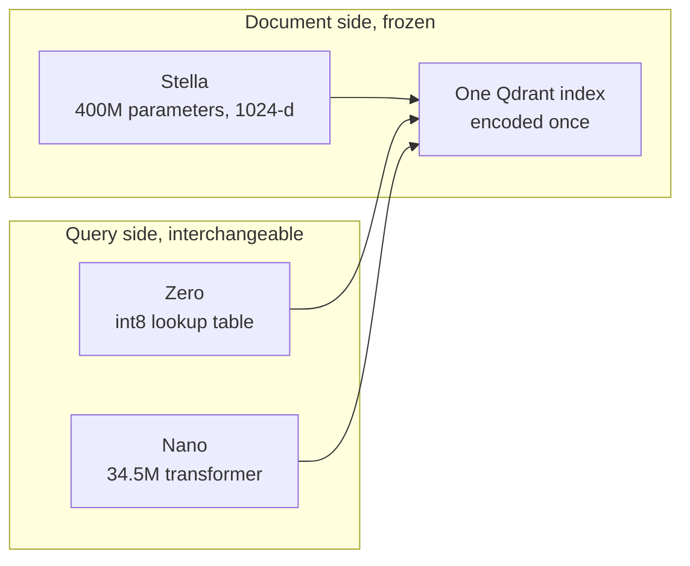

# Constella in Plain English

Constella is one frozen document encoder with two interchangeable query encoders. Documents are
encoded once with Stella. At query time, the same 1024-dimensional index can be searched with Zero,
an int8 lookup table, or Nano, a 34.5M-parameter transformer. Switching query encoders does not
require re-embedding the collection.

This page is the technical introduction to the project. It covers what shipped, why the design is
useful, what the measurements support, and where the evidence stops. The repository contains the
full experiment history, including negative results and review records. For the canonical numbers,
use [`m21/BENCHMARKS.md`](../m21/BENCHMARKS.md).

## The Short Version

| Model | Role | State |
|---|---|---|
| [`stella-en-400M-v5-doc-onnx`](https://huggingface.co/DylanCouzon/stella-en-400M-v5-doc-onnx) | Frozen Stella document encoder, 1024 dimensions | Public |
| [`constella-zero`](https://huggingface.co/DylanCouzon/constella-zero) | Int8 token-vector lookup table, no transformer at query time | Public |
| [`constella-nano`](https://huggingface.co/DylanCouzon/constella-nano) | 34,540,672-parameter query transformer | Public research preview |

The main result is a shared-index family with two query-cost points:

- Zero encodes a query with token lookup, pooling, and normalization. Under the common four-thread
  CPU protocol, its warm 20-word p50 was 0.1119 ms.
- Nano has roughly the query cost of bge-small. Its warm 20-word p50 was 7.2511 ms, compared with
  6.8400 ms for bge-small under the same protocol.
- Nano beat bge-small by 0.017648 nDCG@10 on clean-4 and by 0.027449 across all six registered
  datasets. It beat LEAF by 0.016181 across all six. Clean-4 superiority over LEAF was not
  established.
- Zero scored 0.4339 dense-only across the six. It outperformed the symmetric static encoders in
  the project baseline, which scored roughly 0.32 to 0.36, but finished 0.0243 below
  LightRetriever's dense table.
- Zero plus BM25 with Qdrant DBSF at prefetch 100 scored 0.4887 across all six and 0.4912 on
  clean-4. This is the recommended Qdrant configuration for Zero.

Full BEIR evaluation is still pending. The current results are encouraging, but they do not support
a broad state-of-the-art claim. Nano may prove competitive with the strongest models around its
size; BEIR-18 is the test that will show whether the six-set result generalizes.

Nano's full training cost was about $150 after substantial local precomputation. That is the
observed project cost, not an estimate for reproducing the entire pipeline in the cloud.

## Why Split the Encoders?

Document encoding and query encoding have different economics. Documents can be encoded offline,
once, on larger hardware. Queries arrive continuously and often run on hardware where latency,
memory, cold start, or power matters.

Constella keeps the expensive document side fixed and trains cheaper query encoders to land in the
same vector space:



This is useful when the document index is expensive or slow to rebuild, the query encoder runs at
high volume, or retrieval must run on constrained hardware. A product can use Zero for the cheapest
path, Nano when context and word order matter, or route between them without changing the stored
document vectors.

The longer-term idea is a family of query encoders that share one document index. Some could target
latency tiers; others could target a domain or workload. Zero and Nano establish that the shared
space works. The specialized-model part is still a research direction, not a finished result.

## What Was Measured

The main quality metric is exact-search nDCG@10. The headline partition is clean-4: NFCorpus,
SCIDOCS, SciFact, and TREC-COVID. ArguAna and FiQA are always reported beside it, but Stella
discloses training or evaluation contact with both, so they are excluded from the clean headline.

Nano's absolute scores were:

| Dataset | nDCG@10 |
|---|---:|
| NFCorpus | 0.363080 |
| SCIDOCS | 0.217710 |
| SciFact | 0.721097 |
| TREC-COVID | 0.787116 |
| ArguAna† | 0.623296 |
| FiQA† | 0.477765 |

† Stella-disclosed training or evaluation contact.

The registered comparisons used paired query-level inference in a fixed sequence:

| Comparison | Partition | Delta | Result |
|---|---|---:|---|
| Nano minus bge-small | clean-4 | +0.017648 | Established |
| Nano minus bge-small | all six | +0.027449 | Established |
| Nano minus LEAF asym | all six | +0.016181 | Established |
| Nano minus LEAF asym | clean-4 | -0.001063 | Superiority unestablished; no equivalence claim |

These are query-encoder comparisons against one frozen exact-search harness. They are not ANN
recall measurements or Qdrant latency measurements.

Zero's strongest practical configuration adds a lexical channel:

| System | All Six | Clean-4 |
|---|---:|---:|
| Zero, dense only | 0.4339 | 0.4098 |
| Zero + BM25, Qdrant DBSF, prefetch 100 | 0.4887 | 0.4912 |
| Zero + BM25, convex0 `w=0.8`, prefetch 1000 | 0.4911 | 0.4866 |

DBSF and convex0 are different fusion operators at different prefetch depths. No confidence interval
was computed between them, so the observed values establish neither superiority nor equivalence.
DBSF is recommended because Qdrant ships it and it requires no fitted fusion weight.

## Serving and Edge Results

The common query-serving protocol used three fresh processes per model, batch one, four CPU threads,
five warmups, and 20 samples. The values below are medians across three trials.

| Query Encoder | Hydration | First Query | Warm 20-Word p50 | Peak RSS | Measured Assets |
|---|---:|---:|---:|---:|---:|
| Constella Zero | 0.2618 s | 0.3529 ms | 0.1119 ms | 275.4 MiB | 90.1 MiB |
| bge-small | 0.6726 s | 8.2401 ms | 6.8400 ms | 291.0 MiB | 127.6 MiB |
| Constella Nano | 0.6907 s | 7.6685 ms | 7.2511 ms | 280.9 MiB | 132.3 MiB |

These timings cover query encoding only. They do not include Qdrant search or network latency.

The edge prototype was a separate experiment on an Apple M5 Pro using Qdrant in Docker. A
one-million-document, 1024-dimensional index fit inside a 256 MB container with binary
quantization, originals on disk, the quantized copy in RAM, and rescoring disabled. End-to-end
latency was 3.4 ms with Zero and 4.5 ms with Nano. The fp16 configuration thrashed under the same
limit and took 532 ms. This establishes feasibility for that measured setup. It was not a Qdrant
Edge benchmark, and the quality tables use exact search rather than the binary-quantized index.

## How Zero Works

Zero is a table with one learned 1024-dimensional row per token. At query time it tokenizes the
text, looks up the rows, pools them, and normalizes the result. There is no transformer forward pass.

The rows were trained by regression against Stella query embeddings. Teacher selection turned out
to matter in a non-obvious way: the teacher with the best retrieval score did not necessarily
produce the best table. Across the seven candidates with complete learnability rows, Stella's own
retrieval score was 0.481 on the two development forums and its fitted table scored 0.344, retaining
72%. Other teachers retained between 43% and 69%. In this tested set, a teacher's retrieval quality
did not predict the quality of the table distilled from it.

The table then resisted most attempts to improve it. More data, alternative objectives, new
feature rows, pseudo-relevance feedback, and document-manifold adjustments produced little or no
development gain. The useful improvement came from BM25 fusion, not another table-side mechanism.
This is why Zero ships as the cheapest query path and why the project moved to Nano for more
capacity.

## How Nano Works

Nano starts from the pinned bge-small BERT-style encoder with 384-wide hidden states. For each token,
it concatenates the hidden states from layers 12, 8, and 4 into a 1152-wide feature, applies a
linear projection to 1024 dimensions, pools across the query, and normalizes. The total is
34,540,672 parameters.

Training is regression against Stella vectors. The final mix used 75% query texts and 25%
documents. It combined licensed public data, harvested titles and claims, and locally generated
query forms intended to broaden coverage beyond factoid questions. The frozen checkpoint consumed
exactly 199,999,721 examples across three cycles and was exported to ONNX with Torch, direct ONNX
Runtime, and FastEmbed parity checks.

The first Nano attempt exposed the main problem: retention depended heavily on the query
distribution. It retained 93.8% of the teacher on a development slice close to its training data,
but 71.0% and 50.1% on two forum slices. That result did not separate model capacity from data
coverage. The later data and architecture screen selected broader query forms, the bge-small
backbone, and a wider linear head. The final Nano passed its registered release gate.

## Specialized Query Models

The shared index makes specialized query encoders attractive, but the first experiments did not
produce a releasable improvement.

Zero struggles with short technical terms that Stella's WordPiece vocabulary fragments, including
`s3`, `k8s`, and `hnsw`. M17 added 3,000 whole-word entries and trained five variants. Every trained
variant finished below the untrained added-entry baseline, so Zero v1 stayed selected.

M18 then built a Qdrant project-memory system over a pinned `qdrant/qdrant` snapshot. The system was
usable, but the evaluation treated one resolving comment as the only correct answer for each issue.
Even Stella plus BM25 reached only 0.256 Recall@10, so the surface did not cleanly measure the
artifact lookup task the system was meant to solve. The specialized table cleared its dense bar,
missed its fused bar, and was recorded as no improvement.

M19 tried a deterministic construction instead of training. It added 12 term rows computed from
the Stella target direction while preserving every existing Zero row. The construction passed its
numeric and serving gates with no measured serving regression. Relevance evaluation stopped during
development judgment: 60 of 1,376 pooled items remained unjudgeable from the available passages,
and the decisive Precision@10 and winning-term gates were label-sensitive under exact uncertainty
enumeration. M19 therefore closed as `ENCODER_INCONCLUSIVE`; confirmation remained sealed, and
released Zero v1 remains selected.

The conclusion is narrow: specialized query models remain plausible, but this project has not yet
shown that one improves retrieval. The next attempt needs a defensible answer key before it needs
another training recipe.

## Methodology and Limits

The repository uses stricter controls than a normal model-development project because repeated
benchmark access can turn a test set into a development set.

- Evaluation partitions, decision rules, test order, bootstrap settings, and minimum effects were
  registered before protected results were read.
- Each protected surface had a one-shot access path with committed manifests and receipts.
- Comparisons used paired query-level bootstrap intervals. An unresolved comparison does not imply
  a tie or equivalence.
- Training-data licenses and overlap screening were part of the model recipe.
- Negative results, review findings, and changes to the plan were retained instead of being folded
  into a clean retrospective story.

The current evidence has clear boundaries:

- The reserved four and BEIR-18 have not been opened. Full BEIR remains pending.
- Nano's clean-4 superiority over LEAF was not established.
- Zero did not beat LightRetriever's dense table on the six.
- The edge prototype measured Qdrant in Docker on one Apple M5 Pro. It did not measure Qdrant Edge.
- Native support for all three models currently lives on the
  [`constella-research-preview`](https://github.com/Dylancouzon/fastembed/tree/constella-research-preview)
  FastEmbed branch. The upstream PRs are still pending.
- Specialized Zero variants have not established a retrieval improvement over released Zero v1.

## Try It and Inspect the Evidence

The [`README` quickstart](../README.md#quickstart) indexes documents once with Stella and queries the
same in-memory Qdrant collection with Nano and Zero. The current installation uses the preview
FastEmbed branch:

```bash
pip install "fastembed @ git+https://github.com/Dylancouzon/fastembed.git@constella-research-preview" qdrant-client
```

For deeper review:

- [`m21/BENCHMARKS.md`](../m21/BENCHMARKS.md) is the canonical public benchmark table and discrepancy
  audit.
- [`m13/STATUS.md`](../m13/STATUS.md) records the Nano build, final evaluation, and serving protocol.
- [`m19/FINDINGS.md`](../m19/FINDINGS.md) records the deterministic specialization result and why it
  remained inconclusive.
- [`HARNESS.md`](../HARNESS.md) maps the reusable evaluation and verification machinery.
- [`ROADMAP.md`](../ROADMAP.md) shows what remains, including BEIR-18 and the upstream FastEmbed work.

The repository is an evidence base rather than a guided paper. If a detail here looks surprising,
Claude or Codex can trace it through the status files, result JSONs, registrations, reviews, and
source code. The committed artifacts remain authoritative over this summary.
