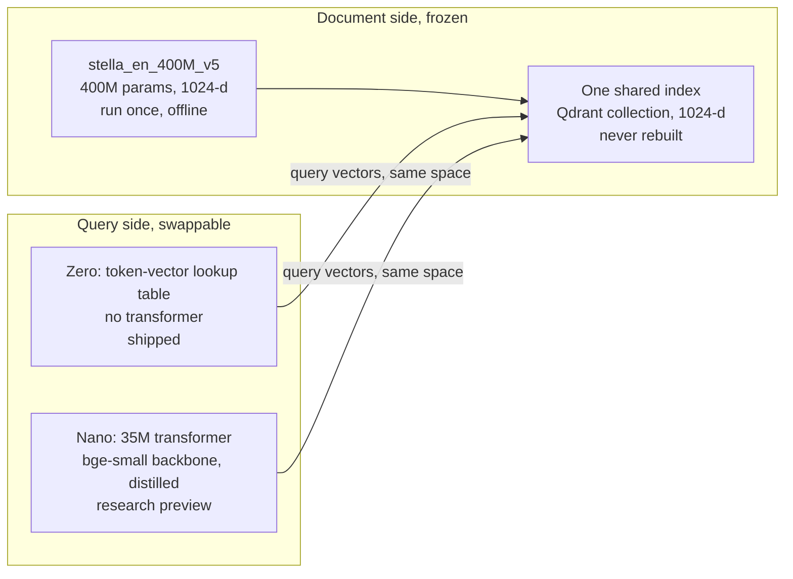
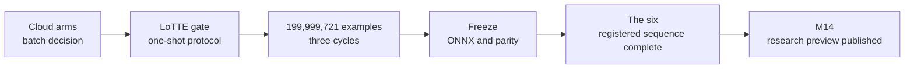

# Constella in Plain English

*Asymmetric dual encoders, the research record from 24 August to 15 September 2026, written for a reader who knows the domain but did not watch the work. The interactive version of this page is a Claude artifact; this file is the GitHub-renderable twin. Numbers are copied from the result JSONs and the milestone findings files, which remain authoritative.*

One document index, built once with a good 400M-parameter model. Two cheap ways to ask it questions: a lookup table that costs almost nothing per query, and a 35M-parameter transformer that costs about what a small embedding model costs. The family is public, with Nano labelled as a research preview. This page explains what we tested, what came out and why the process looks the way it does.

| Where things stand | | |
|---|---:|---|
| Zero, dense only | **0.4339** | all-six nDCG@10, 0.0243 below LightRetriever's dense table. Reported as measured and shipped. |
| Zero + BM25, Qdrant DBSF@100 | **0.4887 / 0.4912** | all-six / clean-4 nDCG@10. The deployed recommendation; no fitted fusion weight. |
| Nano, exact search | **0.363080 / 0.217710 / 0.721097 / 0.787116** | NFCorpus / SCIDOCS / SciFact / TREC-COVID, the clean four. ArguAna† 0.623296; FiQA† 0.477765. |
| Nano, registered contrasts | **+0.017648** | vs bge-small on clean-4; +0.027449 all-six and +0.016181 vs LEAF all-six also established. Clean-4 vs LEAF was −0.001063, superiority unestablished with no equivalence claim. |
| Nano, public state | **Published** | Built, evaluated and released as a research preview at revision `6bb167dc6f60d3992602235b8e8aaa374a309168`. |
| Zero's short-query gap | **v1 retained** | M17 closed with no eligible arm; M18 shipped the system but not an improved encoder; M19 is planned, not executed. |

† Stella discloses training/evaluation contact with ArguAna and FiQA. Comparator absolutes are not published; the evidence contains frozen per-query vectors and registered deltas, not aggregate rows.

---

## Part one: the idea

Dense retrieval works by turning every document into a vector once, storing those vectors in an index, and then turning each incoming query into a vector in the same space and finding the nearest documents. Normally the same model does both jobs. That is wasteful on the query side: documents are encoded once, offline, on whatever hardware you like, but queries are encoded on every request, often on a laptop, a phone, or a small server that is also doing other things.

The bet behind this project is that the two jobs can be split. Keep a strong, expensive model for the documents, and swap in something much cheaper for the queries, trained to land in the same vector space. If it works, the expensive part is paid once and the cheap part runs everywhere. The index never has to be rebuilt when you change the query encoder, because the document side is frozen.

**Zero** is the extreme version. Its table was learned by regressing the pooled lookup output onto the teacher's query embeddings; each token ends up with one fixed row. A query is encoded by looking up its tokens and pooling those rows. There is no neural network at query time at all, so the query cost is a few table lookups and an addition. The catch is that a bag of token vectors cannot know word order or context, so it should lose quality. The question was how much.

**Nano** is the moderate version. A small transformer, capped at 35 million parameters, reads the whole query and is trained by regression to reproduce the teacher's query vector. It costs roughly what a small symmetric embedding model like bge-small costs, so it has to earn its place on quality and on the fact that it shares stella's index instead of needing its own.

The whole thing is also a paper. The repository is deliberately kept as an evidence base: negative results, failed approaches, provenance and the limits of every claim are recorded next to the successes, because a measured miss is a publishable result and an unmeasured claim is not.

### Where the pair pays off

The pattern is worth the trouble wherever the query side runs somewhere the document side cannot, or runs so often that its cost is the bill.

- **Command-line tools and scripts.** Search a large corpus from a CLI without installing torch. Under the common four-thread protocol, Zero's measured assets are 90.1 MiB, hydration takes 0.2618 seconds and the first query 0.3529 milliseconds.
- **Edge and on-device search.** Phones, kiosks, embedded boxes, Qdrant Edge. The query side is a table lookup, so no accelerator, no warm model and no thermal budget. A one-million-document index serves inside a 256 MB container once binary-quantised, at 3.4 ms for zero and 4.5 ms for nano.
- **Frozen and long-lived collections.** Encode documents once with the strong model and never re-embed. The query side can be swapped or upgraded, from zero to nano to whatever comes next, without touching the index, because every student targets the same space.
- **Encode at ingest in the cloud, query anywhere.** Documents pass through the 400M model where GPUs live, once, at ingest. Queries are encoded on whatever the client has: a browser, a serverless function with a tight cold start, a laptop on a train.
- **High-QPS or cost-sensitive query paths.** At high volume the query encoder is the cost centre. In the same batch-one, four-thread synthetic protocol, Zero's warm 20-word p50 is 0.1119 ms and Nano's is 7.2511 ms; neither needs a GPU.
- **Offline and private by construction.** No model server, no network call to embed a query. Search works offline against a synced index, and the query text never has to leave the device to become a vector.
- **Hybrid out of the box.** Zero fused with BM25 through Qdrant DBSF@100 is the deployed recommendation while the query side stays a table plus token counts. The lexical channel is part of the recipe, not an add-on.
- **One index, two speeds.** Because zero and nano share stella's index, a product can route simple queries to the table and harder ones to the small transformer, and move that boundary later without a reindex.

## Part two: how we measure, and why it is strict

Retrieval quality is scored with nDCG@10: for each query, how well the top ten returned documents match the human relevance labels, averaged over the queries of a dataset, then averaged over datasets with equal weight. A difference of 0.01 is large in this world. Our screening resolution is about 0.005.

| Surface | Role |
|---|---|
| **The six** (SciFact, NFCorpus, FiQA-2018, ArguAna, SciDocs, TREC-COVID) | Confirmatory. Standard BEIR sets with published numbers for every competitor. Each system gets exactly one scored access, spent only after its recipe is frozen. Zero spent its access in M7; Nano completed its run in M13. |
| **Clean-4** (NFCorpus, SciDocs, SciFact, TREC-COVID) | The headline. stella discloses ArguAna and FiQA in its own training data, so any student may inherit an advantage there. Fixed before any nano number existed; all six reported beside it. |
| **Reserved four** (FEVER, DBpedia-entity, CQADupStack android and english) | Descriptive. Still unspent and pending under M20, alongside BEIR-18. Neither has a result. |
| **LoTTE-clean** (seven StackExchange forum slices, 14,034 queries) | The fresh out-of-domain build gate, governed by a one-shot transaction and audit. |

Development uses other surfaces. DEV-6 is six components pinned since M7, including two CQADupStack forums and slices of Natural Questions and HotpotQA. COV, the coverage surface built in M10, is four families of consumer-health, scientific, legal and finance questions chosen to look nothing like the training data. Every development read is counted: 494 in-training evaluations by the end of M8, and hundreds more since. The count is published because the alternative, saying we were careful, is not checkable.

Two statistical habits run through everything. Every registered comparison gets a paired bootstrap interval over queries; when superiority is not established, the result is unresolved and says nothing about equivalence. And decisions are registered before their data is seen: the rule, the bar, the sequence and the constants are committed to git and dated, then the number is produced. Changing a rule after seeing the number is the one thing the process is built to prevent.

## Part three: what we did, in order

### M1 to M6, 24 to 25 August: survey and baselines

Before building anything, we measured what already exists. We reproduced LightRetriever, an academic system that also uses a lookup table for queries, and got its dense numbers to match the paper after finding that its tables must include a beginning-of-sequence token. We measured MongoDB's LEAF pair, which uses a small query model against a larger document model, and confirmed byte-for-byte that we had composed it correctly. We measured small symmetric models such as bge-small, static embedding models used symmetrically, BM25, and OpenSearch's inference-free sparse encoder.

- Small transformers on the query side scored around 0.50 to 0.53 on the six. Zero-compute systems scored 0.43 to 0.49. Symmetric static models came decisively last at 0.32 to 0.36.
- A tempting shortcut failed cleanly: fitting a linear map from a static model into a contextual document space, even with test-set-tuned regularisation, scored below the static model used on its own.
- Costs are not one number. Under the later common four-thread protocol, warm p50 was 0.1119 ms for Zero, 6.8400 ms for bge-small and 7.2511 ms for Nano; measured assets were 90.1, 127.6 and 132.3 MiB respectively. A 1024-d index is four times the size of a 384-d one per document.

**What it changed.** The comparison set, the six datasets, the bootstrap habit and the cost framing were fixed here. An external review called the results not decision-grade and listed seven defects; every one was rerun or reworded before anything else started.

### M7, 25 to 28 August: zero, the lookup table

Pick a teacher, distil its query behaviour into a table of token vectors, tune the recipe on development data, freeze it, then spend the single confirmatory access to the six.

**Choosing the teacher taught the project's first big lesson.** The obvious way to pick a teacher is by how well it retrieves. We tried that, chose Snowflake's arctic-embed-l, and withdrew the choice the same day: ranked by the table distilled from it, arctic was 0.048 worse than the model we already had. Across eight candidates, a teacher's own retrieval quality had zero correlation with how good its distilled table was. Only stella_en_400M_v5 beat the incumbent, by 0.037.

**Stella is the best teacher we tested, and the reason is structural.** A lookup table can only reproduce the part of a query vector that adds up from the query's tokens. Every other candidate carries a much larger share of the meaning in context, in how the tokens modify one another inside the transformer, and a table cannot see that. Measured as the fraction of a teacher's own retrieval score that its best closed-form table recovers on the two development forums (`results/m7_learnability_report.json`):

| Teacher | Teacher's own score | Its best table | Recovered |
|---|---:|---:|---:|
| stella_en_400M_v5 | 0.481 | 0.344 | **72%** |
| bge-base-en-v1.5, the incumbent | 0.448 | 0.307 | 69% |
| e5-base-v2 | 0.393 | 0.265 | 67% |
| bge-large-en-v1.5 | 0.449 | 0.275 | 61% |
| mxbai-embed-large-v1 | 0.443 | 0.251 | 57% |
| arctic-embed-l | 0.493 | 0.259 | 53% |
| gte-large-en-v1.5 | 0.471 | 0.203 | 43% |

Two corollaries fell out of the same probe. Within every family the base model out-distils the large one, by 0.04 to 0.07, because the large models push more of the meaning into context. And cosine agreement with the teacher's query vector is the wrong metric: e5-base agrees most closely with its teacher, at 0.91, and ranks sixth on retrieval. Imitating a vector is not reproducing a ranking.

We also did the algebra before spending GPU time. Query-side centering, whitening, per-token weights and similar tricks are all absorbable into a freely trained table, so they cannot raise its ceiling. Only new rows or multiplicity-aware pooling could.

| Comparison on the six | Difference | 95% interval | Verdict |
|---|---:|---:|---|
| Zero int8 table vs LightRetriever dense table 0.4583 | −0.0243 | [−0.0405, −0.0086] | below, resolved |
| Zero vs BM25 0.4174 | +0.0165 | [+0.0017, +0.0311] | not resolved under multiplicity |
| Zero + BM25, convex0, vs OpenSearch 0.4868 | +0.0043 | [−0.0063, +0.0151] | superiority unestablished; no equivalence claim |

The macros: zero dense 0.4339, convex0 fusion 0.4911, the teacher itself 0.5744. Zero retains 75.5% of its teacher on the six. On the development set it had looked like 91.5%, but the out-of-domain part of the development set had said 76.4%, and that was the honest forecast.

**What it changed.** Zero's dense-only score sits below LightRetriever's dense table on the six, and we report that as measured. Fused with BM25 it is a genuinely good system, and it is a query encoder with no neural network in it at all, which is the point: it was published in M11 and we now consider it releasable as a product component. The dev-versus-final gap became a standing rule: report an out-of-domain subset next to every macro. Excluding MS MARCO for licence reasons costs about +0.006, not resolved, so the gap is architectural, not a licensing artefact.

### M8, 28 to 30 August: twelve probes to improve the table

With the document tower frozen, what could close a 0.024 gap? Twelve pre-registered probes on development data, most in closed form, so a negative is a ceiling and not a bad run.

- More data: four times the dose bought +0.001. Closing the gap would need roughly eighteen times the pool.
- The training objective was inert: the table already ranked the correct document first for 99.75% of training queries. Future table training should start from hard candidates.
- Finer vocabulary rows, n-gram rows, pseudo-relevance feedback, aiming at the document manifold, a head on the finished document vector: all negative.
- Subword fragmentation correlates with the gap, but changing it did not move the metric. A correlated channel is not a lever.

**What it changed.** No lever improved the development endpoint by more than about 0.005, and fusion with a lexical channel was worth ten times that. Ship zero fused; treat the query side's capacity as the real limit. That made the case for nano.

### M9, 30 August to 1 September: nano, first attempt

Take bge-small's 33M-parameter backbone, put a linear head on it, and train it by squared-error regression to reproduce stella's query vectors, on about 463,000 real queries from Wikipedia question answering and product search. Release bar: retain at least 87.8% of the teacher on the six and beat bge-small and LEAF. The run consumed 3.74 billion tokens and went flat.

| Screen component | Teacher | Nano | Retention |
|---|---:|---:|---:|
| nq-250k, Wikipedia questions (similar data in the training mix) | 0.8839 | 0.8289 | 93.8% |
| cqadup-physics, forum questions | 0.4931 | 0.3501 | 71.0% |
| cqadup-programmers, forum questions | 0.4681 | 0.2345 | 50.1% |

The macro, 82.2%, hides the finding. Where training queries resemble test queries, nano is inside LEAF's band. Where they do not, it retains half. The run establishes dataset dependence; it does not isolate coverage from capacity. A later screen also found that widening the 384-wide linear head helped under regression.

- Documents as extra regression text helped more than repeating queries.
- A closed-form warm start of the head was worth 0.027 over a random head.
- ONNX export with no custom operators; FastEmbed can serve the model exactly if the linear head is applied per token before pooling.
- Edge deployment needs binary quantisation: fp16 is a hundred times slower under a 256 MB limit.

**What it changed.** The M9 candidate was frozen and not released. Its six-set close-out was completed later in M13; M10 was told to broaden the query forms and test a wider head.

### M10, 1 to 10 September: preparing nano properly

Rescoped on 10 September to preparation, with execution moved to M13. What M10 delivered is the data, the harness and the recipe.

**The data pipeline.** Coverage means query forms. Three parts, all under commercially usable licences, all screened against every evaluation set:

- **The M9 pool**, re-screened: Natural Questions, SQuAD, HotpotQA, FEVER, MIRACL and Mr.TyDi queries, plus one million PAQ questions.
- **Harvest**: real titles, headings and claim sentences mined from Wikipedia, arXiv and the licensed pool. About 1.25 million rows.
- **Generated**: 834,463 queries in seven forms no corpus provides, written by Qwen3-8B at a pinned revision, running locally. Argument, comparison, conversational, finance, health, how-to and yes-or-no. Each form passed a diversity gate and a duplicate check against MS MARCO.
- **Excluded**: MS MARCO (non-commercial: validate only, never train), FineWeb (cannot be screened against the reserved sets without opening them), Claude as a generator (terms forbid training competing models).

**The screen.** Thirteen arms at 5 million examples each, the two backbone candidates at 20 million, all evaluated on COV. Minimum detectable effect 0.0056. A contrast that does not resolve keeps the default; it does not prove the alternatives equal.

| Contrast | Question | Point | Lower bound | Result |
|---|---|---:|---:|---|
| F1 | Which backbone: bge-small or MiniLM-L6? | +0.0116 | +0.0072 | resolved: bge-small |
| A3−A2 | Does harvested real text beat the same volume of PAQ? | +0.0101 | +0.0054 | positive, not resolved |
| A4−A3 | Do the generated forms add on top of harvest? | +0.0121 | +0.0069 | resolved: use them |
| G1 | 1152-wide head vs the 384 M9 used? | +0.0217 | +0.0153 | resolved, descriptive |
| G2 | 1536 vs 1152? | +0.0003 | −0.0028 | not resolved |
| G3 | Small nonlinear head vs linear? | +0.0024 | −0.0003 | not resolved |
| B1 | All queries instead of 75/25? | −0.0011 | −0.0047 | not resolved |
| B2 | Half and half instead of 75/25? | +0.0027 | −0.0005 | not resolved |
| D1 | Normalised loss instead of squared error? | −0.0002 | −0.0019 | not resolved |
| D2 | Document-covariance-weighted loss? | −0.0184 | −0.0238 | negative, mechanism unresolved |
| E1 | Batch 32 or 128? | — | — | cloud, pending |
| C1 | Warm-start from the M9 checkpoint? | — | — | cut before computation |

Two descriptive reads sit beside the screen: a second anchor seed moved the macro by 0.0007, and the generated forms' gain held at 20 million examples (+0.0165). Eighty-two percent of the 5M gain came from the consumer-health family, which is the honest limit of the coverage story so far.

**What it changed.** The recipe was locked: bge-small backbone, the full A4 corpus, a 1152-wide linear head over three layers, 75% queries and 25% documents, squared-error loss, closed-form warm start. At M10's close only the cloud batch decision remained.

### M11, 3 September: shipping zero

`constella-zero` and `stella-en-400M-v5-doc-onnx` went public on Hugging Face, both served by FastEmbed as built-in models. The published bytes hash to the frozen M7 artifact; serving parity against the numpy reference is 4.5e-8 over 1,024 real queries. Eight release gates run at every push. One recorded slip: the repository was public from its first push, so the plan's flip-public-last guarantee was spent early; nothing non-releasable was ever in it.

### M12, 4 to 9 September: fusion in Qdrant

Zero's original fused number came from convex0 with a development-fitted weight, an operator Qdrant does not ship. At prefetch 100, Qdrant DBSF scores 0.4887 on all six and 0.4912 on the clean four; convex0 at prefetch 1,000 scores 0.4911 and 0.4866. No confidence interval compared the two, so the observed difference establishes neither superiority nor equivalence.

**What it changed.** The public recommendation became `Fusion.DBSF` at prefetch 100: it runs in Qdrant and fits zero parameters. Recorded as an owner's product-policy override of the M7 release freeze, on deployability grounds.

### M13, 10 to 15 September: the cloud run

M13 completed the batch decision, LoTTE gate, Nano build, final six-set evaluation, M9 close-out and common serving-cost measurement.

- **The build.** The nominal plan was 200,000,000 examples; the frozen checkpoint actually saw exactly **199,999,721** in three cycles. It froze with an ONNX export and FastEmbed parity checks.
- **The scoring transaction** spent Nano's six-set access after authenticating its manifest, using frozen document caches and hashing the exact query texts and labels scored.
- **The scope cut**, ruled by Dylan after review: no extension cycles, no post-tag continuation, one more review, the LoTTE gate as a small script. Reliability by rehearsal, not by recovery machinery.
- **The LoTTE gate** read the seven cleaned slices under its one-shot protocol before the build. Its reviews added an exclusive lock and receipt, a committed checkpoint manifest and per-slice hashes, and a controller that recomputed the decision from the recorded numbers. The closing re-check returned GO.
- **Box-side DEV-6** filled the cloud arms' development read from identical checkpoint bytes, once, with provenance.

**What it changed.** Nano established superiority over bge-small on clean-4 and all six, and over LEAF on all six. Its clean-4 superiority over LEAF was unestablished, with no equivalence claim. M13 closed with 267 M13 tests passed; M14 then published the research preview.

### M17, 11 to 12 September: more vocabulary

Andrey indexed every issue and pull request in `qdrant/qdrant`, searched it with the released zero, and found that queries like `s3` and `k8s` come back matched to version numbers. The teacher gets them right. M17 tested whether broader vocabulary and training could close that gap.

The cause is structural, not a bug. Zero uses stella's vocabulary, and several load-bearing technical terms are not in it.

| Query | What zero sees |
|---|---|
| `s3` | `s` + `##3` |
| `k8s` | `k` + `##8` + `##s` |
| `hnsw` | `h` + `##ns` + `##w` |
| `kubernetes` | `ku` + `##ber` + `##net` + `##es`, ordinary pieces, works fine |

Stella reads the same fragments in context and works out what they mean together. Zero looks up one fixed vector per fragment and averages them, and the number fragments were learned almost entirely from numeric text, so the query drifts toward version strings. In a long query the ordinary words outvote the fragments. In a two-piece query there is nothing else in the average, which is why this appears in a CLI and not on a benchmark.

M17's answer was breadth: three thousand new whole-word entries across six domains, trained alongside the existing rows. Five variants, 4,000 steps each, one scored read apiece.

| Variant | nDCG@10 |
|---|---:|
| Entries added, no training | **0.6153** |
| C | 0.5807 |
| V | 0.5810 |
| L | 0.5936 |
| VL | 0.5938 |
| VL-A | 0.5938 |

Every trained variant read below the untrained baseline while the training loss fell throughout. The run was stopped and the cause was never found.

**What it changed.** M17 closed on 12 September with `no_survivor`: no trained arm met eligibility against v1, so released Zero v1 stayed shipped. The close-out records an unexplained negative result rather than a verdict on the method, because the diagnostic reads that would separate the causes were never spent. It also caught a standing error: the 35M parameter cap belongs to nano and never applied to zero.

### M18, 12 to 13 September: project memory for one repository

Stop trying to be good everywhere and build the thing Andrey was actually using. A pinned snapshot of `qdrant/qdrant` gives 79,269 searchable passages across 11,574 issues, pull requests and files, served by a stella index, BM25 and the shipped DBSF recipe. Sixteen new entries were added for the shattered terms, every inherited row was frozen so training could only touch the new ones, and the result was measured against a fresh development set.

| 100 development queries | nDCG@10 | Recall@10 |
|---|---:|---:|
| BM25 | 0.109 | 0.218 |
| zero v1 | 0.087 | 0.157 |
| zero v1 + BM25, DBSF@100 | 0.103 | 0.178 |
| stella, the ceiling | 0.137 | 0.232 |
| stella + BM25, DBSF@100, the ceiling | 0.141 | 0.256 |

**The ceiling is the finding, not the student.** A 400M model that puts the right answer in its top ten for under a quarter of queries is a statement about the labels. The queries had been built from issue text with the single correct answer defined as the comment that resolved the thread, so the test scored answer matching rather than the artifact lookup a CLI performs. On troubleshooting queries, BM25, dense and fusion all scored exactly 0.000, which is only possible when the labelled target is unreachable by any route.

Against that surface the new table cleared its dense bar and missed its fused one, and was recorded as no improvement. A side experiment that was registered as unable to count is the clearest evidence the project holds: asked for `k8s`, released zero returned `release v0.8.0` and `v0.8.2` in its top three, and the trained table returned the Kubernetes persistence issue at rank two with both releases gone.

**What it changed.** M18 closed on 13 September as `SYSTEM_READY` plus `ENCODER_NO_IMPROVEMENT`: the internal search system is usable, but released Zero v1 remains its encoder. Measuring the wrong task is now the first thing to check before reading a student's score.

### M19, planned after 13 September: solving for the entry instead of training it

The reviewed M19 plan asks whether a bare term's entry can be computed rather than fitted: if the teacher's direction and Zero's pooling rule are known, choose the row so that `k8s` lands where Stella puts `k8s`. It proposes a deterministic short-query feasibility test without an optimizer or domain training corpus.

The proposed construction would add rows while leaving inherited entries frozen, making the intended blast radius explicit.

It has not executed. There is no score or verdict, and released Zero v1 remains selected.

**What it would answer.** M17 produced a negative screen and M18 measured a surface that did not resolve the intended short-query question. M19 is the planned bounded test of the remaining deterministic idea; until a new execution session runs it, vocabulary specialisation remains unmeasured rather than disproven.

One caveat for the meantime. Fusion repairs `s3` and `k8s` in this corpus only because maintainers write those literals in issue titles. BM25 cannot link `k8s` to a document that says only Kubernetes, and that link is dense-side work.

## Part four: what we built

Nano starts from the pinned bge-small BERT-style encoder with 384-wide hidden states. For each query token, it concatenates the hidden states from layers 12, 8 and 4 into a 1152-wide feature, applies a linear head to 1024 dimensions per token, averages over the query's tokens, and normalises. Total 34,540,672 parameters, under the 35M cap. The head is applied before pooling so FastEmbed can serve the exported graph exactly.

Training was regression: 75% of examples were query texts and 25% documents, in a repeating pattern of three query windows then one document window; the target for each was Stella's vector for that text. Squared error against unit-norm targets, three cycles, AdamW and mixed precision. The nominal schedule was 200,000,000 examples; execution consumed exactly 199,999,721.

Stops between stages made each irreversible read wait for committed identities and checked preconditions. The reserved four and BEIR-18 were not part of this run: both remain unspent and pending under M20.

The final evaluation used four tests in a fixed order, each a one-sided bootstrap comparison at 2.5% with 10,000 resamples of queries within each dataset. Nano established superiority over bge-small on clean-4 and all six, then over LEAF on all six; clean-4 superiority over LEAF was unestablished. Under the common batch-one, four-thread serving protocol, warm 20-word p50 was 0.1119 ms for Zero, 6.8400 ms for bge-small and 7.2511 ms for Nano.

## Part five: why so many rules

- **One access per surface.** A benchmark you have already looked at cannot confirm anything. The six are opened once per system by a script that commits a manifest, pushes a tag, scores, and refuses to run again. Files under protected paths are guarded so only a named module can open them; adding a module is a dated ledger amendment.
- **Register before you look.** Partition, test sequence, bars, bootstrap seed and quantile method are fixed in the registry before a number exists. Changes are dated and the original stays in git.
- **Count the peeking.** Development reuse is tallied and published.
- **Frozen comparators.** The competitor vectors cannot be regenerated; overwriting them would destroy the ability to compare.
- **Licences are part of the recipe.** Every training source must permit commercial derived weights; non-commercial sources may validate but never train.
- **Reviews are adversarial and counted.** Reviewers are briefed to break things and forbidden from opening protected surfaces. They have caught a rounded confidence bound in the single irreversible decision path, a gate that reported failure but exited successfully, and a release guard that failed open. Two independent reviews precede anything expensive or irreversible.
- **Prefer cheaper when superiority is unresolved.** The record says unresolved, never equal.

## Part six: what counted as success, and what a miss means

Nano passed its release gate: better than bge-small on the clean four and on all six, at about bge-small's query cost, while serving Stella's index unchanged. It also beat LEAF on all six; clean-4 superiority over LEAF was not established. M14 published it as a research preview, completing the two-speed family beside Zero and the frozen document tower.

A miss is publishable. The material already includes: a teacher's retrieval quality does not predict its distilled student, and the most decomposable teacher wins; a lookup-table query side retains about three quarters of its teacher and its objective saturates almost immediately; fusion with a lexical channel is worth ten times any table-side lever; a small transformer's retention is a per-distribution quantity, 94% where the training data resembles the queries and 50% where it does not; the depth dependence of fusion operators inverts at realistic prefetch; and adding a vocabulary entry does nothing on its own, since what moves results is where that entry points.

## Glossary

| Term | Meaning |
|---|---|
| nDCG@10 | The quality metric. Rewards relevant documents near the top of the first ten results; 1.0 is perfect. |
| Retention | A student's score divided by its teacher's on the same data. Reported per component. |
| Teacher, student | stella_en_400M_v5 is the teacher; zero and nano are students trained to reproduce its query vectors. |
| Bootstrap CI | Resample the queries thousands of times and recompute the difference; the spread is the interval. Excludes training-seed variation. |
| Resolved | A difference whose interval excludes zero at the registered level. Not resolved keeps the default and claims nothing. |
| MDE | Minimum detectable effect, 0.0056 for the M10 screen. |
| Arm, contrast | An arm is one trained model under one recipe variant; a contrast is a registered comparison between two arms. |
| COV, DEV-6 | Development surfaces: the coverage surface of four unfamiliar families, and the six components pinned since M7. |
| The six, clean-4, reserved four | The confirmatory datasets, the headline subset without the teacher's disclosed training sets, and the never-opened descriptive sets. |
| LoTTE | Stanford's long-tail StackExchange benchmark; seven cleaned forum slices are the one fresh out-of-domain surface before the build. |
| Spent tag | A git tag pushed the moment a one-shot access begins. Its existence refuses every later attempt. |
| Dose, cycle | Training examples consumed; one learning-rate ramp from 1e-4 to 1e-5. The nominal build schedule was 200,000,000; execution consumed exactly 199,999,721 over three cycles. |
| Fusion, DBSF | Combining dense and BM25 results. DBSF normalises each list's scores by their distribution and adds them; it is what Qdrant ships. |
| Inference-free sparse | Systems where documents are expanded by a model but a query is just token counts. Zero's closest competitor class. |

*Sources: `m21/BENCHMARKS.md`, `ROADMAP.md`, `m13/STATUS.md`, `m14/STATUS.md`, `m17/STATUS.md`, `m18/STATUS.md`, `research/m1-m6-findings.md`, the `FINDINGS.md` files of M7 to M10 and M12, `m10/RESULTS.md`, `m10/M102_LOCK.md`, `m13/RULINGS.md`, `m13/EXECUTION.md`, `results/m7_learnability_report.json`, and the registries they cite.*
